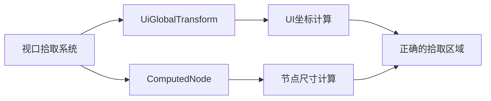

+++
title = "#21382 fix: query `UiGlobalTransform` instead of `GlobalTransform"
date = "2025-10-04T00:00:00"
draft = false
template = "pull_request_page.html"
in_search_index = false

[extra]
current_language = "zh-cn"
available_languages = {"en" = { name = "English", url = "/pull_request/bevy/2025-10/pr-21382-en-20251004" }, "zh-cn" = { name = "中文", url = "/pull_request/bevy/2025-10/pr-21382-zh-cn-20251004" }}
+++

# 技术分析报告：修复 UI 视口拾取查询问题

## 基本信息
- **标题**: fix: query `UiGlobalTransform` instead of `GlobalTransform`
- **PR 链接**: https://github.com/bevyengine/bevy/pull/21382
- **作者**: df51d
- **状态**: 已合并
- **标签**: C-Bug, A-Rendering, A-UI, S-Ready-For-Final-Review, X-Uncontroversial, D-Straightforward
- **创建时间**: 2025-10-04T17:54:42Z
- **合并时间**: 2025-10-04T23:25:13Z
- **合并者**: alice-i-cecile

## 描述翻译
### 目标
修复 #21381

### 解决方案
- 描述用于实现上述目标的解决方案。

### 测试
- 我在 examples/ui/viewport_node 上测试了这些更改。

## 问题背景与解决方案

这个 PR 解决了一个在 Bevy UI 系统中的视口拾取（viewport picking）功能中的组件查询错误。问题的核心在于系统错误地查询了 `GlobalTransform` 组件，而不是专门用于 UI 的 `UiGlobalTransform` 组件。

在 Bevy 的架构中，UI 系统使用专门的变换组件来处理 UI 元素的布局和渲染。`UiGlobalTransform` 是专门为 UI 设计的全局变换组件，它考虑了 UI 特有的坐标系和缩放因子。而通用的 `GlobalTransform` 组件主要用于 3D 场景中的实体变换。

当视口拾取系统错误地使用 `GlobalTransform` 时，会导致坐标计算不准确，因为 UI 系统使用不同的坐标系统和缩放处理。这会影响鼠标交互的准确性，特别是在处理视口节点（viewport nodes）时。

## 实现细节

主要的修改集中在 `crates/bevy_ui/src/widget/viewport.rs` 文件中。修改包括两个关键部分：

1. **导入语句的调整**：将 `GlobalTransform` 的导入移到条件编译块内，并添加了 `UiGlobalTransform` 的导入。

2. **系统查询的修正**：将视口拾取系统中的查询从 `&GlobalTransform` 改为 `&UiGlobalTransform`。

3. **坐标计算的更新**：相应地更新了坐标访问方式，从方法调用改为直接字段访问。

## 技术洞察

这个修复体现了 Bevy 引擎中组件专业化的重要设计原则。在游戏引擎中，不同的系统（如 3D 渲染和 UI 渲染）通常需要不同的坐标系统和变换处理方式。

`UiGlobalTransform` 与 `GlobalTransform` 的主要区别在于：
- `UiGlobalTransform` 专门处理 UI 的像素坐标系统和缩放因子
- `GlobalTransform` 处理 3D 世界坐标系统

通过使用正确的组件类型，确保了坐标计算的一致性，避免了因坐标系不匹配导致的交互问题。

## 影响与改进

这个修复虽然代码改动很小，但对 UI 交互的准确性有重要影响。它确保了：
- 鼠标事件在视口节点上的精确定位
- UI 拾取系统的正确行为
- 视口交互功能的可靠性

## 组件关系图



## 关键文件更改

### `crates/bevy_ui/src/widget/viewport.rs`

**修改内容**：
1. 调整了导入语句的位置和顺序
2. 修改了系统查询中使用的组件类型
3. 更新了坐标访问方式

**代码变更**：
```rust
// 导入调整
#[cfg(feature = "bevy_ui_picking_backend")]
use crate::UiGlobalTransform;

// 系统查询修改 - 之前：
&GlobalTransform,

// 系统查询修改 - 之后：
&UiGlobalTransform,

// 坐标计算修改 - 之前：
let node_rect = Rect::from_center_size(
    global_transform.translation().truncate(),
    computed_node.size(),
);

// 坐标计算修改 - 之后：
let node_rect =
    Rect::from_center_size(global_transform.translation.trunc(), computed_node.size());
```

这些修改确保了视口拾取系统使用正确的 UI 专用变换组件，从而提供准确的坐标计算和交互体验。

## 进一步阅读

- [Bevy UI 系统文档](https://bevyengine.org/learn/quick-start/ui/)
- [Bevy 变换组件说明](https://bevyengine.org/learn/quick-start/transform/)
- [Bevy 拾取系统指南](https://bevyengine.org/learn/quick-start/picking/)

# 完整代码差异

```diff
diff --git a/crates/bevy_ui/src/widget/viewport.rs b/crates/bevy_ui/src/widget/viewport.rs
index dbd457956073d..08b34ea5cb52f 100644
--- a/crates/bevy_ui/src/widget/viewport.rs
+++ b/crates/bevy_ui/src/widget/viewport.rs
@@ -28,10 +28,10 @@ use bevy_picking::{
 use bevy_platform::collections::HashMap;
 use bevy_reflect::Reflect;
 #[cfg(feature = "bevy_ui_picking_backend")]
-use bevy_transform::components::GlobalTransform;
-#[cfg(feature = "bevy_ui_picking_backend")]
 use uuid::Uuid;
 
+#[cfg(feature = "bevy_ui_picking_backend")]
+use crate::UiGlobalTransform;
 use crate::{ComputedNode, Node};
 
 /// Component used to render a [`Camera::target`]  to a node.
@@ -73,7 +73,7 @@ pub fn viewport_picking(
         &PointerId,
         &mut PointerLocation,
         &ComputedNode,
-        &GlobalTransform,
+        &UiGlobalTransform,
     )>,
     camera_query: Query<&Camera>,
     hover_map: Res<HoverMap>,
@@ -123,10 +123,8 @@ pub fn viewport_picking(
         };
 
         // Create a `Rect` in *physical* coordinates centered at the node's GlobalTransform
-        let node_rect = Rect::from_center_size(
-            global_transform.translation().truncate(),
-            computed_node.size(),
-        );
+        let node_rect =
+            Rect::from_center_size(global_transform.translation.trunc(), computed_node.size());
         // Location::position uses *logical* coordinates
         let top_left = node_rect.min * computed_node.inverse_scale_factor();
         let logical_size = computed_node.size() * computed_node.inverse_scale_factor();
```