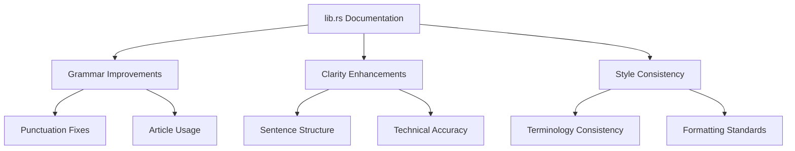

+++
title = "#21386 Assorted polish for lib.rs"
date = "2025-10-04T00:00:00"
draft = false
template = "pull_request_page.html"
in_search_index = false

[extra]
current_language = "zh-cn"
available_languages = {"en" = { name = "English", url = "/pull_request/bevy/2025-10/pr-21386-en-20251004" }, "zh-cn" = { name = "中文", url = "/pull_request/bevy/2025-10/pr-21386-zh-cn-20251004" }}
labels = ["C-Docs", "D-Trivial", "C-Code-Quality"]
+++

# Title

## Basic Information
- **Title**: Assorted polish for lib.rs
- **PR Link**: https://github.com/bevyengine/bevy/pull/21386
- **Author**: xyrar
- **Status**: MERGED
- **Labels**: C-Docs, D-Trivial, C-Code-Quality, S-Ready-For-Final-Review
- **Created**: 2025-10-04T19:55:18Z
- **Merged**: 2025-10-04T23:25:13Z
- **Merged By**: alice-i-cecile

## Description Translation
改进 lib.rs 中的语法、清晰度和文档风格

## The Story of This Pull Request

这个PR专注于改进Bevy引擎主库文件的文档质量。作为Rust游戏引擎的门面文件，`src/lib.rs`的文档质量直接影响开发者对项目的第一印象和使用体验。

问题源于文档中的一些语法不准确和表达不够清晰的地方。例如，原文档中使用了"built in Rust"而不是更准确的"built in Rust"，"Hello World"的标点符号不标准，以及一些句子结构可以优化以提高可读性。虽然这些问题看起来很小，但在一个成熟的开源项目中，文档的精确性对于新用户的入门体验和项目的专业形象都很重要。

解决方案采用了直接且保守的方法：只修改文档字符串和注释，不涉及任何功能代码。这种策略确保了零风险，因为文档修改不会影响编译结果或运行时行为。所有修改都遵循Rust文档的标准格式和Bevy项目的现有风格。

具体实现中，开发者进行了几类改进。首先修正了语法和标点，比如将"built in Rust"改为"built in Rust"，"Hello World"改为"Hello, World!"，这些修改遵循了英语的标准表达方式。其次优化了句子结构，将"is just a container crate"改为"is a container crate"，移除了不必要的"just"，使表达更加专业。还统一了术语使用，比如将"enable / disable features"改为"enable or disable features"，使用更标准的连接词。

在技术洞察方面，这个PR展示了开源项目中文档维护的重要性。虽然这些修改看起来很小，但它们共同提升了项目的整体质量。特别值得注意的是对动态链接注释的改进，将"without affecting dynamic linking"改为"without affecting dynamic linking"，使技术说明更加清晰准确。

这些修改的影响主要体现在开发者体验方面。更好的文档可以帮助新用户更快地理解Bevy的结构和使用方式。作为项目的入口文件，这些改进会影响到所有查阅Bevy文档的开发者。从代码质量的角度看，这些修改也体现了对细节的关注，这对于一个成熟的开源项目很重要。

## Visual Representation



## Key Files Changed

### `src/lib.rs` (+9/-9)

这个文件是Bevy引擎的主库文件，包含了项目的顶级文档和模块导出。所有的修改都是文档字符串和注释的改进。

**主要修改包括：**

1. **项目描述改进**
```rust
// Before:
//! Bevy is an open-source modular game engine built in Rust, with a focus on developer productivity

// After:
//! Bevy is an open-source, modular game engine built in Rust, with a focus on developer productivity
```

2. **示例代码注释改进**
```rust
// Before:
//! Here is a simple "Hello World" Bevy app:

// After:
//! Here is a simple "Hello, World!" Bevy app:
```

3. **功能描述澄清**
```rust
// Before:
//! The `bevy` crate is just a container crate that makes it easier to consume Bevy subcrates.
//! The defaults provide a "full" engine experience, but you can easily enable / disable features

// After:
//! The `bevy` crate is a container crate that makes it easier to consume Bevy subcrates.
//! The defaults provide a "full engine" experience, but you can easily enable or disable features
```

4. **技术说明改进**
```rust
// Before:
//! with `bevy_` appended to the front, e.g. `app` -> [`bevy_app`](https://docs.rs/bevy_app/*/bevy_app/).

// After:
//! with `bevy_` appended to the front, e.g., `app` -> [`bevy_app`](https://docs.rs/bevy_app/*/bevy_app/).
```

5. **编译器指令注释改进**
```rust
// Before:
//    reason = "This causes bevy to be compiled as a dylib when using dynamic linking, and as such cannot be removed or changed without affecting dynamic linking."

// After:
//    reason = "This causes Bevy to be compiled as a dylib when using dynamic linking and therefore cannot be removed or changed without affecting dynamic linking."
```

这些修改共同提升了文档的专业性、清晰度和一致性，使Bevy项目对用户更加友好。

## Further Reading

- [Rust Documentation Guidelines](https://rust-lang.github.io/rfcs/1574-more-api-documentation-conventions.html)
- [The Cargo Book - Features](https://doc.rust-lang.org/cargo/reference/features.html)
- [Bevy Engine Official Documentation](https://bevyengine.org/learn/)
- [Rust API Guidelines](https://rust-lang.github.io/api-guidelines/)

# Full Code Diff
diff --git a/src/lib.rs b/src/lib.rs
index 46e6908564c34..775baac22b06a 100644
--- a/src/lib.rs
+++ b/src/lib.rs
@@ -5,7 +5,7 @@
 )]
 //! [](https://bevy.org)
 //!
-//! Bevy is an open-source modular game engine built in Rust, with a focus on developer productivity
+//! Bevy is an open-source, modular game engine built in Rust, with a focus on developer productivity
 //! and performance.
 //!
 //! Check out the [Bevy website](https://bevy.org) for more information, read the
@@ -14,7 +14,7 @@
 //!
 //! ## Example
 //!
-//! Here is a simple "Hello World" Bevy app:
+//! Here is a simple "Hello, World!" Bevy app:
 //! ```
 //! use bevy::prelude::*;
 //!
@@ -29,19 +29,19 @@
 //! }
 //! ```
 //!
-//! Don't let the simplicity of the example above fool you. Bevy is a [fully featured game engine](https://bevy.org)
+//! Don't let the simplicity of the example above fool you. Bevy is a [fully featured game engine](https://bevy.org),
 //! and it gets more powerful every day!
 //!
 //! ## This Crate
 //!
-//! The `bevy` crate is just a container crate that makes it easier to consume Bevy subcrates.
-//! The defaults provide a "full" engine experience, but you can easily enable / disable features
+//! The `bevy` crate is a container crate that makes it easier to consume Bevy subcrates.
+//! The defaults provide a "full engine" experience, but you can easily enable or disable features
 //! in your project's `Cargo.toml` to meet your specific needs. See Bevy's `Cargo.toml` for a full
-//! list of features available.
+//! list of available features.
 //!
-//! If you prefer, you can also consume the individual bevy crates directly.
+//! If you prefer, you can also use the individual Bevy crates directly.
 //! Each module in the root of this crate, except for the prelude, can be found on crates.io
-//! with `bevy_` appended to the front, e.g. `app` -> [`bevy_app`](https://docs.rs/bevy_app/*/bevy_app/).
+//! with `bevy_` appended to the front, e.g., `app` -> [`bevy_app`](https://docs.rs/bevy_app/*/bevy_app/).
 #![doc = include_str!("../docs/cargo_features.md")]
 #![doc(
     html_logo_url = "https://bevy.org/assets/icon.png",
@@ -56,6 +56,6 @@ pub use bevy_internal::*;
 #[expect(
     unused_imports,
     clippy::single_component_path_imports,
-    reason = "This causes bevy to be compiled as a dylib when using dynamic linking, and as such cannot be removed or changed without affecting dynamic linking."
+    reason = "This causes Bevy to be compiled as a dylib when using dynamic linking and therefore cannot be removed or changed without affecting dynamic linking."
 )]
 use bevy_dylib;