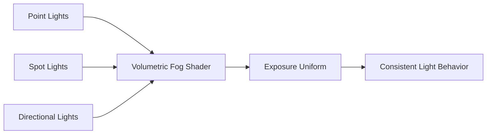

+++
title = "#21387 Fixed fog contribution for point and spotlights"
date = "2025-10-04T00:00:00"
draft = false
template = "pull_request_page.html"
in_search_index = true

[taxonomies]
list_display = ["show"]

[extra]
current_language = "en"
available_languages = {"en" = { name = "English", url = "/pull_request/bevy/2025-10/pr-21387-en-20251004" }, "zh-cn" = { name = "中文", url = "/pull_request/bevy/2025-10/pr-21387-zh-cn-20251004" }}
labels = ["C-Bug", "A-Rendering"]
+++

# Fixed fog contribution for point and spotlights

## Basic Information
- **Title**: Fixed fog contribution for point and spotlights
- **PR Link**: https://github.com/bevyengine/bevy/pull/21387
- **Author**: JeroenHoogers
- **Status**: MERGED
- **Labels**: C-Bug, A-Rendering, S-Ready-For-Final-Review
- **Created**: 2025-10-04T20:44:47Z
- **Merged**: 2025-10-04T22:55:21Z
- **Merged By**: alice-i-cecile

## Description Translation
**Objective**

Fixes #21327 
Volumetric fog contribution was not proportional to the light intensity for point and spotlights.

**Solution**

Take into account `exposure` value for Point and Spotlights to match the Directional light implementation.

**Testing**

- Run the updated `volumetric_fog` example. You can see the volumetric effect of point and spotlights now match the intensity of this light on the surfaces of the room. 

---

**Showcase**

Point and spotlight intensities in the original `volumetric_fog` example were too low to light up the room despite having a very strong volumetric contribution. This update boosts the light intensity and lowers the volumetric contribution of point and spotlights

Before this change `volumetric_fog` example with 10x light intensity for point and spotlights:


After change:


## The Story of This Pull Request

This PR addresses a specific rendering inconsistency in Bevy's volumetric fog system. The core issue was that point lights and spotlights were producing disproportionately strong volumetric fog effects compared to their actual illumination of scene surfaces.

The problem stemmed from an inconsistency in how different light types handled exposure calculations in the volumetric fog shader. While directional lights properly accounted for camera exposure settings, point and spotlights were using a hardcoded scaling factor of 0.1 instead of the actual exposure value. This created a visual disconnect where lights could appear to have strong volumetric scattering in fog while barely illuminating the actual scene geometry.

The solution approach was straightforward: align the point and spotlight volumetric fog calculations with the existing directional light implementation. This involved replacing the magic number 0.1 with the proper `exposure` uniform variable in the shader code. The fix ensures consistent light behavior across all light types and maintains proper HDR tone mapping integration.

Looking at the implementation details, the key change occurs in the volumetric fog shader where the light contribution calculation is modified:

```wgsl
// Before:
let light_factors_per_step = fog_color * light_tint * light_attenuation *
    scattering * density * step_size_world * light_intensity * 0.1;

// After:
let light_factors_per_step = fog_color * light_tint * light_attenuation *
    scattering * density * step_size_world * light_intensity * exposure;
```

This change has important technical implications. By using the actual exposure value instead of a fixed constant, the volumetric fog now properly responds to camera exposure settings and maintains consistent behavior with the rest of the rendering pipeline. This is particularly important for HDR rendering workflows where exposure values can vary significantly.

The example updates are equally important - they demonstrate that with the corrected calculations, the light intensities needed to be increased to maintain the desired visual effect. The point light intensity was increased from 1000.0 to 10,000.0, and the spotlight from 5000.0 to 50,000.0. These adjustments show that the original example values were likely chosen to compensate for the broken volumetric calculations, and now reflect more appropriate values for the corrected implementation.

The impact of this fix is significant for anyone using volumetric fog with point or spotlights. It ensures that light behavior is predictable and consistent, and that artists can trust that the light intensity values they set will produce proportional results in both surface lighting and volumetric effects.

## Visual Representation



## Key Files Changed

### `crates/bevy_pbr/src/volumetric_fog/volumetric_fog.wgsl`

This shader file contains the core volumetric fog calculations. The key change replaces a hardcoded scaling factor with the proper exposure uniform.

```wgsl
// Key change in volumetric fog calculation:
// Before:
let light_factors_per_step = fog_color * light_tint * light_attenuation *
    scattering * density * step_size_world * light_intensity * 0.1;

// After:
let light_factors_per_step = fog_color * light_tint * light_attenuation *
    scattering * density * step_size_world * light_intensity * exposure;
```

### `examples/3d/volumetric_fog.rs`

The example file was updated to use more appropriate light intensities that work correctly with the fixed shader calculations.

```rust
// Point light intensity adjustment:
// Before:
intensity: 1000.0,

// After:
intensity: 10_000.0,

// Spotlight intensity adjustment:
// Before:
intensity: 5000.0, // lumens

// After:
intensity: 50_000.0, // lumens
```

## Further Reading

- [Bevy Volumetric Fog Documentation](https://docs.rs/bevy/latest/bevy/pbr/struct.VolumetricFogSettings.html)
- [WGSL Shader Language Specification](https://www.w3.org/TR/WGSL/)
- [Physically Based Rendering and HDR](https://learnopengl.com/Advanced-Lighting/HDR)
- [Bevy Rendering Architecture](https://bevy-cheatbook.github.io/features/rendering.html)