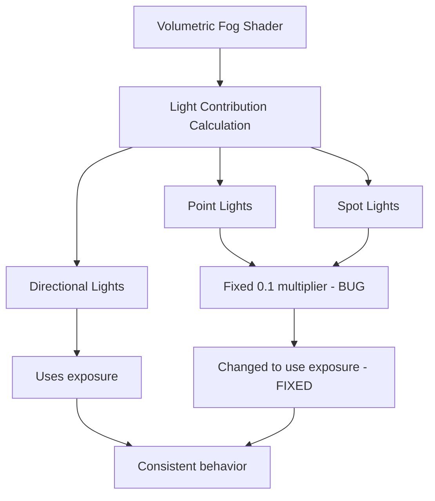

+++
title = "#21387 Fixed fog contribution for point and spotlights"
date = "2025-10-04T00:00:00"
draft = false
template = "pull_request_page.html"
in_search_index = false

[extra]
current_language = "zh-cn"
available_languages = {"en" = { name = "English", url = "/pull_request/bevy/2025-10/pr-21387-en-20251004" }, "zh-cn" = { name = "中文", url = "/pull_request/bevy/2025-10/pr-21387-zh-cn-20251004" }}
labels = ["C-Bug", "A-Rendering"]
+++

# Fixed fog contribution for point and spotlights

## Basic Information
- **Title**: Fixed fog contribution for point and spotlights
- **PR Link**: https://github.com/bevyengine/bevy/pull/21387
- **Author**: JeroenHoogers
- **Status**: MERGED
- **Labels**: C-Bug, A-Rendering, S-Ready-For-Final-Review
- **Created**: 2025-10-04T20:44:47Z
- **Merged**: 2025-10-04T22:55:21Z
- **Merged By**: alice-i-cecile

## Description Translation
### 目标
修复 #21327
点光源和聚光灯的体积极雾贡献与光照强度不成比例。

### 解决方案
对于点光源和聚光灯，考虑 `exposure` 值以匹配定向光的实现。

### 测试
- 运行更新后的 `volumetric_fog` 示例。您现在可以看到点光源和聚光灯的体积极效果现在与这些光源在房间表面的强度相匹配。

---

### 展示
在原始的 `volumetric_fog` 示例中，点光源和聚光灯的强度太低，无法照亮房间，尽管它们具有非常强的体积极贡献。此更新提高了光照强度并降低了点光源和聚光灯的体积极贡献。

在此更改之前，`volumetric_fog` 示例中点光源和聚光灯的光照强度为10倍：


更改后：


## The Story of This Pull Request

### 问题识别与背景
在 Bevy 引擎的体积极雾渲染系统中，开发者发现点光源和聚光灯的体积极雾贡献存在不一致的问题。具体表现为：这些光源在体积极雾中的视觉效果与它们对场景表面的实际照明强度不匹配。问题 #21327 报告了体积极雾贡献与光照强度不成比例的情况。

问题的核心在于着色器计算中使用了硬编码的乘数 0.1，而没有考虑曝光（exposure）设置。这导致了体积极雾效果与场景照明的视觉不一致——点光源和聚光灯在雾中看起来过于强烈，而实际上它们对场景表面的照明却很弱。

### 解决方案分析
开发者采用了直接且有效的修复方法：将点光源和聚光灯的体积极雾计算与定向光保持一致。具体来说，将硬编码的系数 0.1 替换为 `exposure` 变量，这样所有类型的光源都使用相同的曝光计算逻辑。

这个解决方案的优势在于：
- 保持代码一致性：所有光源类型使用相同的计算方法
- 符合物理渲染原则：曝光设置应该影响所有光照计算
- 最小化代码变更：只修改必要的计算部分

### 实现细节
在 `volumetric_fog.wgsl` 着色器中，关键修改位于光照因子计算部分。原来的实现对点光源和聚光灯使用了固定的衰减系数：

```wgsl
// 修改前：
let light_factors_per_step = fog_color * light_tint * light_attenuation *
    scattering * density * step_size_world * light_intensity * 0.1;
```

修改后使用曝光值：

```wgsl
// 修改后：
let light_factors_per_step = fog_color * light_tint * light_attenuation *
    scattering * density * step_size_world * light_intensity * exposure;
```

这个变更确保了体积极雾的贡献计算与场景的曝光设置保持一致，使得视觉效果更加真实。

### 技术洞察
从技术角度看，这个修复涉及了体积极渲染中的光照传输计算。在体积极介质中，光照的散射和吸收遵循特定的物理模型。使用曝光值而不是固定系数，使得计算更符合真实的物理行为：

- **曝光（exposure）** 在渲染管线中用于模拟相机传感器对光线的敏感度
- **光照强度（light_intensity）** 表示光源的物理强度
- **散射系数（scattering）** 控制雾对光线的散射程度

通过将固定系数替换为曝光值，系统现在能够正确处理高动态范围（HDR）渲染场景，其中不同的曝光设置会产生不同的视觉效果。

### 影响与调整
由于修复改变了体积极雾的计算方式，开发者还需要调整示例中的光照强度值以保持视觉平衡：

- 点光源强度从 1000.0 增加到 10,000.0
- 聚光灯强度从 5000.0 增加到 50,000.0

这些调整确保了修复后的视觉效果与修复前相当，同时保持了正确的物理计算关系。从展示图片可以看出，修复后的场景中，体积极雾效果与表面照明更加协调一致。

## Visual Representation



## Key Files Changed

### 1. `crates/bevy_pbr/src/volumetric_fog/volumetric_fog.wgsl`

这个文件包含了体积极雾的着色器实现。主要修改是将点光源和聚光灯的体积极雾贡献计算从使用固定乘数改为使用曝光值。

```wgsl
// 关键修改：
// 修改前：
let light_factors_per_step = fog_color * light_tint * light_attenuation *
    scattering * density * step_size_world * light_intensity * 0.1;

// 修改后：
let light_factors_per_step = fog_color * light_tint * light_attenuation *
    scattering * density * step_size_world * light_intensity * exposure;
```

这个修改确保了所有类型的光源在体积极雾计算中都使用相同的曝光逻辑。

### 2. `examples/3d/volumetric_fog.rs`

这个示例文件进行了相应的光照强度调整，以配合着色器的修复：

```rust
// 点光源强度调整：
// 修改前：
intensity: 1000.0,

// 修改后：
intensity: 10_000.0,

// 聚光灯强度调整：
// 修改前：
intensity: 5000.0, // lumens

// 修改后：
intensity: 50_000.0, // lumens
```

这些调整确保了修复后的视觉效果保持合理，同时展示了修复的正确性。

## Further Reading

- [Bevy 渲染管线文档](https://bevyengine.org/learn/book/introduction/)
- [WGSL 着色器语言规范](https://gpuweb.github.io/gpuweb/wgsl/)
- [体积极渲染理论基础](https://developer.nvidia.com/gpugems/gpugems/part-vi-beyond-triangles/chapter-19-volume-rendering-techniques)
- [物理基础渲染中的曝光控制](https://learnopengl.com/Advanced-Lighting/HDR)