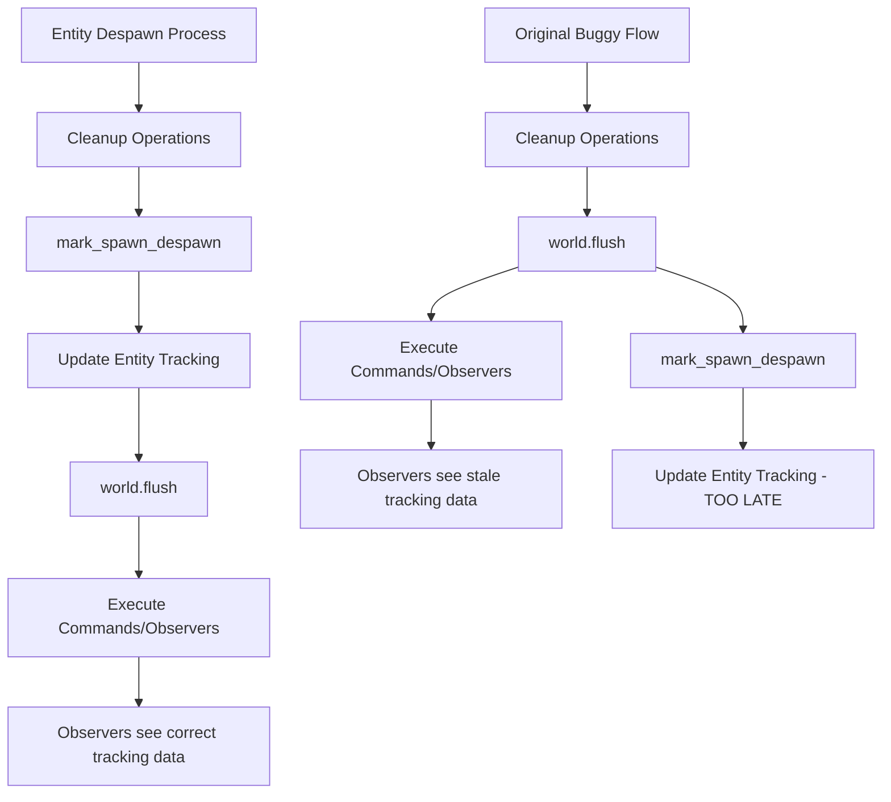

+++
title = "#21397 Call `world.flush()` after `mark_spawn_despawn()`"
date = "2025-10-05T00:00:00"
draft = false
template = "pull_request_page.html"
in_search_index = true

[taxonomies]
list_display = ["show"]

[extra]
current_language = "en"
available_languages = {"en" = { name = "English", url = "/pull_request/bevy/2025-10/pr-21397-en-20251005" }, "zh-cn" = { name = "中文", url = "/pull_request/bevy/2025-10/pr-21397-zh-cn-20251005" }}
labels = ["C-Bug", "A-ECS"]
+++

# Call `world.flush()` after `mark_spawn_despawn()`

## Basic Information
- **Title**: Call `world.flush()` after `mark_spawn_despawn()`
- **PR Link**: https://github.com/bevyengine/bevy/pull/21397
- **Author**: chescock
- **Status**: MERGED
- **Labels**: C-Bug, A-ECS, S-Needs-Review
- **Created**: 2025-10-05T15:23:59Z
- **Merged**: 2025-10-05T20:03:19Z
- **Merged By**: alice-i-cecile

## Description Translation
# Objective

During despawn, commands are flushed before writing the `despawned_by` location.  This means that commands run by observers will not see the updated value.  It also means an entity spawned by one of those commands that re-uses the entity index may have its `spawned_by` overwritten by the `despawned_by` meant for the original entity.  

## Solution

Move the call to `world.flush()` after the call to `mark_spawn_despawn()`.

## Testing

Added a unit test demonstrating the issue.

## The Story of This Pull Request

This PR addresses a subtle but important timing issue in Bevy's ECS (Entity Component System) despawn mechanism. The core problem revolves around the order of operations when despawning entities and how this interacts with Bevy's command system and entity lifecycle tracking.

The issue occurred in the `despawn` method of `EntityWorldMut`. In the original implementation, the code was structured like this:

```rust
// Original problematic order:
// 1. Various cleanup operations
// 2. world.flush() - commands executed here
// 3. mark_spawn_despawn() - entity tracking updated here
```

This ordering created two specific problems. First, when observers (systems that react to component changes or entity lifecycle events) ran during the command flush, they would query for the `despawned_by` information, but this data hadn't been written yet. Second, if a new entity was spawned during the command flush and happened to reuse the same entity index, the new entity's `spawned_by` information could be incorrectly overwritten by the `despawned_by` data intended for the original entity.

The solution was straightforward but critical: simply swap the order of these two operations:

```rust
// Fixed order:
// 1. Various cleanup operations  
// 2. mark_spawn_despawn() - entity tracking updated first
// 3. world.flush() - commands executed after tracking is updated
```

This ensures that when commands (including observer systems) run during the flush, they see the correct entity tracking state. The `despawned_by` information is properly recorded before any systems have a chance to react to the despawn event.

The fix demonstrates an important principle in systems programming: the order of state transitions matters, especially when those transitions can trigger other systems. In this case, we need to ensure the entity's lifecycle state is fully updated before allowing other systems to observe or react to that state change.

To validate the fix, the PR includes a comprehensive unit test that specifically reproduces the problematic scenario. The test uses Bevy's hook system to attach a despawn observer that verifies the `despawned_by` information is correctly available when the observer runs:

```rust
#[test]
fn spawned_by_set_before_flush() {
    #[derive(Component)]
    #[component(on_despawn = on_despawn)]
    struct C;

    fn on_despawn(mut world: DeferredWorld, context: HookContext) {
        let spawned = world.entity(context.entity).spawned_by();
        world.commands().queue(move |world: &mut World| {
            // The entity has finished despawning...
            assert!(world.get_entity(context.entity).is_err());
            let despawned = world
                .entities()
                .entity_get_spawned_or_despawned_by(context.entity);
            // These assertions are only possible if the `track_location` feature is enabled
            if let (Some(spawned), Some(despawned)) =
                (spawned.into_option(), despawned.into_option())
            {
                // ... so ensure that `despawned_by` has been written
                assert!(despawned.is_some());
                assert_ne!(Some(spawned), despawned);
            }
        });
    }

    let mut world = World::new();
    let original = world.spawn(C).id();
    world.despawn(original);
}
```

This test creates a component with a despawn hook, spawns an entity with that component, then despawns it. The hook verifies that the `despawned_by` information is properly set and available when the observer runs, which wouldn't have been true with the original buggy ordering.

## Visual Representation



## Key Files Changed

### `crates/bevy_ecs/src/world/entity_ref.rs` (+32/-1)

This file contains the core implementation of entity references and world operations in Bevy's ECS. The changes fix a critical timing issue in the entity despawn process.

**Key modification in the `despawn` method:**

```rust
// Before:
// ... various cleanup operations ...
world.flush();

// SAFETY: `self.entity` is a valid entity index
unsafe {
    world
        .entities
        .mark_spawn_despawn(self.entity.index(), caller, change_tick);
}

// After:
// ... various cleanup operations (same as before) ...

// SAFETY: `self.entity` is a valid entity index
unsafe {
    world
        .entities
        .mark_spawn_despawn(self.entity.index(), caller, change_tick);
}

world.flush();
```

The change is minimal but significant - it ensures that entity tracking information is updated before any commands or observers run during the flush.

**New test added:**

The PR also adds a comprehensive unit test (`spawned_by_set_before_flush`) that specifically validates the fix by creating a scenario where an observer needs to access the `despawned_by` information during the despawn process.

## Further Reading

- [Bevy ECS Documentation](https://docs.rs/bevy_ecs/latest/bevy_ecs/) - Official documentation for Bevy's Entity Component System
- [Bevy Observers Guide](https://bevyengine.org/learn/quick-start/ecs-observers/) - How to use observers in Bevy
- [Entity Lifecycle Tracking](https://github.com/bevyengine/bevy/blob/main/crates/bevy_ecs/src/entity/entities.rs) - Source code for entity tracking implementation
- [Command System in Bevy](https://bevy-cheatbook.github.io/programming/commands.html) - Explanation of Bevy's command execution model