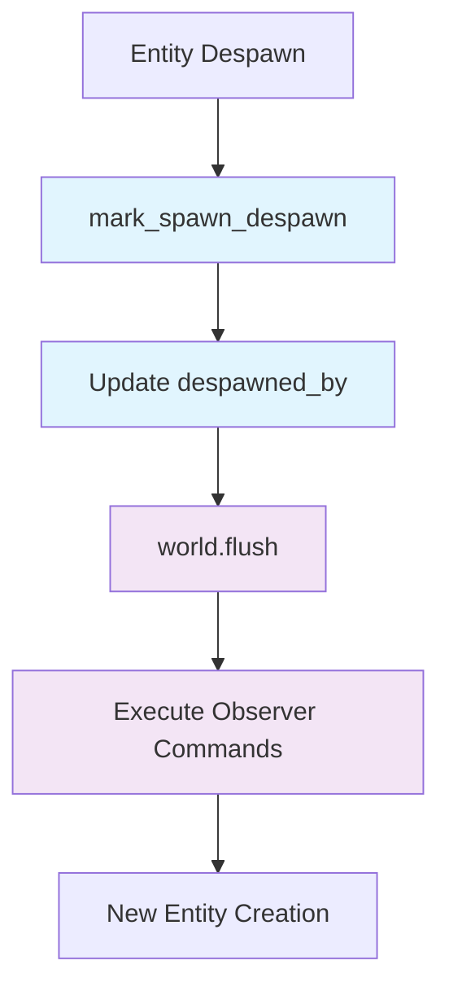

+++
title = "#21397 Call `world.flush()` after `mark_spawn_despawn()`"
date = "2025-10-05T00:00:00"
draft = false
template = "pull_request_page.html"
in_search_index = false

[extra]
current_language = "zh-cn"
available_languages = {"en" = { name = "English", url = "/pull_request/bevy/2025-10/pr-21397-en-20251005" }, "zh-cn" = { name = "中文", url = "/pull_request/bevy/2025-10/pr-21397-zh-cn-20251005" }}
labels = ["C-Bug", "A-ECS"]
+++

# Call `world.flush()` after `mark_spawn_despawn()`

## Basic Information
- **Title**: Call `world.flush()` after `mark_spawn_despawn()`
- **PR Link**: https://github.com/bevyengine/bevy/pull/21397
- **Author**: chescock
- **Status**: MERGED
- **Labels**: C-Bug, A-ECS, S-Needs-Review
- **Created**: 2025-10-05T15:23:59Z
- **Merged**: 2025-10-05T20:03:19Z
- **Merged By**: alice-i-cecile

## Description Translation
# 目标

在反生成（despawn）过程中，命令在写入`despawned_by`位置之前被刷新（flush）。这意味着观察者（observers）运行的命令将不会看到更新后的值。这也意味着由这些命令生成的实体（entity）如果重用了实体索引，则其`spawned_by`可能会被原本用于原始实体的`despawned_by`覆盖。

# 解决方案

将`world.flush()`的调用移到`mark_spawn_despawn()`之后。

# 测试

添加了一个单元测试来演示这个问题。

## The Story of This Pull Request

这个PR解决了一个ECS（Entity Component System）中的时序问题，涉及实体生命周期追踪和命令执行的顺序问题。

**问题根源在于命令刷新与实体状态更新的竞争条件**。在Bevy的ECS系统中，当实体被反生成时，系统需要记录该实体的`despawned_by`信息，用于追踪实体的生命周期。然而，在原始代码中，`world.flush()`在`mark_spawn_despawn()`之前被调用，这导致了两个具体问题：

首先，观察者（observers）在反生成钩子中执行的命令无法看到正确的`despawned_by`值，因为命令执行时该值尚未被设置。其次，更严重的是，如果观察者命令中生成了新的实体，并且这个新实体重用了被反生成实体的索引，那么新实体的`spawned_by`信息可能会被错误的`despawned_by`值覆盖。

**解决方案是调整两个关键操作的执行顺序**。通过将`world.flush()`移到`mark_spawn_despawn()`之后，确保了实体状态更新在命令执行之前完成。这种调整保证了：

1. 观察者命令能够访问到正确的实体状态信息
2. 新生成的实体不会受到前一个实体状态信息的污染
3. 实体生命周期的追踪信息保持一致性

**实现的核心在于理解Bevy ECS的内部工作机制**。`mark_spawn_despawn()`函数负责更新实体的生成/反生成追踪信息，而`world.flush()`会执行所有挂起的命令，包括观察者触发的命令。正确的顺序确保了状态更新先于依赖这些状态的操作。

**测试用例的设计很好地展示了问题的本质**。测试创建了一个带有反生成钩子的组件，在钩子中验证了实体状态的一致性。通过断言`despawned_by`已被正确设置，并且新生成的实体不会受到污染，测试确保了修复的有效性。

这个修复虽然代码改动很小，但对于确保ECS系统实体生命周期追踪的正确性至关重要，特别是在涉及观察者和命令队列的复杂场景中。

## Visual Representation



## Key Files Changed

### `crates/bevy_ecs/src/world/entity_ref.rs` (+32/-1)

这个文件包含了主要的修复逻辑和相应的测试用例。

**核心修复：调整命令刷新时机**
```rust
// Before:
// world.flush();

// SAFETY: `self.entity` is a valid entity index
unsafe {
    world
        .entities
        .mark_spawn_despawn(self.entity.index(), caller, change_tick);
}

// After:
// SAFETY: `self.entity` is a valid entity index
unsafe {
    world
        .entities
        .mark_spawn_despawn(self.entity.index(), caller, change_tick);
}

world.flush();
```

**新增测试用例验证修复：**
```rust
#[test]
fn spawned_by_set_before_flush() {
    #[derive(Component)]
    #[component(on_despawn = on_despawn)]
    struct C;

    fn on_despawn(mut world: DeferredWorld, context: HookContext) {
        let spawned = world.entity(context.entity).spawned_by();
        world.commands().queue(move |world: &mut World| {
            // The entity has finished despawning...
            assert!(world.get_entity(context.entity).is_err());
            let despawned = world
                .entities()
                .entity_get_spawned_or_despawned_by(context.entity);
            // These assertions are only possible if the `track_location` feature is enabled
            if let (Some(spawned), Some(despawned)) =
                (spawned.into_option(), despawned.into_option())
            {
                // ... so ensure that `despawned_by` has been written
                assert!(despawned.is_some());
                assert_ne!(Some(spawned), despawned);
            }
        });
    }

    let mut world = World::new();
    let original = world.spawn(C).id();
    world.despawn(original);
}
```

## Further Reading

- [Bevy ECS 官方文档](https://bevyengine.org/learn/book/ecs/)
- [实体生命周期追踪 RFC](https://github.com/bevyengine/bevy/issues/357)
- [观察者模式在 ECS 中的应用](https://github.com/bevyengine/bevy/issues/2212)
- [命令队列和执行时机](https://bevyengine.org/learn/book/advanced/commands/)