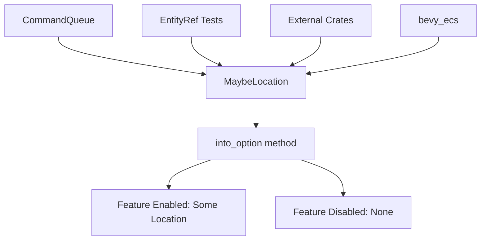

+++
title = "#21399 Remove uses of `#[cfg(feature = \"track_location\")]` outside of the implementation of `MaybeLocation`"
date = "2025-10-05T00:00:00"
draft = false
template = "pull_request_page.html"
in_search_index = true

[taxonomies]
list_display = ["show"]

[extra]
current_language = "en"
available_languages = {"en" = { name = "English", url = "/pull_request/bevy/2025-10/pr-21399-en-20251005" }, "zh-cn" = { name = "中文", url = "/pull_request/bevy/2025-10/pr-21399-zh-cn-20251005" }}
labels = ["A-ECS", "C-Code-Quality", "D-Straightforward"]
+++

# Title

## Basic Information
- **Title**: Remove uses of `#[cfg(feature = "track_location")]` outside of the implementation of `MaybeLocation`
- **PR Link**: https://github.com/bevyengine/bevy/pull/21399
- **Author**: chescock
- **Status**: MERGED
- **Labels**: A-ECS, C-Code-Quality, S-Ready-For-Final-Review, D-Straightforward
- **Created**: 2025-10-05T15:39:21Z
- **Merged**: 2025-10-05T20:30:40Z
- **Merged By**: alice-i-cecile

## Description Translation
# Objective

Remove uses of `#[cfg(feature = "track_location")]` outside of the implementation of `MaybeLocation`.  

Reducing the amount of conditional compilation makes the code less brittle, since compilation errors will be found regardless of whether the feature is enabled.  

We also want to ensure that uses of `MaybeLocation` outside of `bevy_ecs` don't need their *own* feature flags.  Avoiding the flags even within `bevy_ecs` helps ensure that all use cases are covered, and makes it easier to move or copy implementations from `bevy_ecs` into other crates.  

## Solution

Remove `#[cfg(feature = "track_location")]` annotations.  Use `.into_option()` in the cases where we want the behavior to depend on whether the feature is enabled.

## The Story of This Pull Request

This PR addresses a code quality issue in Bevy's ECS (Entity Component System) related to conditional compilation. The problem centered around the `track_location` feature flag, which was being used extensively throughout the codebase rather than being contained within the `MaybeLocation` type's implementation.

The core issue was that conditional compilation with `#[cfg(feature = "track_location")]` was scattered across multiple files, making the code harder to maintain and test. When feature flags are used extensively, compilation errors might only surface when the feature is enabled or disabled, leading to brittle code that could break in different build configurations. Additionally, this approach created friction for developers wanting to use `MaybeLocation` outside of `bevy_ecs`, as they would need to manage their own feature flags.

The solution adopted a more disciplined approach to feature flag management. Instead of conditionally compiling entire sections of code based on the feature flag, the PR moves to using `MaybeLocation::into_option()` at the point of use. This method returns `Some(location)` when the feature is enabled and `None` when it's disabled, allowing the same code to compile regardless of the feature flag state while maintaining the appropriate runtime behavior.

In `command_queue.rs`, the changes were structural. The `caller` field was made unconditional in the `CommandQueue` struct:

```rust
// Before:
#[cfg(feature = "track_location")]
pub(crate) caller: MaybeLocation,

// After:
pub(crate) caller: MaybeLocation,
```

Similarly, the `Default` implementation now always initializes the `caller` field:

```rust
// Before:
#[cfg(feature = "track_location")]
caller: MaybeLocation::caller(),

// After:
caller: MaybeLocation::caller(),
```

The `Debug` implementation was simplified by removing conditional field addition and instead relying on `MaybeLocation`'s own `Debug` implementation:

```rust
// Before:
let mut binding = f.debug_struct("CommandQueue");
binding.field("len_bytes", &self.bytes.len());

#[cfg(feature = "track_location")]
binding.field("caller", &self.caller.into_option());

binding.finish_non_exhaustive()

// After:
f.debug_struct("CommandQueue")
    .field("len_bytes", &self.bytes.len())
    .field("caller", &self.caller)
    .finish_non_exhaustive()
```

The `Drop` implementation demonstrates the key pattern of using `into_option()` for conditional behavior:

```rust
// Before:
#[cfg(feature = "track_location")]
warn!("CommandQueue has un-applied commands being dropped. Did you forget to call SystemState::apply? caller:{:?}",self.caller.into_option());
#[cfg(not(feature = "track_location"))]
warn!("CommandQueue has un-applied commands being dropped. Did you forget to call SystemState::apply?");

// After:
if let Some(caller) = self.caller.into_option() {
    warn!("CommandQueue has un-applied commands being dropped. Did you forget to call SystemState::apply? caller:{caller:?}");
} else {
    warn!("CommandQueue has un-applied commands being dropped. Did you forget to call SystemState::apply?");
}
```

In `entity_ref.rs`, the test code was updated to use the same pattern, making the tests compile unconditionally while only running location-specific assertions when the feature is enabled:

```rust
// Before:
#[cfg(feature = "track_location")]
let e1_spawned = world.entity(id1).spawned_by();
// ... more conditional code ...

// After:
let e1_spawned = world.entity(id1).spawned_by();
// ... unconditional code ...
if let (Some(e1_spawned), Some(e1_despawned)) = 
    (e1_spawned.into_option(), e1_despawned.into_option()) 
{
    assert!(e1_despawned.is_some());
    assert_ne!(Some(e1_spawned), e1_despawned);
}
```

This approach provides several technical benefits. First, it ensures that all code paths are compiled regardless of feature flag settings, catching potential compilation errors early. Second, it reduces code duplication by eliminating the need for parallel implementations for feature-enabled and feature-disabled scenarios. Third, it makes the codebase more maintainable by localizing feature-specific behavior to the `MaybeLocation` type itself.

The architectural insight here is that feature flags should be treated as implementation details of specific types rather than as global compile-time switches that affect large portions of the codebase. By encapsulating the feature-dependent behavior within `MaybeLocation`, the rest of the code can interact with it through a stable interface that works consistently regardless of the feature flag state.

This change aligns with software engineering best practices for feature flag management, where the goal is to minimize the impact of feature flags on the overall code structure and maintain a clean separation between feature-dependent and feature-independent code.

## Visual Representation



## Key Files Changed

### `crates/bevy_ecs/src/world/command_queue.rs` (+10/-15)

This file contains the core command execution system in Bevy's ECS. The changes remove conditional compilation around location tracking and use `into_option()` for conditional behavior.

**Key changes:**
- Made `caller` field unconditional in `CommandQueue` struct
- Simplified `Debug` implementation to always include caller field
- Used `into_option()` in `Drop` implementation for conditional warning messages

```rust
// Key change in Drop implementation:
if let Some(caller) = self.caller.into_option() {
    warn!("CommandQueue has un-applied commands being dropped. Did you forget to call SystemState::apply? caller:{caller:?}");
} else {
    warn!("CommandQueue has un-applied commands being dropped. Did you forget to call SystemState::apply?");
}
```

### `crates/bevy_ecs/src/world/entity_ref.rs` (+8/-4)

This file handles entity references and their operations. The changes update tests to use the new `into_option()` pattern.

**Key changes:**
- Removed conditional compilation from test code
- Used `into_option()` to conditionally run location-specific assertions

```rust
// Key change in test assertions:
if let (Some(e1_spawned), Some(e1_despawned)) =
    (e1_spawned.into_option(), e1_despawned.into_option())
{
    assert!(e1_despawned.is_some());
    assert_ne!(Some(e1_spawned), e1_despawned);
}
```

## Further Reading

- [Rust Conditional Compilation](https://doc.rust-lang.org/reference/conditional-compilation.html) - Official Rust documentation on `#[cfg]` attributes
- [Feature Flag Best Practices](https://martinfowler.com/articles/feature-toggles.html) - Martin Fowler's comprehensive guide to feature toggles
- [Bevy ECS Documentation](https://bevyengine.org/learn/quick-start/ecs/) - Bevy's Entity Component System overview
- [Rust Enum and Option Types](https://doc.rust-lang.org/book/ch06-00-enums.html) - Rust enums and the Option type pattern used in this PR