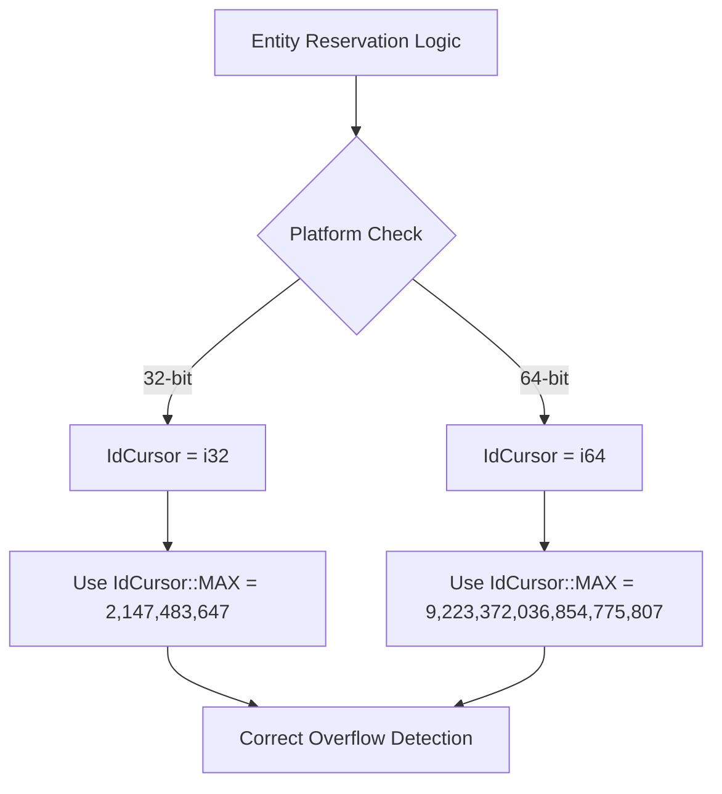

+++
title = "#21401 Fix entity reservation on 32-bit platforms"
date = "2025-10-05T00:00:00"
draft = false
template = "pull_request_page.html"
in_search_index = true

[taxonomies]
list_display = ["show"]

[extra]
current_language = "en"
available_languages = {"en" = { name = "English", url = "/pull_request/bevy/2025-10/pr-21401-en-20251005" }, "zh-cn" = { name = "中文", url = "/pull_request/bevy/2025-10/pr-21401-zh-cn-20251005" }}
labels = ["C-Bug", "D-Trivial", "A-ECS", "O-Embedded"]
+++

# Title
Fix entity reservation on 32-bit platforms

## Basic Information
- **Title**: Fix entity reservation on 32-bit platforms
- **PR Link**: https://github.com/bevyengine/bevy/pull/21401
- **Author**: Shatur
- **Status**: MERGED
- **Labels**: C-Bug, D-Trivial, A-ECS, S-Ready-For-Final-Review, O-Embedded
- **Created**: 2025-10-05T17:28:04Z
- **Merged**: 2025-10-05T18:17:14Z
- **Merged By**: alice-i-cecile

## Description Translation
# Objective

- Casting `u32::MAX` to `IdCursor` on platforms such as GBA results in -1. 

## Solution

- I replaced with `IdCursor::MAX` and made the panic less cryptic.

## Testing

- I porting https://github.com/bushrat011899/bevy_mod_gba to 0.17 and this change fixes the breakout example.

## The Story of This Pull Request

This PR addresses a subtle but critical issue in Bevy's Entity Component System (ECS) that affected 32-bit platforms, particularly embedded systems like the Game Boy Advance (GBA). The problem emerged when the engine attempted to reserve entity IDs beyond the limits of 32-bit integer arithmetic.

The core issue was in the entity reservation logic where the code used `u32::MAX as IdCursor` to check for overflow conditions. On platforms where `IdCursor` is a 32-bit integer type (like GBA), casting `u32::MAX` (4,294,967,295) to a signed 32-bit integer results in -1 due to two's complement representation. This made the overflow check effectively useless, as the condition `raw >= -1` would almost always be true for any non-negative value of `raw`.

The developer approached this by replacing the problematic cast with `IdCursor::MAX`, which correctly represents the maximum value for the `IdCursor` type on the target platform. This ensures consistent behavior across different architectures - on 64-bit systems, `IdCursor::MAX` would be a large positive number, while on 32-bit systems it would be 2,147,483,647.

Additionally, the panic message was improved from the cryptic "too many entities" to a more informative "number of entities can't exceed {IdCursor::MAX}", making debugging easier for developers encountering this limit.

The fix was validated by porting the `bevy_mod_gba` project to Bevy 0.17, where it resolved issues in the breakout example that were previously caused by the incorrect overflow detection. This demonstrates the practical impact of the fix on real embedded game development scenarios.

The change is minimal but significant because entity management is fundamental to ECS performance and correctness. Incorrect overflow detection could lead to either premature panics or, worse, silent entity ID corruption when the actual limit is exceeded.

## Visual Representation



## Key Files Changed

- `crates/bevy_ecs/src/entity/mod.rs` (+2/-2)

This file contains the core entity management logic for Bevy's ECS. The changes were made in the `reserve_entities` method of the `Entities` structure, which handles allocating new entity IDs.

```rust
// File: crates/bevy_ecs/src/entity/mod.rs
// Before:
if raw >= u32::MAX as IdCursor {
    panic!("too many entities");
}

// After:
if raw == IdCursor::MAX {
    panic!("number of entities can't exceed {}", IdCursor::MAX);
}
```

The changes address two issues:
1. **Platform-specific casting**: Replaced `u32::MAX as IdCursor` with `IdCursor::MAX` to ensure correct overflow detection on all