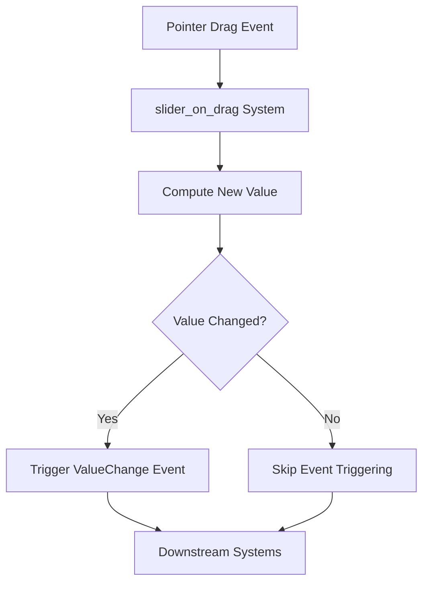

+++
title = "#21404 Emit slider drag value change only when value changes"
date = "2025-10-05T00:00:00"
draft = false
template = "pull_request_page.html"
in_search_index = true

[taxonomies]
list_display = ["show"]

[extra]
current_language = "en"
available_languages = {"en" = { name = "English", url = "/pull_request/bevy/2025-10/pr-21404-en-20251005" }, "zh-cn" = { name = "中文", url = "/pull_request/bevy/2025-10/pr-21404-zh-cn-20251005" }}
labels = ["C-Bug", "A-UI"]
+++

# Title
Emitting Slider Drag Value Changes Only When Values Actually Change

## Basic Information
- **Title**: Emit slider drag value change only when value changes
- **PR Link**: https://github.com/bevyengine/bevy/pull/21404
- **Author**: doup
- **Status**: MERGED
- **Labels**: C-Bug, A-UI, S-Ready-For-Final-Review
- **Created**: 2025-10-05T19:12:23Z
- **Merged**: 2025-10-05T19:59:21Z
- **Merged By**: alice-i-cecile

## Description Translation
# Objective

Fixes #21376

## Solution

Just check if the value has changed with an `if`.  The issue mentions `.set_if_neq` but I'm not sure if it's relevant as `slider_on_drag` doesn't directly change the component value but emits an event.

## Testing

Checked on the feathers example:

https://github.com/user-attachments/assets/ac5bb2fa-9054-4eed-985f-846ac15f310d

## The Story of This Pull Request

This PR addresses a subtle but important issue in Bevy's UI slider widget implementation. The problem was straightforward: slider drag events were being triggered continuously during drag operations, even when the actual slider value hadn't changed. This led to unnecessary event processing and potential performance issues in applications using sliders.

The core issue was in the `slider_on_drag` system, which handles pointer drag events for slider widgets. Previously, this system would emit a `ValueChange` event every time a drag event occurred, without checking whether the computed slider value had actually changed from its previous value.

The solution implemented is a classic optimization pattern - only perform work when the data has actually changed. The developer added a simple conditional check that compares the newly computed slider value with the current value before triggering the change event. This prevents redundant event emissions when the user is dragging the slider but the underlying value remains the same due to precision constraints or other factors.

The implementation required two key changes to the `slider_on_drag` function:

1. **Query Expansion**: The system query was modified to include the current `SliderValue` component, which wasn't previously accessed in this context.

2. **Conditional Event Triggering**: Added an `if rounded_value != value.0` check before triggering the `ValueChange` event, ensuring the event only fires when the value actually changes.

This approach is efficient because it avoids the overhead of event processing and system execution for unchanged values. The check itself is computationally inexpensive - just a simple floating-point comparison - making it a good trade-off between performance gain and code complexity.

The fix demonstrates an important principle in game engine development: systems should avoid unnecessary work, especially in hot code paths like input handling. By preventing redundant event emissions, this change reduces the load on downstream systems that might be listening for slider value changes.

## Visual Representation



## Key Files Changed

**File**: `crates/bevy_ui_widgets/src/slider.rs` (+9/-5)

This file contains the core implementation of Bevy's slider widget. The changes focus on the drag event handling system to prevent unnecessary value change events.

**Key Changes**:

1. **Query Modification**: Added `SliderValue` to the system query to access the current slider value
2. **Conditional Event Triggering**: Added value change check before emitting events

```rust
// File: crates/bevy_ui_widgets/src/slider.rs
// Before:
if let Ok((node, range, precision, transform, drag, disabled)) = q_slider.get_mut(event.entity)
{
    // ... value computation ...
    commands.trigger(ValueChange {
        source: event.entity,
        value: rounded_value,
    });
}

// After:
if let Ok((value, node, range, precision, transform, drag, disabled)) = 
    q_slider.get_mut(event.entity)
{
    // ... value computation ...
    if rounded_value != value.0 {
        commands.trigger(ValueChange {
            source: event.entity,
            value: rounded_value,
        });
    }
}
```

The changes are minimal but effective - the system now checks if the computed `rounded_value` differs from the current `value.0` before triggering the event. This prevents redundant event emissions during drag operations where the value doesn't actually change.

## Further Reading

- [Bevy UI System Documentation](https://docs.rs/bevy_ui/latest/bevy_ui/)
- [Bevy ECS Queries](https://bevy-cheatbook.github.io/programming/queries.html)
- [Event Systems in Bevy](https://bevy-cheatbook.github.io/programming/events.html)
- [UI Widget Implementation Patterns](https://github.com/bevyengine/bevy/tree/main/crates/bevy_ui/src/widget)

# Full Code Diff
```diff
diff --git a/crates/bevy_ui_widgets/src/slider.rs b/crates/bevy_ui_widgets/src/slider.rs
index 59c3e580b19df..d19e344b29e4e 100644
--- a/crates/bevy_ui_widgets/src/slider.rs
+++ b/crates/bevy_ui_widgets/src/slider.rs
@@ -330,6 +330,7 @@ pub(crate) fn slider_on_drag(
     mut event: On<Pointer<Drag>>,
     mut q_slider: Query<
         (
+            &SliderValue,
             &ComputedNode,
             &SliderRange,
             Option<&SliderPrecision>,
@@ -344,7 +345,8 @@ pub(crate) fn slider_on_drag(
     mut commands: Commands,
     ui_scale: Res<UiScale>,
 ) {
-    if let Ok((node, range, precision, transform, drag, disabled)) = q_slider.get_mut(event.entity)
+    if let Ok((value, node, range, precision, transform, drag, disabled)) =
+        q_slider.get_mut(event.entity)
     {
         event.propagate(false);
         if drag.dragging && !disabled {
@@ -369,10 +371,12 @@ pub(crate) fn slider_on_drag(
                     .unwrap_or(new_value),
             );
 
-            commands.trigger(ValueChange {
-                source: event.entity,
-                value: rounded_value,
-            });
+            if rounded_value != value.0 {
+                commands.trigger(ValueChange {
+                    source: event.entity,
+                    value: rounded_value,
+                });
+            }
         }
     }
 }
```