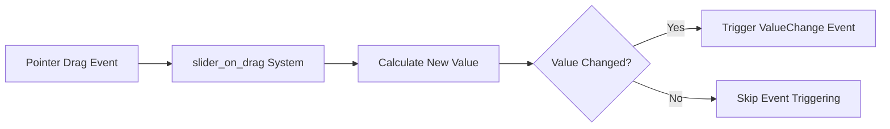

+++
title = "#21404 Emit slider drag value change only when value changes"
date = "2025-10-05T00:00:00"
draft = false
template = "pull_request_page.html"
in_search_index = false

[extra]
current_language = "zh-cn"
available_languages = {"en" = { name = "English", url = "/pull_request/bevy/2025-10/pr-21404-en-20251005" }, "zh-cn" = { name = "中文", url = "/pull_request/bevy/2025-10/pr-21404-zh-cn-20251005" }}
labels = ["C-Bug", "A-UI"]
+++

# Title

## Basic Information
- **Title**: Emit slider drag value change only when value changes
- **PR Link**: https://github.com/bevyengine/bevy/pull/21404
- **Author**: doup
- **Status**: MERGED
- **Labels**: C-Bug, A-UI, S-Ready-For-Final-Review
- **Created**: 2025-10-05T19:12:23Z
- **Merged**: 2025-10-05T19:59:21Z
- **Merged By**: alice-i-cecile

## Description Translation
### 目标
修复 #21376

### 解决方案
只需使用 `if` 检查值是否发生变化。问题描述中提到了 `.set_if_neq`，但我不确定它是否相关，因为 `slider_on_drag` 并不直接改变组件值，而是发出事件。

### 测试
在 feathers 示例中进行了检查：

https://github.com/user-attachments/assets/ac5bb2fa-9054-4eed-985f-846ac15f310d

## The Story of This Pull Request

这个PR解决了一个UI滑块组件中的事件触发问题。问题的核心在于滑块拖动过程中，即使滑块的实际数值没有发生变化，系统也会持续触发值变更事件。

**问题背景**：在Bevy引擎的UI系统中，滑块组件在处理拖动事件时存在一个效率问题。当用户拖动滑块时，`slider_on_drag` 系统会为每个拖动事件触发 `ValueChange` 事件，即使计算出的新值与当前值完全相同。这种情况可能发生在：
- 由于精度限制导致数值四舍五入后没有实际变化
- 滑块位置微小变动但不足以改变最终数值
- 边界条件处理

**解决方案选择**：开发者采用了直接而有效的方法 - 在触发事件前添加一个简单的条件检查。虽然问题描述中提到了 `.set_if_neq` 方法，但考虑到 `slider_on_drag` 是通过命令系统触发事件而非直接修改组件，使用基础的 `if` 条件判断更为合适。

**实现细节**：修改主要集中在 `slider_on_drag` 函数中。首先在查询中添加了对 `SliderValue` 组件的引用，这样系统就能访问到滑块的当前值。然后在计算完新的四舍五入值后，通过条件判断 `rounded_value != value.0` 来确保只在数值实际发生变化时才触发事件。

这个修改体现了事件系统设计的一个重要原则：避免不必要的事件触发。在UI交互中，减少冗余事件可以：
- 降低事件处理系统的负载
- 避免不必要的组件重渲染
- 防止意外的事件循环触发

**技术考量**：使用直接的值比较而非 `.set_if_neq` 是合理的选择，因为这里处理的是事件触发而非组件状态更新。`.set_if_neq` 主要用于资源或组件的更新优化，而事件系统的优化需要不同的策略。

**实际影响**：这个修复虽然代码改动不大，但对用户体验和系统性能有积极影响。通过减少不必要的事件触发，可以避免潜在的重复处理逻辑，特别是在复杂UI场景中，多个系统可能监听同一个值变更事件时。

## Visual Representation



## Key Files Changed

- `crates/bevy_ui_widgets/src/slider.rs` (+9/-5)

### 主要修改说明

这个文件包含了滑块UI组件的核心逻辑。修改主要集中在 `slider_on_drag` 函数，该函数处理滑块的拖动交互。

**关键代码变更**：

```rust
// 修改前：
pub(crate) fn slider_on_drag(
    mut event: On<Pointer<Drag>>,
    mut q_slider: Query<
        (
            &ComputedNode,
            &SliderRange,
            Option<&SliderPrecision>,
            &GlobalTransform,
            &mut Dragging,
            Option<&Disabled>,
        ),
        With<SliderMarker>,
    >,
    // ... 其他参数
) {
    if let Ok((node, range, precision, transform, drag, disabled)) = q_slider.get_mut(event.entity)
    {
        // ... 计算新值逻辑
        commands.trigger(ValueChange {
            source: event.entity,
            value: rounded_value,
        });
    }
}

// 修改后：
pub(crate) fn slider_on_drag(
    mut event: On<Pointer<Drag>>,
    mut q_slider: Query<
        (
            &SliderValue,  // 新增：查询当前滑块值
            &ComputedNode,
            &SliderRange,
            Option<&SliderPrecision>,
            &GlobalTransform,
            &mut Dragging,
            Option<&Disabled>,
        ),
        With<SliderMarker>,
    >,
    // ... 其他参数
) {
    if let Ok((value, node, range, precision, transform, drag, disabled)) = 
        q_slider.get_mut(event.entity)  // 现在解构包含value
    {
        // ... 计算新值逻辑
        if rounded_value != value.0 {  // 新增：值变化检查
            commands.trigger(ValueChange {
                source: event.entity,
                value: rounded_value,
            });
        }
    }
}
```

**修改要点**：
1. 在查询中添加了 `&SliderValue` 来获取当前滑块值
2. 在解构查询结果时包含新的 `value` 字段
3. 添加条件判断 `rounded_value != value.0`，只在值实际变化时触发事件

这些修改直接解决了问题描述中的冗余事件触发问题，确保了事件系统只在必要时被触发。

## Further Reading

- [Bevy UI 系统文档](https://docs.rs/bevy_ui/latest/bevy_ui/)
- [Bevy 事件系统指南](https://bevy-cheatbook.github.io/programming/events.html)
- [ECS 查询模式](https://bevy-cheatbook.github.io/programming/query.html)

# Full Code Diff
diff --git a/crates/bevy_ui_widgets/src/slider.rs b/crates/bevy_ui_widgets/src/slider.rs
index 59c3e580b19df..d19e344b29e4e 100644
--- a/crates/bevy_ui_widgets/src/slider.rs
+++ b/crates/bevy_ui_widgets/src/slider.rs
@@ -330,6 +330,7 @@ pub(crate) fn slider_on_drag(
     mut event: On<Pointer<Drag>>,
     mut q_slider: Query<
         (
+            &SliderValue,
             &ComputedNode,
             &SliderRange,
             Option<&SliderPrecision>,
@@ -344,7 +345,8 @@ pub(crate) fn slider_on_drag(
     mut commands: Commands,
     ui_scale: Res<UiScale>,
 ) {
-    if let Ok((node, range, precision, transform, drag, disabled)) = q_slider.get_mut(event.entity)
+    if let Ok((value, node, range, precision, transform, drag, disabled)) =
+        q_slider.get_mut(event.entity)
     {
         event.propagate(false);
         if drag.dragging && !disabled {
@@ -369,10 +371,12 @@ pub(crate) fn slider_on_drag(
                     .unwrap_or(new_value),
             );
 
-            commands.trigger(ValueChange {
-                source: event.entity,
-                value: rounded_value,
-            });
+            if rounded_value != value.0 {
+                commands.trigger(ValueChange {
+                    source: event.entity,
+                    value: rounded_value,
+                });
+            }
         }
     }
 }