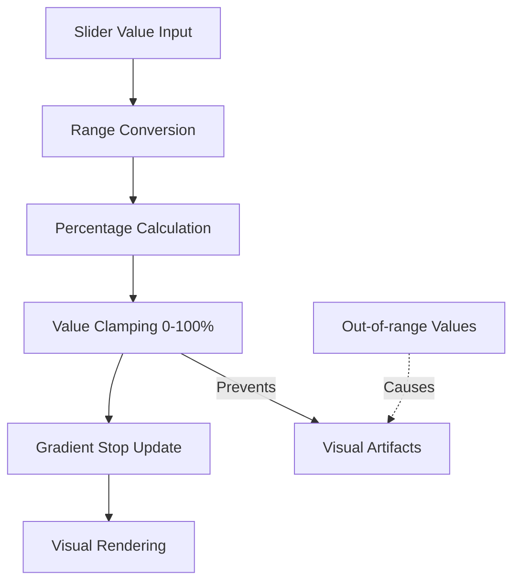

+++
title = "#21405 Fix slider value indicator bar when value is out of range"
date = "2025-10-05T00:00:00"
draft = false
template = "pull_request_page.html"
in_search_index = true

[taxonomies]
list_display = ["show"]

[extra]
current_language = "en"
available_languages = {"en" = { name = "English", url = "/pull_request/bevy/2025-10/pr-21405-en-20251005" }, "zh-cn" = { name = "中文", url = "/pull_request/bevy/2025-10/pr-21405-zh-cn-20251005" }}
labels = ["C-Bug", "D-Trivial", "A-UI"]
+++

# Fix slider value indicator bar when value is out of range

## Basic Information
- **Title**: Fix slider value indicator bar when value is out of range
- **PR Link**: https://github.com/bevyengine/bevy/pull/21405
- **Author**: doup
- **Status**: MERGED
- **Labels**: C-Bug, D-Trivial, A-UI, S-Ready-For-Final-Review
- **Created**: 2025-10-05T20:03:31Z
- **Merged**: 2025-10-05T20:49:32Z
- **Merged By**: alice-i-cecile

## Description Translation
**Objective**

When the slider value is out of range the indicator bar renders incorrectly. For example:

```rs
SliderProps {
    max: 10.0,
    value: 100.0, // or -100.0,
    ..default()
},
```


**Solution**

Clamp slider gradient to 0-100 range.

**Testing**

Tried different values in feathers example.


## The Story of This Pull Request

This pull request addresses a visual rendering bug in Bevy's UI slider component. The issue occurred when a slider was configured with values outside its defined range, causing the visual indicator bar to render incorrectly.

The problem originated in the slider gradient calculation logic. When a slider value exceeded the maximum or fell below the minimum range, the computed percentage value for the gradient stops could become negative or exceed 100%. This resulted in visual artifacts where the slider's filled portion would extend beyond the slider track boundaries or render in unexpected positions.

The solution implements proper value clamping in the gradient calculation. By applying `clamp(0.0, 100.0)` to the computed percentage value, the gradient stops are guaranteed to remain within valid bounds regardless of the input value. This ensures consistent visual behavior while maintaining the mathematical correctness of the underlying value calculation.

The implementation demonstrates a common defensive programming pattern where UI components should gracefully handle edge cases and invalid input states. Rather than relying on callers to always provide valid values, the component itself ensures visual consistency through internal validation.

This fix is particularly important for slider components, which often receive programmatically set values that may temporarily fall outside expected ranges during animations, user interactions, or state transitions. The clamped gradient calculation prevents visual glitches during these transient states while preserving the actual slider value for programmatic use.

## Visual Representation



## Key Files Changed

### `crates/bevy_feathers/src/controls/slider.rs`

This file contains the core slider control implementation in Bevy's feather UI system. The change modifies the gradient calculation to handle out-of-range values properly.

**Key modification:**
```rust
// Before:
let percent_value = range.thumb_position(value.0) * 100.0;

// After:
let percent_value = (range.thumb_position(value.0) * 100.0).clamp(0.0, 100.0);
```

The change adds a simple clamp operation that ensures the gradient percentage stays within the valid 0-100% range. This prevents visual rendering issues when slider values exceed their configured bounds.

## Further Reading

- [Rust `clamp` method documentation](https://doc.rust-lang.org/std/primitive.f64.html#method.clamp)
- [Bevy UI Components](https://bevyengine.org/learn/quick-start/ui/)
- [Defensive Programming Patterns](https://en.wikipedia.org/wiki/Defensive_programming)
- [UI Input Validation Best Practices](https://developer.mozilla.org/en-US/docs/Learn/Forms/Form_validation)

# Full Code Diff
```diff
diff --git a/crates/bevy_feathers/src/controls/slider.rs b/crates/bevy_feathers/src/controls/slider.rs
index 594174c15a7d0..99460d04fc1ff 100644
--- a/crates/bevy_feathers/src/controls/slider.rs
+++ b/crates/bevy_feathers/src/controls/slider.rs
@@ -216,7 +216,7 @@ fn update_slider_pos(
 ) {
     for (slider_ent, value, range, precision, mut gradient) in q_sliders.iter_mut() {
         if let [Gradient::Linear(linear_gradient)] = &mut gradient.0[..] {
-            let percent_value = range.thumb_position(value.0) * 100.0;
+            let percent_value = (range.thumb_position(value.0) * 100.0).clamp(0.0, 100.0);
             linear_gradient.stops[1].point = Val::Percent(percent_value);
             linear_gradient.stops[2].point = Val::Percent(percent_value);
         }
```