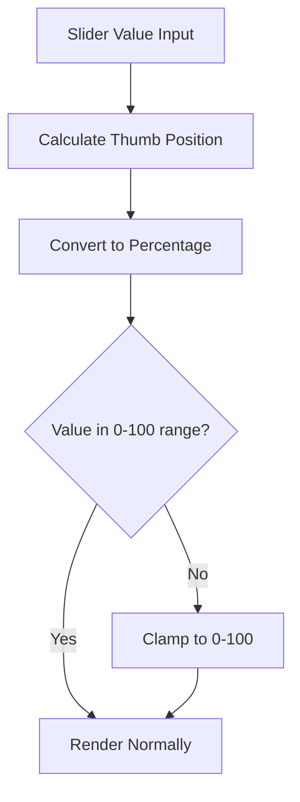

+++
title = "#21405 Fix slider value indicator bar when value is out of range"
date = "2025-10-05T00:00:00"
draft = false
template = "pull_request_page.html"
in_search_index = false

[extra]
current_language = "zh-cn"
available_languages = {"en" = { name = "English", url = "/pull_request/bevy/2025-10/pr-21405-en-20251005" }, "zh-cn" = { name = "中文", url = "/pull_request/bevy/2025-10/pr-21405-zh-cn-20251005" }}
labels = ["C-Bug", "D-Trivial", "A-UI"]
+++

# Title
Fix slider value indicator bar when value is out of range

## Basic Information
- **Title**: Fix slider value indicator bar when value is out of range
- **PR Link**: https://github.com/bevyengine/bevy/pull/21405
- **Author**: doup
- **Status**: MERGED
- **Labels**: C-Bug, D-Trivial, A-UI, S-Ready-For-Final-Review
- **Created**: 2025-10-05T20:03:31Z
- **Merged**: 2025-10-05T20:49:32Z
- **Merged By**: alice-i-cecile

## Description Translation
# 目标

当滑块值超出范围时，指示器条渲染不正确。例如：

```rs
SliderProps {
    max: 10.0,
    value: 100.0, // 或 -100.0,
    ..default()
},
```


## 解决方案

将滑块渐变值限制在 0-100 范围内。

## 测试

在 feathers 示例中尝试了不同的值。


## The Story of This Pull Request

这个PR解决了一个UI组件中的视觉bug。问题出现在Bevy引擎的feathers UI库中的滑块控件上，当滑块的值超出其定义的范围时，指示器条的渲染会出现异常。

问题的根源在于滑块值的计算逻辑。滑块控件使用线性渐变来显示当前值的填充状态，通过两个渐变停止点来控制填充区域。当用户设置的值超出滑块的最小-最大范围时，`range.thumb_position(value.0)`函数会返回一个超出0-1范围的值，乘以100后自然也就超出了0-100的范围。

在CSS和UI渲染系统中，百分比值通常应该在0-100%范围内。当传入超出这个范围的值时，不同的渲染引擎可能会有不同的处理方式，有些可能会忽略无效值，有些可能会产生意外的视觉效果。从提供的截图可以看到，当值为100.0而最大值为10.0时，指示器条显示异常，没有正确反映滑块的当前状态。

解决方案很直接：在计算百分比值时使用`clamp(0.0, 100.0)`方法将结果限制在有效范围内。这个改动确保了无论滑块的实际值是多少，用于渲染的百分比值始终在0-100之间，从而保证了视觉表现的一致性。

从工程角度看，这是一个防御性编程的例子。虽然理论上滑块值应该在有效范围内，但实际使用中可能会因为各种原因（如数据绑定错误、用户输入验证不充分等）出现超出范围的值。通过在最底层的渲染逻辑中添加边界检查，可以确保组件在各种边界情况下都能正常显示。

这个修复的代价很小——只是一个简单的clamp操作，但带来的收益很明显：更健壮的UI组件和更好的用户体验。这种在渲染层添加边界检查的模式在UI开发中很常见，可以有效防止因为数据异常导致的视觉错误。

## Visual Representation



## Key Files Changed

### `crates/bevy_feathers/src/controls/slider.rs` (+1/-1)

这个文件包含了滑块控件的核心实现。修改发生在`update_slider_pos`函数中，该函数负责根据滑块的当前值更新视觉表现。

**关键修改：**
```rust
// 修改前：
let percent_value = range.thumb_position(value.0) * 100.0;

// 修改后：
let percent_value = (range.thumb_position(value.0) * 100.0).clamp(0.0, 100.0);
```

这个修改确保了无论`range.thumb_position`返回什么值，最终的百分比值都会被限制在0-100的范围内，避免了因为超出范围的百分比值导致的渲染问题。

## Further Reading

- [Rust std::primitive::f32::clamp](https://doc.rust-lang.org/std/primitive.f32.html#method.clamp) - Rust中f32类型的clamp方法文档
- [Bevy UI System](https://bevyengine.org/learn/quick-start/ui/) - Bevy引擎UI系统文档
- [Defensive Programming](https://en.wikipedia.org/wiki/Defensive_programming) - 防御性编程的概念和实践

# Full Code Diff
diff --git a/crates/bevy_feathers/src/controls/slider.rs b/crates/bevy_feathers/src/controls/slider.rs
index 594174c15a7d0..99460d04fc1ff 100644
--- a/crates/bevy_feathers/src/controls/slider.rs
+++ b/crates/bevy_feathers/src/controls/slider.rs
@@ -216,7 +216,7 @@ fn update_slider_pos(
 ) {
     for (slider_ent, value, range, precision, mut gradient) in q_sliders.iter_mut() {
         if let [Gradient::Linear(linear_gradient)] = &mut gradient.0[..] {
-            let percent_value = range.thumb_position(value.0) * 100.0;
+            let percent_value = (range.thumb_position(value.0) * 100.0).clamp(0.0, 100.0);
             linear_gradient.stops[1].point = Val::Percent(percent_value);
             linear_gradient.stops[2].point = Val::Percent(percent_value);
         }