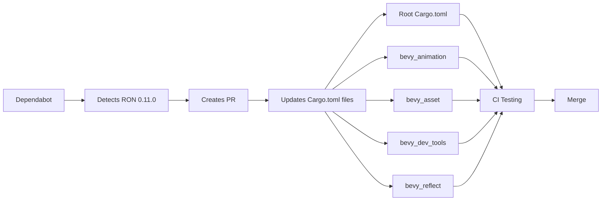

+++
title = "#21416 Update ron requirement from 0.10 to 0.11"
date = "2025-10-06T00:00:00"
draft = false
template = "pull_request_page.html"
in_search_index = true

[taxonomies]
list_display = ["show"]

[extra]
current_language = "en"
available_languages = {"en" = { name = "English", url = "/pull_request/bevy/2025-10/pr-21416-en-20251006" }, "zh-cn" = { name = "中文", url = "/pull_request/bevy/2025-10/pr-21416-zh-cn-20251006" }}
labels = ["C-Dependencies"]
+++

# Update ron requirement from 0.10 to 0.11

## Basic Information
- **Title**: Update ron requirement from 0.10 to 0.11
- **PR Link**: https://github.com/bevyengine/bevy/pull/21416
- **Author**: app/dependabot
- **Status**: MERGED
- **Labels**: C-Dependencies
- **Created**: 2025-10-06T06:06:56Z
- **Merged**: 2025-10-06T07:37:35Z
- **Merged By**: james7132

## Description Translation
Updates the requirements on [ron](https://github.com/ron-rs/ron) to permit the latest version.
<details>
<summary>Release notes</summary>
<p><em>Sourced from <a href="https://github.com/ron-rs/ron/releases">ron's releases</a>.</em></p>
<blockquote>
<h2>v0.11.0</h2>
<h2>What's Changed</h2>
<ul>
<li>Add <code>no_std</code> Support by <a href="https://github.com/bushrat011899"><code>@​bushrat011899</code></a> in <a href="https://redirect.github.com/ron-rs/ron/pull/567">ron-rs/ron#567</a></li>
<li>SpannedError: Store error span by <a href="https://github.com/pfnsec"><code>@​pfnsec</code></a> in <a href="https://redirect.github.com/ron-rs/ron/pull/569">ron-rs/ron#569</a></li>
<li>Fix (again) non-exhaustive matching on Number by <a href="https://github.com/juntyr"><code>@​juntyr</code></a> in <a href="https://redirect.github.com/ron-rs/ron/pull/568">ron-rs/ron#568</a></li>
<li>Add file IO with Vec<!-- raw HTML omitted --> example by <a href="https://github.com/LanHikari22"><code>@​LanHikari22</code></a> in <a href="https://redirect.github.com/ron-rs/ron/pull/573">ron-rs/ron#573</a></li>
<li>Patch serde content detection hack by <a href="https://github.com/juntyr"><code>@​juntyr</code></a> in <a href="https://redirect.github.com/ron-rs/ron/pull/580">ron-rs/ron#580</a></li>
</ul>
<h2>New Contributors</h2>
<ul>
<li><a href="https://github.com/bushrat011899"><code>@​bushrat011899</code></a> made their first contribution in <a href="https://redirect.github.com/ron-rs/ron/pull/567">ron-rs/ron#567</a></li>
<li><a href="https://github.com/pfnsec"><code>@​pfnsec</code></a> made their first contribution in <a href="https://redirect.github.com/ron-rs/ron/pull/569">ron-rs/ron#569</a></li>
<li><a href="https://github.com/LanHikari22"><code>@​LanHikari22</code></a> made their first contribution in <a href="https://redirect.github.com/ron-rs/ron/pull/573">ron-rs/ron#573</a></li>
</ul>
<p><strong>Full Changelog</strong>: <a href="https://github.com/ron-rs/ron/compare/v0.10.1...v0.11.0">https://github.com/ron-rs/ron/compare/v0.10.1...v0.11.0</a></p>
</blockquote>
</details>
<details>
<summary>Changelog</summary>
<p><em>Sourced from <a href="https://github.com/ron-rs/ron/blob/master/CHANGELOG.md">ron's changelog</a>.</em></p>
<blockquote>
<h2>[0.11.0] - 2025-08-27</h2>
<h3>API Changes</h3>
<ul>
<li>
<p>Breaking: <code>SpannedError</code> now stores the full error span in span: Span { start: Position, end: Position }`, to facilitate, e.g., language server highlighting of syntax errors.</p>
</li>
<li>
<p>Breaking: Added <code>no_std</code> support via a new <code>std</code> feature (enabled by default). With default features disabled, you must enable the <code>std</code> feature to access <code>de::from_reader</code>, and the <code>std::io</code> operations on <code>Options</code>, such as <code>from_reader</code>, <code>from_reader_seed</code>, <code>to_io_writer</code>, and <code>to_io_writer_pretty</code> (<a href="https://redirect.github.com/ron-rs/ron/pull/567">#567</a>)</p>
</li>
<li>
<p>Breaking: Fixed (again) <code>ron::value::Number</code> to ensure it is non-exhaustive, to avoid breaking <code>match</code>es when feature unification enables more of its variants than expected (<a href="https://redirect.github.com/ron-rs/ron/pull/568">#568</a>)</p>
</li>
</ul>
<h3>Examples</h3>
<ul>
<li>Add a new example <code>file_read_write_vec.rs</code> for reading and writing <code>Vec&lt;T&gt;</code> to/from files. (<a href="https://redirect.github.com/ron-rs/ron/pull/573">#573</a>)</li>
</ul>
<h2>[0.10.1] - 2025-04-08</h2>
<h3>API Changes</h3>
<ul>
<li>Add <code>ron::Options::to_io_writer</code> and <code>ron::Options::to_io_writer_pretty</code> to allow writing into an <code>io::Writer</code> (<a href="https://redirect.github.com/ron-rs/ron/pull/561">#561</a>)</li>
<li>Breaking: <code>ron::value::Number</code> is now non-exhaustive, to avoid breaking <code>match</code>es when feature unification enables more of its variants than expected (<a href="https://redirect.github.com/ron-rs/ron/pull/564">#564</a>)</li>
</ul>
<h2>[0.9.0] - 2025-03-18</h2>
<h3>API Changes</h3>
<ul>
<li>Add <code>ron::value::RawValue</code> helper type which can (de)serialize any valid RON (<a href="https://redirect.github.com/ron-rs/ron/pull/407">#407</a>)</li>
<li>Add <code>escape_strings</code> option to <code>PrettyConfig</code> to allow serialising with or without escaping (<a href="https://redirect.github.com/ron-rs/ron/pull/426">#426</a>)</li>
<li>Add <code>compact_maps</code> and <code>compact_structs</code> options to <code>PrettyConfig</code> to allow serialising maps and structs on a single line (<a href="https://redirect.github.com/ron-rs/ron/pull/448">#448</a>)</li>
<li>Add minimal support for <code>#[serde(flatten)]</code> with roundtripping through RON maps (<a href="https://redirect.github.com/ron-rs/ron/pull/455">#455</a>)</li>
<li>Add minimal roundtripping support for <code>#[serde(tag = &quot;tag&quot;)]</code>, <code>#[serde(tag = &quot;tag&quot;, content = &quot;content&quot;)]</code>, and <code>#[serde(untagged)]</code> enums (<a href="https://redirect.github.com/ron-rs/ron/pull/451">#451</a>)</li>
<li>Breaking: Expand the <code>value::Number</code> enum to explicitly encode all possible number types (<a href="https://redirect.github.com/ron-rs/ron/pull/479">#479</a>)</li>
<li>Add <code>number_suffixes</code> option to <code>PrettyConfig</code> to allow serialising numbers with their explicit type suffix, e.g. <code>42i32</code> (<a href="https://redirect.github.com/ron-rs/ron/pull/481">#481</a>)</li>
<li>Allow <code>ron::value::RawValue</code> to capture any whitespace to the left and right of a ron value (<a href="https://redirect.github.com/ron-rs/ron/pull/487">#487</a>)</li>
<li>Breaking: Enforce that ron always writes valid UTF-8 (<a href="https://redirect.github.com/ron-rs/ron/pull/488">#488</a>)</li>
<li>Add convenient <code>Value::from</code> impls (<a href="https://redirect.github.com/ron-rs/ron/pull/498">#498</a>)</li>
<li>Add new extension <code>explicit_struct_names</code> which requires that struct names are included during deserialization (<a href="https://redirect.github.com/ron-rs/ron/pull/522">#522</a>)</li>
<li>Add new path-based field metadata serialization support via <code>PrettyConfig</code> (<a href="https://redirect.github.com/ron-rs/ron/pull/544">#544</a>)</li>
<li>Breaking: Change <code>PrettyConfig</code> so that <code>new_line</code>, <code>indentor</code> and <code>separator</code> are all <code>Cow&lt;'static, str&gt;</code> instead of <code>String</code> (<a href="https://redirect.github.com/ron-rs/ron/pull/546">#546</a>)</li>
</ul>
<h3>Format Changes</h3>
<ul>
<li>[Non-API] Breaking: Treat <code>Some</code> like a newtype variant with <code>unwrap_variant_newtypes</code> (<a href="https://redirect.github.com/ron-rs/ron/pull/465">#465</a>)</li>
<li>Allow parsing floating point literals with underscores (<a href="https://redirect.github.com/ron-rs/ron/pull/481">#481</a>)</li>
<li><strong>Format-Breaking:</strong> Switch from base64-encoded to Rusty byte strings, still allow base64 deserialising for now (<a href="https://redirect.github.com/ron-rs/ron/pull/438">#438</a>)</li>
<li>Fix issue <a href="https://redirect.github.com/ron-rs/ron/issues/241">#241</a> and allow parsing numbers with explicit type suffixes, e.g. <code>1u8</code> or <code>-1f32</code> (<a href="https://redirect.github.com/ron-rs/ron/pull/481">#481</a>)</li>
<li>Add support for byte literals as strongly typed unsigned 8-bit integers (<a href="https://redirect.github.com/ron-rs/ron/pull/438">#438</a>)</li>
<li>Fix issue <a href="https://redirect.github.com/ron-rs/ron/issues/321">#321</a> and allow parsing UTF-8 identifiers (<a href="https://redirect.github.com/ron-rs/ron/pull/488">#488</a>)</li>
</ul>
<h3>Bug Fixes</h3>
<!-- raw HTML omitted -->
</blockquote>
<p>... (truncated)</p>
</details>
<details>
<summary>Commits</summary>
<ul>
<li><a href="https://github.com/ron-rs/ron/commit/cdd9fccd76e4c2f515706453f7c0e4351b8f3784"><code>cdd9fcc</code></a> Bump ron to v0.11.0</li>
<li><a href="https://github.com/ron-rs/ron/commit/1dcc70e5d759b48ee1b861757fc4f52facec2b0d"><code>1dcc70e</code></a> Patch serde content detection hack (<a href="https://redirect.github.com/ron-rs/ron/issues/580">#580</a>)</li>
<li><a href="https://github.com/ron-rs/ron/commit/29e244a21cc8eefeceb6a3a7e2be71760a0ce792"><code>29e244a</code></a> Add file IO with Vec&lt;T&gt; example (<a href="https://redirect.github.com/ron-rs/ron/issues/573">#573</a>)</li>
<li><a href="https://github.com/ron-rs/ron/commit/ba572011ad8eb24992cb6fa9e540a86e3e249a91"><code>ba57201</code></a> Fix (again) non-exhaustive matching on Number (<a href="https://redirect.github.com/ron-rs/ron/issues/568">#568</a>)</li>
<li><a href="https://github.com/ron-rs/ron/commit/27a26d691a24ac1eef3462086eed31dcbc0196f9"><code>27a26d6</code></a> SpannedError: Store error span (<a href="https://redirect.github.com/ron-rs/ron/issues/569">#569</a>)</li>
<li><a href="https://github.com/ron-rs/ron/commit/b7a5bfcef32ac68d7aff4d9984c30fa83f159305"><code>b7a5bfc</code></a> Add <code>no_std</code> support (<a href="https://redirect.github.com/ron-rs/ron/issues/567">#567</a>)</li>
<li><a href="https://github.com/ron-rs/ron/commit/3159534d8111a31d33791826aef2132308cc032c"><code>3159534</code></a> Add 564_exhaustive_number test</li>
<li>See full diff in <a href="https://github.com/ron-rs/ron/compare/v0.10.1...v0.11.0">compare view</a></li>
</ul>
</details>
<br />


Dependabot will resolve any conflicts with this PR as long as you don't alter it yourself. You can also trigger a rebase manually by commenting `@dependabot rebase`.

[//]: # (dependabot-automerge-start)
[//]: # (dependabot-automerge-end)

---

<details>
<summary>Dependabot commands and options</summary>
<br />

You can trigger Dependabot actions by commenting on this PR:
- `@dependabot rebase` will rebase this PR
- `@dependabot recreate` will recreate this PR, overwriting any edits that have been made to it
- `@dependabot merge` will merge this PR after your CI passes on it
- `@dependabot squash and merge` will squash and merge this PR after your CI passes on it
- `@dependabot cancel merge` will cancel a previously requested merge and block automerging
- `@dependabot reopen` will reopen this PR if it is closed
- `@dependabot close` will close this PR and stop Dependabot recreating it. You can achieve the same result by closing it manually
- `@dependabot show <dependency name> ignore conditions` will show all of the ignore conditions of the specified dependency
- `@dependabot ignore this major version` will close this PR and stop Dependabot creating any more for this major version (unless you reopen the PR or upgrade to it yourself)
- `@dependabot ignore this minor version` will close this PR and stop Dependabot creating any more for this minor version (unless you reopen the PR or upgrade to it yourself)
- `@dependabot ignore this dependency` will close this PR and stop Dependabot creating any more for this dependency (unless you reopen the PR or upgrade to it yourself)


</details>

## The Story of This Pull Request

This PR represents a routine but important dependency maintenance task in the Bevy engine. Dependabot, GitHub's automated dependency management tool, detected that the RON (Rusty Object Notation) serialization library had a new version available and automatically created this update request.

The core challenge in dependency updates is managing compatibility while gaining access to new features and bug fixes. RON 0.11.0 introduces several breaking changes that needed evaluation:

- **no_std support**: The addition of `no_std` support with a new `std` feature (enabled by default) means that crates using RON with default features disabled now need to explicitly enable the `std` feature for I/O operations
- **Error span changes**: `SpannedError` now stores full error spans with start and end positions, which could affect error handling code
- **Number enum changes**: The `ron::value::Number` enum is now non-exhaustive to prevent breaking matches when feature unification enables more variants

The solution approach was straightforward: update the version requirement across all Bevy crates that depend on RON. Since this is a minor version update with breaking changes, the team needed to verify that Bevy's usage patterns weren't affected by the API changes.

The implementation consisted of simple version string updates across five Cargo.toml files. The most notable change was in `bevy_asset`, which uses RON with `default-features = false`. The update preserved this configuration, which means the asset system will continue to use RON without the new `std` feature enabled by default.

Technical insights from this update include:
- The importance of automated dependency management in large Rust projects
- How breaking changes in serialization libraries can affect downstream consumers
- The value of maintaining consistent dependency versions across a workspace

The impact of this update is primarily maintenance-oriented: Bevy gains access to RON's latest features and bug fixes while ensuring long-term compatibility. The quick merge (within 90 minutes) suggests the changes were non-disruptive and the team had confidence in the update.

## Visual Representation



## Key Files Changed

**Root Cargo.toml**
- Changed ron dev-dependency from 0.10 to 0.11
- Used for development dependencies and examples

```toml
# Before:
ron = "0.10"

# After:
ron = "0.11"
```

**crates/bevy_animation/Cargo.toml**
- Updated ron dependency for animation data serialization
- Animation curves and keyframes may be stored in RON format

```toml
# Before:
ron = "0.10"

# After:
ron = "0.11"
```

**crates/bevy_asset/Cargo.toml**
- Updated ron dependency with default-features = false preserved
- Asset metadata and configuration files use RON format

```toml
# Before:
ron = { version = "0.10", default-features = false }

# After:
ron = { version = "0.11", default-features = false }
```

**crates/bevy_dev_tools/Cargo.toml**
- Updated optional ron dependency for developer tools
- Scene serialization and debugging tools may use RON

```toml
# Before:
ron = { version = "0.10", optional = true }

# After:
ron = { version = "0.11", optional = true }
```

**crates/bevy_reflect/Cargo.toml**
- Updated ron dev-dependency for reflection testing
- Used in tests for serialization/deserialization of reflected types

```toml
# Before:
ron = "0.10"

# After:
ron = "0.11"
```

## Further Reading

- [RON GitHub Repository](https://github.com/ron-rs/ron) - The official RON serialization format implementation
- [Dependabot Documentation](https://docs.github.com/en/code-security/dependabot) - GitHub's automated dependency management tool
- [Cargo SemVer Compatibility](https://doc.rust-lang.org/cargo/reference/semver.html) - Rust's semantic versioning rules for dependencies
- [Bevy Asset System](https://bevyengine.org/learn/book/getting-started/assets/) - How Bevy handles asset loading and serialization