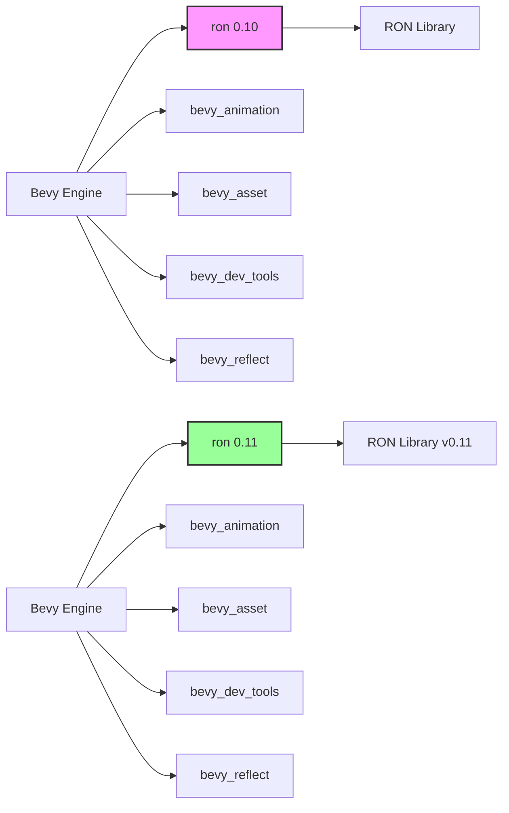

+++
title = "#21416 Update ron requirement from 0.10 to 0.11"
date = "2025-10-06T00:00:00"
draft = false
template = "pull_request_page.html"
in_search_index = false

[extra]
current_language = "zh-cn"
available_languages = {"en" = { name = "English", url = "/pull_request/bevy/2025-10/pr-21416-en-20251006" }, "zh-cn" = { name = "中文", url = "/pull_request/bevy/2025-10/pr-21416-zh-cn-20251006" }}
labels = ["C-Dependencies"]
+++

# Update ron requirement from 0.10 to 0.11

## Basic Information
- **Title**: Update ron requirement from 0.10 to 0.11
- **PR Link**: https://github.com/bevyengine/bevy/pull/21416
- **Author**: app/dependabot
- **Status**: MERGED
- **Labels**: C-Dependencies
- **Created**: 2025-10-06T06:06:56Z
- **Merged**: 2025-10-06T07:37:35Z
- **Merged By**: james7132

## Description Translation
更新 [ron](https://github.com/ron-rs/ron) 的要求以允许最新版本。
<details>
<summary>发布说明</summary>
<p><em>来源自 <a href="https://github.com/ron-rs/ron/releases">ron 的发布</a>。</em></p>
<blockquote>
<h2>v0.11.0</h2>
<h2>有哪些变化</h2>
<ul>
<li>通过 <a href="https://github.com/bushrat011899"><code>@​bushrat011899</code></a> 在 <a href="https://redirect.github.com/ron-rs/ron/pull/567">ron-rs/ron#567</a> 中添加 <code>no_std</code> 支持</li>
<li>通过 <a href="https://github.com/pfnsec"><code>@​pfnsec</code></a> 在 <a href="https://redirect.github.com/ron-rs/ron/pull/569">ron-rs/ron#569</a> 中存储错误跨度</li>
<li>通过 <a href="https://github.com/juntyr"><code>@​juntyr</code></a> 在 <a href="https://redirect.github.com/ron-rs/ron/pull/568">ron-rs/ron#568</a> 中再次修复 Number 的非穷尽匹配</li>
<li>通过 <a href="https://github.com/LanHikari22"><code>@​LanHikari22</code></a> 在 <a href="https://redirect.github.com/ron-rs/ron/pull/573">ron-rs/ron#573</a> 中添加带有 Vec<!-- raw HTML omitted --> 示例的文件 IO</li>
<li>通过 <a href="https://github.com/juntyr"><code>@​juntyr</code></a> 在 <a href="https://redirect.github.com/ron-rs/ron/pull/580">ron-rs/ron#580</a> 中修补 serde 内容检测 hack</li>
</ul>
<h2>新贡献者</h2>
<ul>
<li><a href="https://github.com/bushrat011899"><code>@​bushrat011899</code></a> 在 <a href="https://redirect.github.com/ron-rs/ron/pull/567">ron-rs/ron#567</a> 中做出了第一次贡献</li>
<li><a href="https://github.com/pfnsec"><code>@​pfnsec</code></a> 在 <a href="https://redirect.github.com/ron-rs/ron/pull/569">ron-rs/ron#569</a> 中做出了第一次贡献</li>
<li><a href="https://github.com/LanHikari22"><code>@​LanHikari22</code></a> 在 <a href="https://redirect.github.com/ron-rs/ron/pull/573">ron-rs/ron#573</a> 中做出了第一次贡献</li>
</ul>
<p><strong>完整变更日志</strong>: <a href="https://github.com/ron-rs/ron/compare/v0.10.1...v0.11.0">https://github.com/ron-rs/ron/compare/v0.10.1...v0.11.0</a></p>
</blockquote>
</details>
<details>
<summary>变更日志</summary>
<p><em>来源自 <a href="https://github.com/ron-rs/ron/blob/master/CHANGELOG.md">ron 的变更日志</a>。</em></p>
<blockquote>
<h2>[0.11.0] - 2025-08-27</h2>
<h3>API 变更</h3>
<ul>
<li>
<p>破坏性变更: <code>SpannedError</code> 现在存储完整的错误跨度在 span: Span { start: Position, end: Position }` 中，以便于例如语言服务器高亮语法错误。</p>
</li>
<li>
<p>破坏性变更: 通过新的 <code>std</code> 特性（默认启用）添加了 <code>no_std</code> 支持。禁用默认特性时，你必须启用 <code>std</code> 特性来访问 <code>de::from_reader</code>，以及 <code>Options</code> 上的 <code>std::io</code> 操作，例如 <code>from_reader</code>、<code>from_reader_seed</code>、<code>to_io_writer</code> 和 <code>to_io_writer_pretty</code> (<a href="https://redirect.github.com/ron-rs/ron/pull/567">#567</a>)</p>
</li>
<li>
<p>破坏性变更: 再次修复了 <code>ron::value::Number</code> 以确保它是非穷尽的，以避免当特性统一启用了比预期更多的变体时破坏 <code>match</code> 语句 (<a href="https://redirect.github.com/ron-rs/ron/pull/568">#568</a>)</p>
</li>
</ul>
<h3>示例</h3>
<ul>
<li>添加了一个新的示例 <code>file_read_write_vec.rs</code>，用于读取和写入 <code>Vec&lt;T&gt;</code> 到/从文件。(<a href="https://redirect.github.com/ron-rs/ron/pull/573">#573</a>)</li>
</ul>
<h2>[0.10.1] - 2025-04-08</h2>
<h3>API 变更</h3>
<ul>
<li>添加 <code>ron::Options::to_io_writer</code> 和 <code>ron::Options::to_io_writer_pretty</code> 以允许写入到 <code>io::Writer</code> (<a href="https://redirect.github.com/ron-rs/ron/pull/561">#561</a>)</li>
<li>破坏性变更: <code>ron::value::Number</code> 现在是非穷尽的，以避免当特性统一启用了比预期更多的变体时破坏 <code>match</code> 语句 (<a href="https://redirect.github.com/ron-rs/ron/pull/564">#564</a>)</li>
</ul>
<h2>[0.9.0] - 2025-03-18</h2>
<h3>API 变更</h3>
<ul>
<li>添加 <code>ron::value::RawValue</code> 辅助类型，可以（反）序列化任何有效的 RON (<a href="https://redirect.github.com/ron-rs/ron/pull/407">#407</a>)</li>
<li>添加 <code>escape_strings</code> 选项到 <code>PrettyConfig</code> 以允许序列化时带或不带转义 (<a href="https://redirect.github.com/ron-rs/ron/pull/426">#426</a>)</li>
<li>添加 <code>compact_maps</code> 和 <code>compact_structs</code> 选项到 <code>PrettyConfig</code> 以允许序列化映射和结构体为单行 (<a href="https://redirect.github.com/ron-rs/ron/pull/448">#448</a>)</li>
<li>添加对 <code>#[serde(flatten)]</code> 的最小支持，通过 RON 映射进行往返 (<a href="https://redirect.github.com/ron-rs/ron/pull/455">#455</a>)</li>
<li>添加对 <code>#[serde(tag = &quot;tag&quot;)]</code>、<code>#[serde(tag = &quot;tag&quot;, content = &quot;content&quot;)]</code> 和 <code>#[serde(untagged)]</code> 枚举的最小往返支持 (<a href="https://redirect.github.com/ron-rs/ron/pull/451">#451</a>)</li>
<li>破坏性变更: 扩展了 <code>value::Number</code> 枚举以显式编码所有可能的数字类型 (<a href="https://redirect.github.com/ron-rs/ron/pull/479">#479</a>)</li>
<li>添加 <code>number_suffixes</code> 选项到 <code>PrettyConfig</code> 以允许序列化数字时带有显式类型后缀，例如 <code>42i32</code> (<a href="https://redirect.github.com/ron-rs/ron/pull/481">#481</a>)</li>
<li>允许 <code>ron::value::RawValue</code> 捕获 RON 值左侧和右侧的任何空白 (<a href="https://redirect.github.com/ron-rs/ron/pull/487">#487</a>)</li>
<li>破坏性变更: 强制 ron 始终写入有效的 UTF-8 (<a href="https://redirect.github.com/ron-rs/ron/pull/488">#488</a>)</li>
<li>添加方便的 <code>Value::from</code> 实现 (<a href="https://redirect.github.com/ron-rs/ron/pull/498">#498</a>)</li>
<li>添加新的扩展 <code>explicit_struct_names</code>，要求在反序列化期间包含结构体名称 (<a href="https://redirect.github.com/ron-rs/ron/pull/522">#522</a>)</li>
<li>通过 <code>PrettyConfig</code> 添加新的基于路径的字段元数据序列化支持 (<a href="https://redirect.github.com/ron-rs/ron/pull/544">#544</a>)</li>
<li>破坏性变更: 更改 <code>PrettyConfig</code> 使得 <code>new_line</code>、<code>indentor</code> 和 <code>separator</code> 都是 <code>Cow&lt;'static, str&gt;</code> 而不是 <code>String</code> (<a href="https://redirect.github.com/ron-rs/ron/pull/546">#546</a>)</li>
</ul>
<h3>格式变更</h3>
<ul>
<li>[非 API] 破坏性变更: 使用 <code>unwrap_variant_newtypes</code> 将 <code>Some</code> 视为新类型变体 (<a href="https://redirect.github.com/ron-rs/ron/pull/465">#465</a>)</li>
<li>允许解析带有下划线的浮点数字面量 (<a href="https://redirect.github.com/ron-rs/ron/pull/481">#481</a>)</li>
<li><strong>格式破坏性变更:</strong> 从 base64 编码切换到 Rusty 字节字符串，仍然允许 base64 反序列化 (<a href="https://redirect.github.com/ron-rs/ron/pull/438">#438</a>)</li>
<li>修复问题 <a href="https://redirect.github.com/ron-rs/ron/issues/241">#241</a> 并允许解析带有显式类型后缀的数字，例如 <code>1u8</code> 或 <code>-1f32</code> (<a href="https://redirect.github.com/ron-rs/ron/pull/481">#481</a>)</li>
<li>添加对字节字面量作为强类型无符号 8 位整数的支持 (<a href="https://redirect.github.com/ron-rs/ron/pull/438">#438</a>)</li>
<li>修复问题 <a href="https://redirect.github.com/ron-rs/ron/issues/321">#321</a> 并允许解析 UTF-8 标识符 (<a href="https://redirect.github.com/ron-rs/ron/pull/488">#488</a>)</li>
</ul>
<h3>错误修复</h3>
<!-- raw HTML omitted -->
</blockquote>
<p>... (截断)</p>
</details>
<details>
<summary>提交</summary>
<ul>
<li><a href="https://github.com/ron-rs/ron/commit/cdd9fccd76e4c2f515706453f7c0e4351b8f3784"><code>cdd9fcc</code></a> 将 ron 升级到 v0.11.0</li>
<li><a href="https://github.com/ron-rs/ron/commit/1dcc70e5d759b48ee1b861757fc4f52facec2b0d"><code>1dcc70e</code></a> 修补 serde 内容检测 hack (<a href="https://redirect.github.com/ron-rs/ron/issues/580">#580</a>)</li>
<li><a href="https://github.com/ron-rs/ron/commit/29e244a21cc8eefeceb6a3a7e2be71760a0ce792"><code>29e244a</code></a> 添加带有 Vec&lt;T&gt; 示例的文件 IO (<a href="https://redirect.github.com/ron-rs/ron/issues/573">#573</a>)</li>
<li><a href="https://github.com/ron-rs/ron/commit/ba572011ad8eb24992cb6fa9e540a86e3e249a91"><code>ba57201</code></a> 再次修复 Number 的非穷尽匹配 (<a href="https://redirect.github.com/ron-rs/ron/issues/568">#568</a>)</li>
<li><a href="https://github.com/ron-rs/ron/commit/27a26d691a24ac1eef3462086eed31dcbc0196f9"><code>27a26d6</code></a> SpannedError: 存储错误跨度 (<a href="https://redirect.github.com/ron-rs/ron/issues/569">#569</a>)</li>
<li><a href="https://github.com/ron-rs/ron/commit/b7a5bfcef32ac68d7aff4d9984c30fa83f159305"><code>b7a5bfc</code></a> 添加 <code>no_std</code> 支持 (<a href="https://redirect.github.com/ron-rs/ron/issues/567">#567</a>)</li>
<li><a href="https://github.com/ron-rs/ron/commit/3159534d8111a31d33791826aef2132308cc032c"><code>3159534</code></a> 添加 564_exhaustive_number 测试</li>
<li>查看完整差异在 <a href="https://github.com/ron-rs/ron/compare/v0.10.1...v0.11.0">比较视图</a></li>
</ul>
</details>
<br />


Dependabot 将解决与此 PR 的任何冲突，只要你不自行更改它。你也可以通过评论 `@dependabot rebase` 手动触发 rebase。

[//]: # (dependabot-automerge-start)
[//]: # (dependabot-automerge-end)

---

<details>
<summary>Dependabot 命令和选项</summary>
<br />

你可以通过评论此 PR 来触发 Dependabot 操作：
- `@dependabot rebase` 将 rebase 此 PR
- `@dependabot recreate` 将重新创建此 PR，覆盖对其进行的任何编辑
- `@dependabot merge` 将在你的 CI 通过后合并此 PR
- `@dependabot squash and merge` 将在你的 CI 通过后 squash 并合并此 PR
- `@dependabot cancel merge` 将取消先前请求的合并并阻止自动合并
- `@dependabot reopen` 将重新打开此 PR（如果已关闭）
- `@dependabot close` 将关闭此 PR 并阻止 Dependabot 重新创建它。你可以通过手动关闭它来达到相同的结果
- `@dependabot show <dependency name> ignore conditions` 将显示指定依赖项的所有忽略条件
- `@dependabot ignore this major version` 将关闭此 PR 并阻止 Dependabot 为此主要版本创建更多 PR（除非你重新打开 PR 或自行升级）
- `@dependabot ignore this minor version` 将关闭此 PR 并阻止 Dependabot 为此次要版本创建更多 PR（除非你重新打开 PR 或自行升级）
- `@dependabot ignore this dependency` 将关闭此 PR 并阻止 Dependabot 为此依赖项创建更多 PR（除非你重新打开 PR 或自行升级）


</details>

## The Story of This Pull Request

这是一个由 Dependabot 自动生成的依赖项更新 PR，将 RON (Rusty Object Notation) 序列化库从 0.10 版本升级到 0.11 版本。RON 是 Bevy 游戏引擎中用于配置文件和序列化数据的格式，类似于 JSON 但设计为更人类可读。

### 依赖更新的必要性

在软件工程中，保持依赖项更新是维护项目健康的重要实践。RON 0.11.0 版本带来了几个重要的改进：

- **no_std 支持**：通过新的 `std` 特性（默认启用）添加了 `no_std` 支持，这对于嵌入式系统和资源受限环境很重要
- **错误处理改进**：`SpannedError` 现在存储完整的错误跨度信息，有助于开发工具提供更好的错误定位
- **API 稳定性**：再次修复了 `ron::value::Number` 的非穷尽匹配问题，确保模式匹配的稳定性

### 技术实现分析

这个 PR 的实现相对简单但关键 - 它只涉及修改 5 个 Cargo.toml 文件中的版本号。这种简洁性表明 RON 0.11.0 保持了向后兼容性，或者 Bevy 没有使用那些发生破坏性变更的 API。

从工程角度来看，这个更新有几个技术优势：

1. **安全性改进**：新版本通常包含安全修复
2. **性能优化**：依赖项更新往往带来性能改进
3. **新功能可用性**：为未来使用新 API 特性铺平道路

### 影响评估

这次更新对 Bevy 代码库的影响是有限的，因为：
- 没有修改任何实际的 Rust 代码文件
- 只更新了版本约束
- 所有现有的测试和构建过程应该继续正常工作

值得注意的是，这个 PR 在创建后约 1.5 小时内就被合并，这表明 Bevy 团队已经验证了兼容性，或者依赖项更新通过了所有自动化测试。

## Visual Representation



## Key Files Changed

这个 PR 修改了 5 个 Cargo.toml 文件，将 ron 依赖从 0.10 版本更新到 0.11 版本：

### 1. 根目录 Cargo.toml
```toml
# File: Cargo.toml
# Before:
ron = "0.10"

# After:
ron = "0.11"
```
这个文件中的 ron 依赖用于开发依赖项，主要在测试和示例中使用。

### 2. bevy_animation/Cargo.toml
```toml
# File: crates/bevy_animation/Cargo.toml
# Before:
ron = "0.10"

# After:
ron = "0.11"
```
动画系统使用 RON 来序列化动画配置和关键帧数据。

### 3. bevy_asset/Cargo.toml
```toml
# File: crates/bevy_asset/Cargo.toml
# Before:
ron = { version = "0.10", default-features = false }

# After:
ron = { version = "0.11", default-features = false }
```
资产系统使用 RON 来处理资产元数据和配置文件，特别注意这里禁用了默认特性。

### 4. bevy_dev_tools/Cargo.toml
```toml
# File: crates/bevy_dev_tools/Cargo.toml
# Before:
ron = { version = "0.10", optional = true }

# After:
ron = { version = "0.11", optional = true }
```
开发者工具可选地使用 RON 进行配置和调试数据序列化。

### 5. bevy_reflect/Cargo.toml
```toml
# File: crates/bevy_reflect/Cargo.toml
# Before:
ron = "0.10"

# After:
ron = "0.11"
```
反射系统在测试中使用 RON 来验证序列化和反序列化行为。

## Further Reading

- [RON 官方文档](https://github.com/ron-rs/ron) - RON 序列化格式的完整文档
- [Semantic Versioning](https://semver.org/) - 理解语义版本控制如何工作
- [Cargo 依赖管理](https://doc.rust-lang.org/cargo/reference/specifying-dependencies.html) - Rust 依赖管理的最佳实践
- [Bevy 序列化系统](https://bevyengine.org/learn/book/getting-started/resources/) - Bevy 中资源管理和序列化的概念

# Full Code Diff
```diff
diff --git a/Cargo.toml b/Cargo.toml
index 72c321d5717bd..de2c7334afe8b 100644
--- a/Cargo.toml
+++ b/Cargo.toml
@@ -598,7 +598,7 @@ bevy_dylib = { path = "crates/bevy_dylib", version = "0.18.0-dev", default-featu
 [dev-dependencies]
 rand = "0.9.0"
 rand_chacha = "0.9.0"
-ron = "0.10"
+ron = "0.11"
 flate2 = "1.0"
 serde = { version = "1", features = ["derive"] }
 serde_json = "1.0.140"
diff --git a/crates/bevy_animation/Cargo.toml b/crates/bevy_animation/Cargo.toml
index 4e3bc44cf26bf..954ac23948cf9 100644
--- a/crates/bevy_animation/Cargo.toml
+++ b/crates/bevy_animation/Cargo.toml
@@ -31,7 +31,7 @@ bevy_platform = { path = "../bevy_platform", version = "0.18.0-dev", default-fea
 
 # other
 petgraph = { version = "0.8", features = ["serde-1"] }
-ron = "0.10"
+ron = "0.11"
 serde = "1"
 blake3 = { version = "1.0" }
 downcast-rs = { version = "2", default-features = false, features = ["std"] }
diff --git a/crates/bevy_asset/Cargo.toml b/crates/bevy_asset/Cargo.toml
index 6dbb223feb117..11296ec580190 100644
--- a/crates/bevy_asset/Cargo.toml
+++ b/crates/bevy_asset/Cargo.toml
@@ -53,7 +53,7 @@ either = { version = "1.13", default-features = false }
 futures-io = { version = "0.3", default-features = false }
 futures-lite = { version = "2.0.1", default-features = false }
 blake3 = { version = "1.5", default-features = false }
-ron = { version = "0.10", default-features = false }
+ron = { version = "0.11", default-features = false }
 serde = { version = "1", default-features = false, features = ["derive"] }
 thiserror = { version = "2", default-features = false }
 derive_more = { version = "2", default-features = false, features = ["from"] }
diff --git a/crates/bevy_dev_tools/Cargo.toml b/crates/bevy_dev_tools/Cargo.toml
index 8c78426c497fd..e3e063cdcfc79 100644
--- a/crates/bevy_dev_tools/Cargo.toml
+++ b/crates/bevy_dev_tools/Cargo.toml
@@ -34,7 +34,7 @@ bevy_state = { path = "../bevy_state", version = "0.18.0-dev" }
 
 # other
 serde = { version = "1.0", features = ["derive"], optional = true }
-ron = { version = "0.10", optional = true }
+ron = { version = "0.11", optional = true }
 tracing = { version = "0.1", default-features = false, features = ["std"] }
 
 [lints]
diff --git a/crates/bevy_reflect/Cargo.toml b/crates/bevy_reflect/Cargo.toml
index 857481bd04800..ad20e990250d6 100644
--- a/crates/bevy_reflect/Cargo.toml
+++ b/crates/bevy_reflect/Cargo.toml
@@ -133,7 +133,7 @@ wgpu-types = { version = "26", features = [
 inventory = { version = "0.3", optional = true }
 
 [dev-dependencies]
-ron = "0.10"
+ron = "0.11"
 rmp-serde = "1.1"
 bincode = { version = "2.0", features = ["serde"] }
 serde_json = "1.0.140"
```