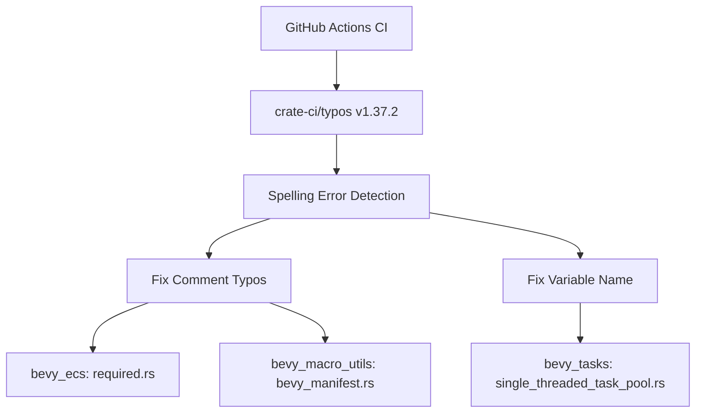

+++
title = "#21418 (Adopted) Bump crate-ci/typos from 1.36.3 to 1.37.2 #21414"
date = "2025-10-06T00:00:00"
draft = false
template = "pull_request_page.html"
in_search_index = true

[taxonomies]
list_display = ["show"]

[extra]
current_language = "en"
available_languages = {"en" = { name = "English", url = "/pull_request/bevy/2025-10/pr-21418-en-20251006" }, "zh-cn" = { name = "中文", url = "/pull_request/bevy/2025-10/pr-21418-zh-cn-20251006" }}
labels = ["D-Trivial", "A-Build-System"]
+++

# Title

## Basic Information
- **Title**: (Adopted) Bump crate-ci/typos from 1.36.3 to 1.37.2 #21414
- **PR Link**: https://github.com/bevyengine/bevy/pull/21418
- **Author**: greeble-dev
- **Status**: MERGED
- **Labels**: D-Trivial, A-Build-System, S-Needs-Review
- **Created**: 2025-10-06T09:54:56Z
- **Merged**: 2025-10-06T10:56:30Z
- **Merged By**: mockersf

## Description Translation
Adopts https://github.com/bevyengine/bevy/pull/21414. Bumps [crate-ci/typos](https://github.com/crate-ci/typos) from 1.36.3 to 1.37.2.

## The Story of This Pull Request

This PR represents a routine maintenance update focused on improving code quality through better spelling validation. The core issue was straightforward: the Bevy project uses the `crate-ci/typos` GitHub Action to detect and prevent spelling errors in code, and this dependency needed updating to the latest version.

The update from typos v1.36.3 to v1.37.2 brought improved spelling detection capabilities. As a result, the newer version identified several existing spelling errors in the codebase that had previously gone unnoticed. This created a natural workflow where updating the tool revealed issues that then needed to be fixed.

The changes fall into two categories: updating the CI configuration and fixing the newly detected spelling errors. In the CI workflow file, the version reference was updated from `v1.36.3` to `v1.37.2`. This simple version bump enabled the more sophisticated spelling checks that then identified the actual code issues.

The spelling corrections themselves were minor but important for code clarity and professionalism. In the ECS component system, the word "guarantees" was misspelled as "guaranees" in a safety comment. In the macro utilities, "stabilizes" was misspelled as "stablizes" in a TODO comment. Most significantly, in the task pool tests, a variable name was misspelled as `recever` instead of `receiver`, which could cause confusion during code maintenance.

These spelling corrections, while small, improve code readability and maintainability. Clear spelling in comments helps developers understand the code's intent, and correctly spelled variable names prevent confusion during debugging and future modifications.

The implementation approach was direct and effective: update the tool, run it to identify issues, then fix the identified problems. This demonstrates a good practice of keeping development tools current and addressing the issues they uncover.

## Visual Representation



## Key Files Changed

### `.github/workflows/ci.yml` (+1/-1)
Updated the typos action to the latest version to enable improved spelling detection.

```yaml
# File: .github/workflows/ci.yml
# Before:
-        uses: crate-ci/typos@v1.36.3

# After:
+        uses: crate-ci/typos@v1.37.2
```

### `crates/bevy_ecs/src/component/required.rs` (+1/-1)
Fixed a typo in a safety comment to improve code documentation clarity.

```rust
// File: crates/bevy_ecs/src/component/required.rs
// Before:
// SAFETY: the caller guaranees that `required_component` is valid for the component with ID `required_id`.

// After:
// SAFETY: the caller guarantees that `required_component` is valid for the component with ID `required_id`.
```

### `crates/bevy_macro_utils/src/bevy_manifest.rs` (+1/-1)
Corrected spelling in a TODO comment about future Rust language features.

```rust
// File: crates/bevy_macro_utils/src/bevy_manifest.rs
// Before:
// TODO: Switch to using RwLockWriteGuard::downgrade when it stablizes.

// After:
// TODO: Switch to using RwLockWriteGuard::downgrade when it stabilizes.
```

### `crates/bevy_tasks/src/single_threaded_task_pool.rs` (+2/-2)
Fixed a misspelled variable name in test code to maintain code consistency.

```rust
// File: crates/bevy_tasks/src/single_threaded_task_pool.rs
// Before:
        let (sender, recever) = async_channel::unbounded();
        // ... later in the test ...
                recever.recv().await

// After:
        let (sender, receiver) = async_channel::unbounded();
        // ... later in the test ...
                receiver.recv().await
```

## Further Reading

- [crate-ci/typos GitHub Repository](https://github.com/crate-ci/typos) - The spelling checker tool used in this PR
- [GitHub Actions Documentation](https://docs.github.com/en/actions) - For understanding CI/CD workflows
- [Rust API Guidelines on Naming](https://rust-lang.github.io/api-guidelines/naming.html) - Best practices for naming in Rust code