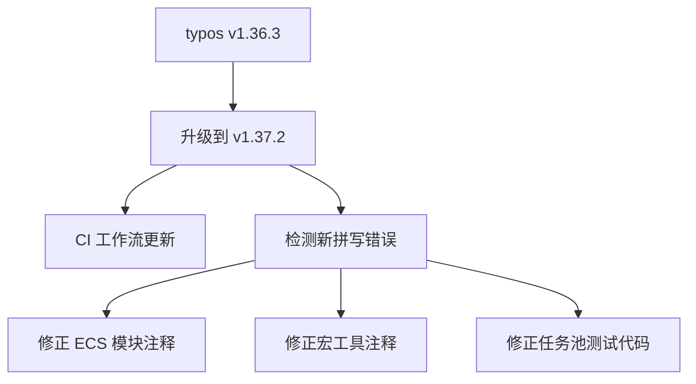

+++
title = "#21418 (Adopted) Bump crate-ci/typos from 1.36.3 to 1.37.2 #21414"
date = "2025-10-06T00:00:00"
draft = false
template = "pull_request_page.html"
in_search_index = false

[extra]
current_language = "zh-cn"
available_languages = {"en" = { name = "English", url = "/pull_request/bevy/2025-10/pr-21418-en-20251006" }, "zh-cn" = { name = "中文", url = "/pull_request/bevy/2025-10/pr-21418-zh-cn-20251006" }}
labels = ["D-Trivial", "A-Build-System"]
+++

# Title

## Basic Information
- **Title**: (Adopted) Bump crate-ci/typos from 1.36.3 to 1.37.2 #21414
- **PR Link**: https://github.com/bevyengine/bevy/pull/21418
- **Author**: greeble-dev
- **Status**: MERGED
- **Labels**: D-Trivial, A-Build-System, S-Needs-Review
- **Created**: 2025-10-06T09:54:56Z
- **Merged**: 2025-10-06T10:56:30Z
- **Merged By**: mockersf

## Description Translation
采用 https://github.com/bevyengine/bevy/pull/21414。将 [crate-ci/typos](https://github.com/crate-ci/typos) 从 1.36.3 升级到 1.37.2。

## The Story of This Pull Request

这是一个关于代码质量工具升级的简单但重要的维护性 PR。核心目标是更新 Bevy 项目中使用的代码拼写检查工具 typos 的版本，从 1.36.3 升级到 1.37.2。

在软件开发过程中，代码拼写错误虽然不影响功能，但会影响代码的可读性和专业性。Bevy 项目使用 crate-ci/typos 这个工具来自动化检测代码中的拼写错误。随着工具的版本迭代，新版本通常包含更多的拼写规则和改进的检测能力。

这个 PR 首先更新了 CI 工作流中使用的 typos 版本。在 `.github/workflows/ci.yml` 文件中，将使用的 action 版本从 `v1.36.3` 更新到 `v1.37.2`：

```yaml
# 更新前：
uses: crate-ci/typos@v1.36.3

# 更新后：
uses: crate-ci/typos@v1.37.2
```

版本升级后，新的 typos 工具检测出了代码库中之前未被发现的几个拼写错误。这些错误分布在三个不同的文件中：

在 `bevy_ecs` 模块的组件系统中，有一个安全注释中的拼写错误被修正。原来的 "guaranees" 被修正为正确的拼写 "guarantees"：

```rust
// 修正前：
// SAFETY: the caller guaranees that `required_component` is valid...

// 修正后：
// SAFETY: the caller guarantees that `required_component` is valid...
```

在 `bevy_macro_utils` 中，一个关于 Rust 标准库 API 稳定性的 TODO 注释中的拼写错误被修正。原来的 "stablizes" 被修正为 "stabilizes"：

```rust
// 修正前：
// TODO: Switch to using RwLockWriteGuard::downgrade when it stablizes.

// 修正后：
// TODO: Switch to using RwLockWriteGuard::downgrade when it stabilizes.
```

在 `bevy_tasks` 的测试代码中，一个变量名的拼写错误被修正。原来的 "recever" 被修正为正确的 "receiver"：

```rust
// 修正前：
let (sender, recever) = async_channel::unbounded();
// ... 
recever.recv().await

// 修正后：
let (sender, receiver) = async_channel::unbounded();
// ...
receiver.recv().await
```

这些修正虽然看起来很小，但对于维护代码质量和专业性很重要。特别是在安全注释和 API 文档中，准确的拼写能够确保其他开发者正确理解代码的意图和约束条件。

从技术角度看，这个 PR 展示了持续集成工具链维护的重要性。通过定期更新开发工具，项目能够受益于工具的最新改进，同时保持代码库的高质量标准。这类维护性工作虽然不涉及功能变更，但对于项目的长期健康至关重要。

## Visual Representation



## Key Files Changed

### `.github/workflows/ci.yml`
- **变更**: +1/-1
- **描述**: 更新 CI 工作流中使用的 typos 版本
- **代码示例**:
```yaml
# 变更前：
uses: crate-ci/typos@v1.36.3

# 变更后：
uses: crate-ci/typos@v1.37.2
```

### `crates/bevy_ecs/src/component/required.rs`
- **变更**: +1/-1
- **描述**: 修正安全注释中的拼写错误
- **代码示例**:
```rust
// 变更前：
// SAFETY: the caller guaranees that `required_component` is valid...

// 变更后：
// SAFETY: the caller guarantees that `required_component` is valid...
```

### `crates/bevy_macro_utils/src/bevy_manifest.rs`
- **变更**: +1/-1
- **描述**: 修正 TODO 注释中的拼写错误
- **代码示例**:
```rust
// 变更前：
// TODO: Switch to using RwLockWriteGuard::downgrade when it stablizes.

// 变更后：
// TODO: Switch to using RwLockWriteGuard::downgrade when it stabilizes.
```

### `crates/bevy_tasks/src/single_threaded_task_pool.rs`
- **变更**: +2/-2
- **描述**: 修正测试代码中的变量名拼写错误
- **代码示例**:
```rust
// 变更前：
let (sender, recever) = async_channel::unbounded();
recever.recv().await

// 变更后：
let (sender, receiver) = async_channel::unbounded();
receiver.recv().await
```

## Further Reading

- [crate-ci/typos GitHub Repository](https://github.com/crate-ci/typos) - 了解这个拼写检查工具的功能和使用方法
- [Bevy Engine Contribution Guidelines](https://github.com/bevyengine/bevy/blob/main/CONTRIBUTING.md) - Bevy 项目的贡献指南
- [GitHub Actions Documentation](https://docs.github.com/en/actions) - GitHub Actions 的官方文档