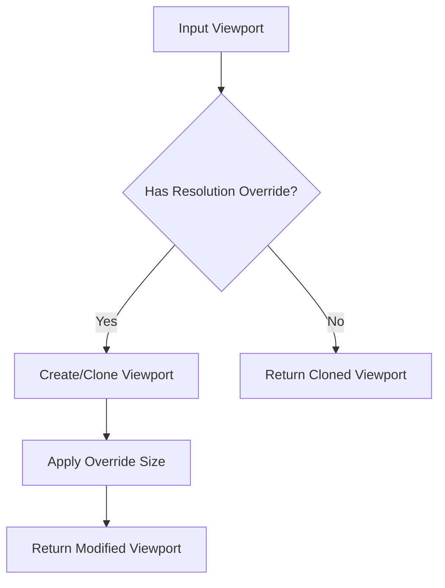

+++
title = "#21506 Clarify `from_viewport_and_override` logic"
date = "2025-10-29T00:00:00"
draft = false
template = "pull_request_page.html"
in_search_index = true

[taxonomies]
list_display = ["show"]

[extra]
current_language = "en"
available_languages = {"en" = { name = "English", url = "/pull_request/bevy/2025-10/pr-21506-en-20251029" }, "zh-cn" = { name = "中文", url = "/pull_request/bevy/2025-10/pr-21506-zh-cn-20251029" }}
labels = ["D-Trivial", "C-Code-Quality", "A-Camera"]
+++

# Title: Clarify `from_viewport_and_override` logic

## Basic Information
- **Title**: Clarify `from_viewport_and_override` logic
- **PR Link**: https://github.com/bevyengine/bevy/pull/21506
- **Author**: Breakdown-Dog
- **Status**: MERGED
- **Labels**: D-Trivial, C-Code-Quality, S-Ready-For-Final-Review, A-Camera
- **Created**: 2025-10-11T09:48:13Z
- **Merged**: 2025-10-29T19:31:18Z
- **Merged By**: alice-i-cecile

## Description Translation
# Objective

- This commit refactors the `from_viewport_and_override` function to improve readability and safety.

## Solution

- Replaces the initial `cloned()` and subsequent `if/else` logic with a clearer `if let` structure.
- Removes the need for `unwrap()` by handling both `Some` and `None` cases

## Testing

- I don't know how to make sure there is no probelm, but I run some examples and I don't see the errors.

## The Story of This Pull Request

This PR addresses a code quality issue in the Bevy camera system. The problem was in the `from_viewport_and_override` function, which had logic that was harder to read and used `unwrap()` - a potential source of runtime panics if the code structure were to change in the future.

The original implementation used a mutable `viewport` variable that started as a clone of the input, then conditionally modified it. This approach required checking if the viewport was `None` and creating a default, then using `unwrap()` to access the mutable reference. While functionally correct, this pattern is less idiomatic in Rust and introduces unnecessary risk.

The solution replaces this with a more straightforward approach using `if let` and `map_or_else`. When there's a resolution override, the code now explicitly handles both the `Some` and `None` cases for the viewport parameter. It either clones the existing viewport or creates a default one, then applies the override and returns the result. When there's no override, it simply returns a cloned viewport if one exists.

This refactoring demonstrates several Rust best practices:

1. **Eliminating `unwrap()`**: By using `map_or_else`, the code explicitly handles both cases without relying on runtime assertions
2. **Clearer control flow**: The `if let` structure makes it immediately obvious what condition triggers the override behavior
3. **Reduced mutable state**: The new implementation avoids the mutable variable and the conditional default initialization

The change is purely refactoring - it doesn't alter the functional behavior, just makes the code safer and more maintainable. The author tested this by running existing examples and verifying no regressions occurred, which is appropriate for a code quality improvement of this nature.

## Visual Representation



## Key Files Changed

**File**: `crates/bevy_camera/src/camera.rs` (+5/-9)

This file contains the core camera functionality in Bevy. The changes focus on the `Viewport` struct's `from_viewport_and_override` method, which handles viewport creation with optional resolution overrides.

**Before:**
```rust
impl Viewport {
    pub fn from_viewport_and_override(
        viewport: Option<&Self>,
        main_pass_resolution_override: Option<&MainPassResolutionOverride>,
    ) -> Option<Self> {
        let mut viewport = viewport.cloned();

        if let Some(override_size) = main_pass_resolution_override {
            if viewport.is_none() {
                viewport = Some(Viewport::default());
            }

            viewport.as_mut().unwrap().physical_size = **override_size;
        }

        viewport
    }
}
```

**After:**
```rust
impl Viewport {
    pub fn from_viewport_and_override(
        viewport: Option<&Self>,
        main_pass_resolution_override: Option<&MainPassResolutionOverride>,
    ) -> Option<Self> {
        if let Some(override_size) = main_pass_resolution_override {
            let mut vp = viewport.map_or_else(Self::default, Self::clone);
            vp.physical_size = **override_size;
            Some(vp)
        } else {
            viewport.cloned()
        }
    }
}
```

The key improvements:
- Removed mutable variable and `unwrap()` call
- Used `map_or_else` to handle both `Some` and `None` cases explicitly
- Clearer separation of the override vs non-override paths

## Further Reading

- [Rust Option::map_or_else documentation](https://doc.rust-lang.org/std/option/enum.Option.html#method.map_or_else)
- [Rust if let syntax](https://doc.rust-lang.org/rust-by-example/flow_control/if_let.html)
- [Bevy Camera System documentation](https://docs.rs/bevy_camera/latest/bevy_camera/)

# Full Code Diff
```diff
diff --git a/crates/bevy_camera/src/camera.rs b/crates/bevy_camera/src/camera.rs
index 815c7609460df..5a79bbbdc473e 100644
--- a/crates/bevy_camera/src/camera.rs
+++ b/crates/bevy_camera/src/camera.rs
@@ -84,17 +84,13 @@ impl Viewport {
         viewport: Option<&Self>,
         main_pass_resolution_override: Option<&MainPassResolutionOverride>,
     ) -> Option<Self> {
-        let mut viewport = viewport.cloned();
-
         if let Some(override_size) = main_pass_resolution_override {
-            if viewport.is_none() {
-                viewport = Some(Viewport::default());
-            }
-
-            viewport.as_mut().unwrap().physical_size = **override_size;
+            let mut vp = viewport.map_or_else(Self::default, Self::clone);
+            vp.physical_size = **override_size;
+            Some(vp)
+        } else {
+            viewport.cloned()
         }
-
-        viewport
     }
 }
 
```