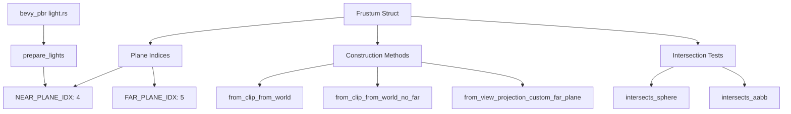

+++
title = "#21508 Improve Frustum struct readability"
date = "2025-10-29T00:00:00"
draft = false
template = "pull_request_page.html"
in_search_index = true

[taxonomies]
list_display = ["show"]

[extra]
current_language = "en"
available_languages = {"en" = { name = "English", url = "/pull_request/bevy/2025-10/pr-21508-en-20251029" }, "zh-cn" = { name = "中文", url = "/pull_request/bevy/2025-10/pr-21508-zh-cn-20251029" }}
labels = ["D-Trivial", "C-Code-Quality", "A-Camera"]
+++

# Improve Frustum struct readability

## Basic Information
- **Title**: Improve Frustum struct readability
- **PR Link**: https://github.com/bevyengine/bevy/pull/21508
- **Author**: Breakdown-Dog
- **Status**: MERGED
- **Labels**: D-Trivial, C-Code-Quality, S-Ready-For-Final-Review, A-Camera
- **Created**: 2025-10-11T14:00:52Z
- **Merged**: 2025-10-29T19:31:18Z
- **Merged By**: alice-i-cecile

## Description Translation
# Objective

- This PR refactors the Frustum struct to improve code readability and maintainability by replacing magic numbers with named constants and unrolling a loop for clarity.

## Testing

- I ran the command 'cargo test --package bevy_camera --lib -- primitives::tests --show-output' and all the test are passed.

---

## The Story of This Pull Request

This PR addresses a common code quality issue in the Bevy engine's frustum implementation: the use of hard-coded indices and complex loop logic that made the code difficult to understand and maintain. The changes focus on improving readability through straightforward refactoring techniques.

The core problem was that the `Frustum` struct used magic numbers like `4` and `5` to represent specific plane indices (near and far planes) throughout the codebase. These magic numbers appeared in multiple methods including `from_clip_from_world`, `intersects_sphere`, and `intersects_aabb`. When reading the code, developers had to mentally track what each index represented, which increased cognitive load and made the code more error-prone during modifications.

The solution approach was systematic and practical. The developer introduced named constants to replace the magic numbers:

```rust
pub const NEAR_PLANE_IDX: usize = 4;
const FAR_PLANE_IDX: usize = 5;
const INACTIVE_HALF_SPACE: Vec4 = Vec4::new(0.0, 0.0, 0.0, f32::INFINITY);
```

These constants immediately clarify the purpose of each index. For example, instead of seeing `half_spaces[5]`, developers now see `half_spaces[Self::FAR_PLANE_IDX]`, which is self-documenting.

One of the most significant changes was in the `from_clip_from_world_no_far` method, where a complex loop with conditional logic was replaced with explicit array construction:

**Before:**
```rust
let mut half_spaces = [HalfSpace::default(); 6];
for (i, half_space) in half_spaces.iter_mut().enumerate().take(5) {
    let row = clip_from_world.row(i / 2);
    *half_space = HalfSpace::new(if (i & 1) == 0 && i != 4 {
        row3 + row
    } else {
        row3 - row
    });
}
half_spaces[5] = HalfSpace::new(Vec4::new(0.0, 0.0, 0.0, f32::MAX));
```

**After:**
```rust
Self {
    half_spaces: [
        HalfSpace::new(row3 + row0),
        HalfSpace::new(row3 - row0),
        HalfSpace::new(row3 + row1),
        HalfSpace::new(row3 - row1),
        HalfSpace::new(row3 + row2),
        HalfSpace::new(Self::INACTIVE_HALF_SPACE),
    ],
}
```

This unrolled loop is much easier to understand because it clearly shows how each plane is constructed from the matrix rows. The relationship between the matrix components and the resulting frustum planes becomes immediately apparent.

The changes also improved the `intersects_aabb` method by combining two separate condition checks into a single, more readable condition:

```rust
if (idx == Self::NEAR_PLANE_IDX && !intersect_near)
    || (idx == Self::FAR_PLANE_IDX && !intersect_far)
{
    continue;
}
```

This consolidation makes the skip logic more explicit and reduces the chance of missing one of the conditions during future modifications.

The impact of these changes is primarily on code maintainability. The refactored code is easier to read, understand, and modify. The use of named constants reduces the risk of off-by-one errors when working with plane indices, and the explicit array construction eliminates the mental overhead of deciphering complex loop logic.

From a technical perspective, these changes don't affect performance since they're primarily syntactic improvements that compile to the same machine code. The constants are resolved at compile time, and the unrolled loop produces identical instructions to the original loop.

The changes also demonstrate good software engineering practices by making the code more self-documenting and reducing the reliance on comments to explain what specific numerical values represent.

## Visual Representation



## Key Files Changed

### `crates/bevy_camera/src/primitives.rs` (+29/-18)

This file contains the core frustum implementation changes. The modifications replace magic numbers with named constants and simplify complex loop logic.

**Key changes:**
- Added named constants for plane indices
- Replaced loop with explicit array construction
- Improved condition checks in intersection methods

**Code examples:**
```rust
// Before:
frustum.half_spaces[5] = HalfSpace::new(clip_from_world.row(2));

// After:
frustum.half_spaces[Self::FAR_PLANE_IDX] = HalfSpace::new(clip_from_world.row(2));
```

```rust
// Before:
let max = if intersect_far { 6 } else { 5 };
for half_space in &self.half_spaces[..max] {

// After:
let max = if intersect_far {
    Self::FAR_PLANE_IDX
} else {
    Self::NEAR_PLANE_IDX
};
for half_space in &self.half_spaces[..=max] {
```

### `crates/bevy_pbr/src/render/light.rs` (+5/-2)

This file was updated to use the new named constant from the Frustum struct, ensuring consistency across the codebase.

**Code example:**
```rust
// Before:
frustum.half_spaces[4] =
    HalfSpace::new(frustum.half_spaces[4].normal().extend(f32::INFINITY));

// After:
frustum.half_spaces[Frustum::NEAR_PLANE_IDX] = HalfSpace::new(
    frustum.half_spaces[Frustum::NEAR_PLANE_IDX]
        .normal()
        .extend(f32::INFINITY),
);
```

## Further Reading

- [Bevy Engine Documentation on Cameras and Projection](https://bevyengine.org/learn/book/getting-started/camera/)
- [Frustum Culling Techniques](https://learnopengl.com/Guest-Articles/2021/Scene/Frustum-Culling)
- [Rust Code Style Guidelines](https://github.com/rust-lang/rfcs/blob/master/style-guide/README.md)
- [Magic Numbers in Software Development](https://refactoring.guru/replace-magic-number-with-symbolic-constant)