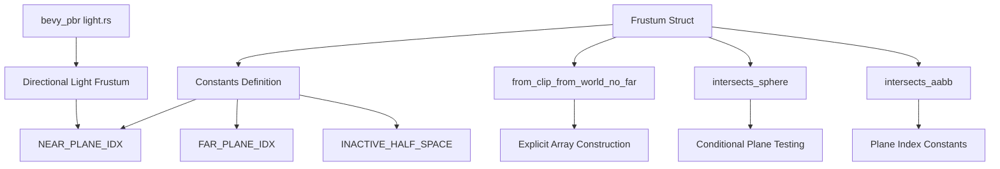

+++
title = "#21508 Improve Frustum struct readability"
date = "2025-10-29T00:00:00"
draft = false
template = "pull_request_page.html"
in_search_index = false

[extra]
current_language = "zh-cn"
available_languages = {"en" = { name = "English", url = "/pull_request/bevy/2025-10/pr-21508-en-20251029" }, "zh-cn" = { name = "中文", url = "/pull_request/bevy/2025-10/pr-21508-zh-cn-20251029" }}
labels = ["D-Trivial", "C-Code-Quality", "A-Camera"]
+++

# Improve Frustum struct readability

## Basic Information
- **Title**: Improve Frustum struct readability
- **PR Link**: https://github.com/bevyengine/bevy/pull/21508
- **Author**: Breakdown-Dog
- **Status**: MERGED
- **Labels**: D-Trivial, C-Code-Quality, S-Ready-For-Final-Review, A-Camera
- **Created**: 2025-10-11T14:00:52Z
- **Merged**: 2025-10-29T19:31:18Z
- **Merged By**: alice-i-cecile

## Description Translation
# Objective

- 这个 PR 重构了 Frustum 结构体，通过用命名常量替换魔法数字和展开循环以提高清晰度，从而改善代码可读性和可维护性。

## Testing

- 我运行了命令 'cargo test --package bevy_camera --lib -- primitives::tests --show-output'，所有测试都通过了。

---

## The Story of This Pull Request

这个 PR 主要解决了一个典型的代码可读性问题：在 Frustum 结构体的实现中使用了硬编码的索引值和魔法数字，这使得代码难以理解和维护。

问题的核心在于 `primitives.rs` 文件中的 Frustum 实现。原来的代码使用数字 4 和 5 来分别表示近平面和远平面的索引，同时在 `from_clip_from_world_no_far` 方法中使用了一个复杂的循环逻辑来构建平截头体的六个面。这种实现方式有几个问题：

1. **魔法数字问题**：数字 4 和 5 在代码中直接出现，没有明确的含义说明
2. **循环逻辑复杂**：原有的循环使用位运算和条件判断，理解起来比较困难
3. **维护困难**：如果需要调整平面索引或逻辑，需要仔细检查所有使用这些数字的地方

开发者采取的解决方案很直接：用命名常量替换魔法数字，并展开复杂的循环为显式的数组构造。

首先，在 Frustum 实现中引入了三个常量：

```rust
pub const NEAR_PLANE_IDX: usize = 4;
const FAR_PLANE_IDX: usize = 5;
const INACTIVE_HALF_SPACE: Vec4 = Vec4::new(0.0, 0.0, 0.0, f32::INFINITY);
```

这些常量立即改善了代码的可读性。现在，当看到 `Frustum::NEAR_PLANE_IDX` 时，开发者可以清楚地知道这是在引用近平面，而不是一个神秘的数字 4。

接下来，关键的改进是在 `from_clip_from_world_no_far` 方法中。原来的实现使用了一个复杂的循环：

```rust
let mut half_spaces = [HalfSpace::default(); 6];
for (i, half_space) in half_spaces.iter_mut().enumerate().take(5) {
    let row = clip_from_world.row(i / 2);
    *half_space = HalfSpace::new(if (i & 1) == 0 && i != 4 {
        row3 + row
    } else {
        row3 - row
    });
}
half_spaces[5] = HalfSpace::new(Vec4::new(0.0, 0.0, 0.0, f32::MAX));
```

这个循环的逻辑比较复杂：它遍历前5个平面，根据索引的奇偶性决定是加还是减矩阵行，并且对索引4有特殊处理。展开后的版本更加清晰：

```rust
Self {
    half_spaces: [
        HalfSpace::new(row3 + row0),
        HalfSpace::new(row3 - row0),
        HalfSpace::new(row3 + row1),
        HalfSpace::new(row3 - row1),
        HalfSpace::new(row3 + row2),
        HalfSpace::new(Self::INACTIVE_HALF_SPACE),
    ],
}
```

现在可以清楚地看到六个平面的构造方式：每个坐标轴的正负方向各一个平面，加上一个初始化的远平面。

在相交测试方法中，原来的硬编码数字也被替换为命名常量：

```rust
// 之前：
let max = if intersect_far { 6 } else { 5 };

// 之后：
let max = if intersect_far {
    Self::FAR_PLANE_IDX
} else {
    Self::NEAR_PLANE_IDX
};
```

在 `intersects_aabb` 方法中，条件判断也变得更加清晰：

```rust
// 之前：
if idx == 4 && !intersect_near {
    continue;
}
if idx == 5 && !intersect_far {
    continue;
}

// 之后：
if (idx == Self::NEAR_PLANE_IDX && !intersect_near)
    || (idx == Self::FAR_PLANE_IDX && !intersect_far)
{
    continue;
}
```

这种重构的一个重要好处是提高了代码的维护性。现在，如果需要调整平面索引，只需要修改常量定义，而不需要搜索和替换整个代码库中的魔法数字。

在 `bevy_pbr/src/render/light.rs` 中，相应的修改也体现了这种改进：

```rust
// 之前：
frustum.half_spaces[4] =
    HalfSpace::new(frustum.half_spaces[4].normal().extend(f32::INFINITY));

// 之后：
frustum.half_spaces[Frustum::NEAR_PLANE_IDX] = HalfSpace::new(
    frustum.half_spaces[Frustum::NEAR_PLANE_IDX]
        .normal()
        .extend(f32::INFINITY),
);
```

这个修改使得代码的意图更加明确：我们正在修改近平面，而不是某个神秘的第四个平面。

从技术角度来看，这种重构不会影响性能，因为常量在编译时会被内联，展开的循环也不会引入额外的运行时开销。但它在可读性和可维护性方面带来了显著的改进。

## Visual Representation



## Key Files Changed

### `crates/bevy_camera/src/primitives.rs` (+29/-18)

这个文件包含了 Frustum 结构体的主要实现改进：

**主要变更：**
1. 添加了命名常量来替换魔法数字
2. 展开复杂循环为显式数组构造
3. 更新相交测试方法使用命名常量

**关键代码片段：**

```rust
// 新增常量定义
pub const NEAR_PLANE_IDX: usize = 4;
const FAR_PLANE_IDX: usize = 5;
const INACTIVE_HALF_SPACE: Vec4 = Vec4::new(0.0, 0.0, 0.0, f32::INFINITY);

// 改进的 from_clip_from_world_no_far 方法
fn from_clip_from_world_no_far(clip_from_world: &Mat4) -> Self {
    let row0 = clip_from_world.row(0);
    let row1 = clip_from_world.row(1);
    let row2 = clip_from_world.row(2);
    let row3 = clip_from_world.row(3);

    Self {
        half_spaces: [
            HalfSpace::new(row3 + row0),
            HalfSpace::new(row3 - row0),
            HalfSpace::new(row3 + row1),
            HalfSpace::new(row3 - row1),
            HalfSpace::new(row3 + row2),
            HalfSpace::new(Self::INACTIVE_HALF_SPACE),
        ],
    }
}
```

### `crates/bevy_pbr/src/render/light.rs` (+5/-2)

这个文件更新了方向光平截头体的处理，使用新的命名常量：

**关键代码片段：**

```rust
// 使用命名常量替换魔法数字
frustum.half_spaces[Frustum::NEAR_PLANE_IDX] = HalfSpace::new(
    frustum.half_spaces[Frustum::NEAR_PLANE_IDX]
        .normal()
        .extend(f32::INFINITY),
);
```

## Further Reading

- [Rust 常量文档](https://doc.rust-lang.org/std/keyword.const.html) - 了解 Rust 中常量的使用最佳实践
- [Bevy 相机系统文档](https://docs.rs/bevy_camera/latest/bevy_camera/) - 了解 Bevy 相机系统的工作原理
- [平截头体剔除算法](https://learnopengl.com/Guest-Articles/2021/Scene/Frustum-Culling) - 深入理解平截头体在图形编程中的应用
- [代码可读性最佳实践](https://rust-unofficial.github.io/patterns/idioms/avoid-magic-numbers.html) - 避免使用魔法数字的编程模式

# Full Code Diff
```diff
diff --git a/crates/bevy_camera/src/primitives.rs b/crates/bevy_camera/src/primitives.rs
index e7f7526dce6ac..86c487150053c 100644
--- a/crates/bevy_camera/src/primitives.rs
+++ b/crates/bevy_camera/src/primitives.rs
@@ -275,11 +275,15 @@ pub struct Frustum {
 }
 
 impl Frustum {
+    pub const NEAR_PLANE_IDX: usize = 4;
+    const FAR_PLANE_IDX: usize = 5;
+    const INACTIVE_HALF_SPACE: Vec4 = Vec4::new(0.0, 0.0, 0.0, f32::INFINITY);
+
     /// Returns a frustum derived from `clip_from_world`.
     #[inline]
     pub fn from_clip_from_world(clip_from_world: &Mat4) -> Self {
         let mut frustum = Frustum::from_clip_from_world_no_far(clip_from_world);
-        frustum.half_spaces[5] = HalfSpace::new(clip_from_world.row(2));
+        frustum.half_spaces[Self::FAR_PLANE_IDX] = HalfSpace::new(clip_from_world.row(2));
         frustum
     }
 
@@ -294,7 +298,7 @@ impl Frustum {
     ) -> Self {
         let mut frustum = Frustum::from_clip_from_world_no_far(clip_from_world);
         let far_center = *view_translation - far * *view_backward;
-        frustum.half_spaces[5] =
+        frustum.half_spaces[Self::FAR_PLANE_IDX] =
             HalfSpace::new(view_backward.extend(-view_backward.dot(far_center)));
         frustum
     }
@@ -305,26 +309,33 @@ impl Frustum {
     /// Returns a frustum derived from `view_projection`,
     /// without a far plane.
     fn from_clip_from_world_no_far(clip_from_world: &Mat4) -> Self {
+        let row0 = clip_from_world.row(0);
+        let row1 = clip_from_world.row(1);
+        let row2 = clip_from_world.row(2);
         let row3 = clip_from_world.row(3);
-        let mut half_spaces = [HalfSpace::default(); 6];
-        for (i, half_space) in half_spaces.iter_mut().enumerate().take(5) {
-            let row = clip_from_world.row(i / 2);
-            *half_space = HalfSpace::new(if (i & 1) == 0 && i != 4 {
-                row3 + row
-            } else {
-                row3 - row
-            });
+
+        Self {
+            half_spaces: [
+                HalfSpace::new(row3 + row0),
+                HalfSpace::new(row3 - row0),
+                HalfSpace::new(row3 + row1),
+                HalfSpace::new(row3 - row1),
+                HalfSpace::new(row3 + row2),
+                HalfSpace::new(Self::INACTIVE_HALF_SPACE),
+            ],
         }
-        half_spaces[5] = HalfSpace::new(Vec4::new(0.0, 0.0, 0.0, f32::MAX));
-        Self { half_spaces }
     }
 
     /// Checks if a sphere intersects the frustum.
     #[inline]
     pub fn intersects_sphere(&self, sphere: &Sphere, intersect_far: bool) -> bool {
         let sphere_center = sphere.center.extend(1.0);
-        let max = if intersect_far { 6 } else { 5 };
-        for half_space in &self.half_spaces[..max] {
+        let max = if intersect_far {
+            Self::FAR_PLANE_IDX
+        } else {
+            Self::NEAR_PLANE_IDX
+        };
+        for half_space in &self.half_spaces[..=max] {
             if half_space.normal_d().dot(sphere_center) + sphere.radius <= 0.0 {
                 return false;
             }
@@ -342,11 +353,11 @@ impl Frustum {
         intersect_far: bool,
     ) -> bool {
         let aabb_center_world = world_from_local.transform_point3a(aabb.center).extend(1.0);
+
         for (idx, half_space) in self.half_spaces.into_iter().enumerate() {
-            if idx == 4 && !intersect_near {
-                continue;
-            }
-            if idx == 5 && !intersect_far {
+            if (idx == Self::NEAR_PLANE_IDX && !intersect_near)
+                || (idx == Self::FAR_PLANE_IDX && !intersect_far)
+            {
                 continue;
             }
             let p_normal = half_space.normal();
diff --git a/crates/bevy_pbr/src/render/light.rs b/crates/bevy_pbr/src/render/light.rs
index 8bce0f4556bb6..f95b69a0a7859 100644
--- a/crates/bevy_pbr/src/render/light.rs
+++ b/crates/bevy_pbr/src/render/light.rs
@@ -1557,8 +1557,11 @@ pub fn prepare_lights(
 
                 let mut frustum = *frustum;
                 // Push the near clip plane out to infinity for directional lights
-                frustum.half_spaces[4] =
-                    HalfSpace::new(frustum.half_spaces[4].normal().extend(f32::INFINITY));
+                frustum.half_spaces[Frustum::NEAR_PLANE_IDX] = HalfSpace::new(
+                    frustum.half_spaces[Frustum::NEAR_PLANE_IDX]
+                        .normal()
+                        .extend(f32::INFINITY),
+                );
 
                 let retained_view_entity = RetainedViewEntity::new(
                     *light_main_entity,
```