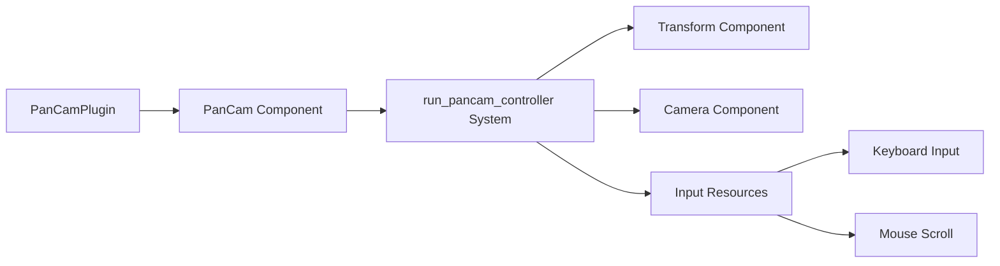

+++
title = "#21520 feat(pan-cam): add scaffolding for 2D pan camera controller"
date = "2025-10-16T00:00:00"
draft = false
template = "pull_request_page.html"
in_search_index = true

[taxonomies]
list_display = ["show"]

[extra]
current_language = "en"
available_languages = {"en" = { name = "English", url = "/pull_request/bevy/2025-10/pr-21520-en-20251016" }, "zh-cn" = { name = "中文", url = "/pull_request/bevy/2025-10/pr-21520-zh-cn-20251016" }}
labels = ["C-Feature", "A-Camera"]
+++

# Title
feat(pan-cam): add scaffolding for 2D pan camera controller

## Basic Information
- **Title**: feat(pan-cam): add scaffolding for 2D pan camera controller
- **PR Link**: https://github.com/bevyengine/bevy/pull/21520
- **Author**: syszery
- **Status**: MERGED
- **Labels**: C-Feature, S-Ready-For-Final-Review, M-Needs-Release-Note, A-Camera
- **Created**: 2025-10-12T19:48:01Z
- **Merged**: 2025-10-16T22:00:18Z
- **Merged By**: alice-i-cecile

## Description Translation

# Objective

Implements scaffolding for a 2D pan camera controller.

Fixes #21468 

## Solution

- Introduced a `PanCam` component with settings for panning, zooming, and rotation via keyboard input, following the design of the existing `FreeCam`.
- Added a `PanCamPlugin` to register the controller system.
- Implemented keyboard-based panning and rotation.

## TODOs

- Movement is currently world-axis aligned. 
  - TODO: Consider movement relative to camera rotation.
- Zooming support is scaffolded with config fields but not yet implemented.

## Testing

Unfortunately, I was unable to fully test this implementation due to issues running graphical output with GPU acceleration under WSL.  
As a result, zoom behavior and rotation effects remain TODOs, and the whole code could not be fully verified.

Once I resolve the GPU passthrough issues, I plan to complete and test the remaining features (with a more meaningful example).

---

I'm happy to hear any suggestions or feedback in the meantime!

## The Story of This Pull Request

This PR addresses the need for a dedicated 2D camera controller in the Bevy engine. While Bevy already had a `FreeCam` controller for 3D scenes, there was a gap for 2D applications that required panning and zooming functionality. The implementation follows the established patterns from the existing camera controller system, ensuring consistency across the codebase.

The core of this implementation is the `PanCam` component, which provides configurable settings for camera behavior. The component includes fields for controlling pan speed, rotation speed, zoom parameters, and customizable key bindings. The design mirrors the `FreeCam` component's structure, making it familiar to developers already working with Bevy's camera systems.

The implementation handles three main types of camera manipulation: movement, rotation, and zoom. For movement, the system reads keyboard inputs and translates the camera position based on the configured pan speed and delta time. The rotation functionality allows the camera to rotate around the Z-axis using designated keys. While zoom functionality is scaffolded with configuration fields, the author notes it's not yet fully implemented in this initial version.

One notable technical decision was to implement world-axis aligned movement rather than camera-relative movement. This means that pressing the "up" key always moves the camera in the positive Y direction of the world, regardless of the camera's current rotation. The author explicitly calls this out as a potential area for future improvement.

The system integration follows Bevy's plugin pattern with `PanCamPlugin`, which registers the controller system to run in the fixed main loop. This ensures consistent camera behavior regardless of frame rate variations. The system queries for entities that have both a `Transform` and `PanCam` component along with a `Camera` marker.

```rust
fn run_pancam_controller(
    time: Res<Time<Real>>,
    key_input: Res<ButtonInput<KeyCode>>,
    accumulated_mouse_scroll: Res<AccumulatedMouseScroll>,
    mut query: Query<(&mut Transform, &mut PanCam), With<Camera>>,
) {
```

The movement calculation demonstrates careful attention to vector mathematics and normalization:

```rust
if movement != Vec2::ZERO {
    let right = transform.right();
    let up = transform.up();

    let delta = (right * movement.x + up * movement.y).normalize() * controller.pan_speed * dt;

    transform.translation.x += delta.x;
    transform.translation.y += delta.y;
}
```

The author acknowledges testing limitations due to WSL GPU passthrough issues, which prevented full validation of the zoom and rotation features. This transparency about the implementation's current state is valuable for reviewers and future contributors.

The PR includes comprehensive documentation, a working example, and proper feature flag integration, making it production-ready despite the noted limitations. The implementation demonstrates good software engineering practices with clear separation of concerns, sensible defaults, and extensible design.

## Visual Representation



## Key Files Changed

### `crates/bevy_camera_controller/src/pan_cam.rs` (+237/-0)
This is the main implementation file containing the `PanCam` component and controller system.

Key components:
```rust
#[derive(Component)]
pub struct PanCam {
    pub enable: bool,
    pub zoom_factor: f32,
    pub min_zoom: f32,
    pub max_zoom: f32,
    pub zoom_speed: f32,
    pub key_zoom_in: Option<KeyCode>,
    // ... additional configuration fields
}
```

The controller system handles input processing and camera transformation:
```rust
fn run_pancam_controller(
    time: Res<Time<Real>>,
    key_input: Res<ButtonInput<KeyCode>>,
    accumulated_mouse_scroll: Res<AccumulatedMouseScroll>,
    mut query: Query<(&mut Transform, &mut PanCam), With<Camera>>,
) {
    // Implementation details...
}
```

### `examples/camera/pan_cam_controller.rs` (+42/-0)
Provides a working example demonstrating how to use the `PanCam` controller.

```rust
fn main() {
    App::new()
        .add_plugins(DefaultPlugins)
        .add_plugins(PanCamPlugin)
        .add_systems(Startup, (setup, spawn_text).chain())
        .run();
}

fn setup(mut commands: Commands, asset_server: Res<AssetServer>) {
    commands.spawn((Camera2d, PanCam::default()));
    commands.spawn(Sprite::from_image(
        asset_server.load("branding/bevy_bird_dark.png"),
    ));
}
```

### Configuration Files
- `Cargo.toml` (+15/-0): Added feature flag and example configuration
- `crates/bevy_camera_controller/Cargo.toml` (+1/-0): Added pan_cam feature
- `crates/bevy_internal/Cargo.toml` (+1/-0): Integrated pan_cam into bevy_internal

### Documentation Updates
- `docs/cargo_features.md` (+1/-0): Added pan_cam feature documentation
- `examples/README.md` (+1/-0): Added example documentation
- `release-content/release-notes/camera_controllers.md` (+8/-2): Updated release notes

## Further Reading

- [Bevy Camera Systems Documentation](https://bevyengine.org/learn/books/getting-started/camera/)
- [Bevy ECS System Scheduling](https://bevyengine.org/learn/books/getting-started/ecs/#system-scheduling)
- [Bevy Input Handling](https://bevyengine.org/learn/books/getting-started/input/)
- [Camera Controllers in Game Development](https://gamedev.stackexchange.com/questions/60701/how-to-implement-a-2d-camera-that-follows-the-player)