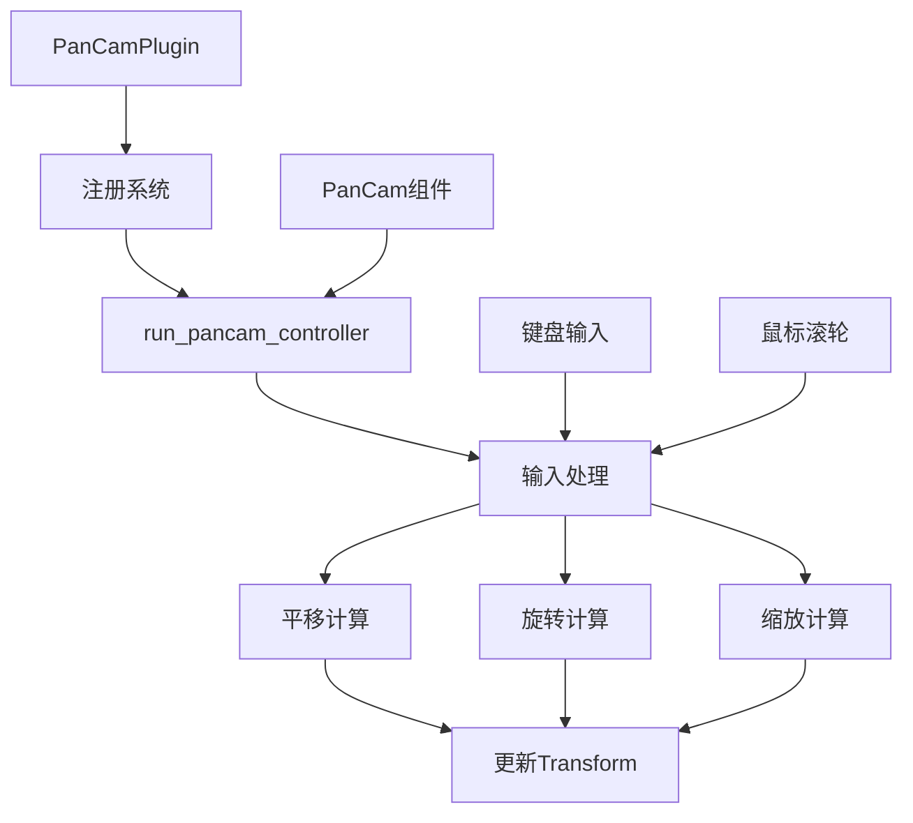

+++
title = "#21520 feat(pan-cam): add scaffolding for 2D pan camera controller"
date = "2025-10-16T00:00:00"
draft = false
template = "pull_request_page.html"
in_search_index = false

[extra]
current_language = "zh-cn"
available_languages = {"en" = { name = "English", url = "/pull_request/bevy/2025-10/pr-21520-en-20251016" }, "zh-cn" = { name = "中文", url = "/pull_request/bevy/2025-10/pr-21520-zh-cn-20251016" }}
labels = ["C-Feature", "A-Camera"]
+++

# Title

## Basic Information
- **Title**: feat(pan-cam): add scaffolding for 2D pan camera controller
- **PR Link**: https://github.com/bevyengine/bevy/pull/21520
- **Author**: syszery
- **Status**: MERGED
- **Labels**: C-Feature, S-Ready-For-Final-Review, M-Needs-Release-Note, A-Camera
- **Created**: 2025-10-12T19:48:01Z
- **Merged**: 2025-10-16T22:00:18Z
- **Merged By**: alice-i-cecile

## Description Translation
**目标**

实现2D平移相机控制器的脚手架。

修复 #21468

**解决方案**

- 引入 `PanCam` 组件，包含通过键盘输入进行平移、缩放和旋转的设置，遵循现有 `FreeCam` 的设计。
- 添加 `PanCamPlugin` 来注册控制器系统。
- 实现基于键盘的平移和旋转。

**待办事项**

- 当前移动与世界轴对齐。
  - 待办：考虑相对于相机旋转的移动。
- 缩放支持已通过配置字段搭建脚手架但尚未实现。

**测试**

不幸的是，由于在WSL下运行图形输出与GPU加速的问题，我无法完全测试此实现。
因此，缩放行为和旋转效果仍然是待办事项，整个代码无法完全验证。

一旦我解决了GPU直通问题，我计划完成并测试剩余功能（使用更有意义的示例）。

---

在此期间，我很乐意听取任何建议或反馈。

## The Story of This Pull Request

这个PR解决了一个具体的需求：为Bevy引擎添加一个专门用于2D场景的平移相机控制器。开发者syszery面临的问题是Bevy缺乏原生的2D相机控制解决方案，用户需要手动实现平移、缩放和旋转功能。

**问题背景与约束**

在2D游戏开发中，相机控制是基础需求。开发者经常需要实现类似RTS游戏或地图查看器的相机行为——通过键盘或鼠标平移视图，并支持缩放。此前Bevy的相机控制器主要针对3D场景，缺乏专门为2D优化的解决方案。

技术约束包括：
- 需要与Bevy现有的ECS架构和输入系统集成
- 遵循现有相机控制器的设计模式
- 提供灵活的配置选项
- 保持向后兼容性

**解决方案架构**

开发者采用了与现有`FreeCam`控制器相似的架构模式。这种一致性让熟悉Bevy的开发者能够快速上手。核心设计包括：

1. **组件化设计**：`PanCam`组件包含所有配置选项
2. **插件系统**：`PanCamPlugin`负责系统注册
3. **输入处理**：支持键盘和鼠标输入

**实现细节**

核心实现在`run_pancam_controller`系统中，该系统处理三种主要操作：

```rust
// 平移处理
let mut movement = Vec2::ZERO;
if let Some(key) = controller.key_left {
    if key_input.pressed(key) {
        movement.x -= 1.0;
    }
}
// ... 其他方向键处理

if movement != Vec2::ZERO {
    let right = transform.right();
    let up = transform.up();
    let delta = (right * movement.x + up * movement.y).normalize() * controller.pan_speed * dt;
    transform.translation.x += delta.x;
    transform.translation.y += delta.y;
}
```

平移系统考虑了相机的当前朝向，使用`transform.right()`和`transform.up()`来确保移动方向与相机视角一致。

旋转实现相对直接：
```rust
if let Some(key) = controller.key_rotate_ccw {
    if key_input.pressed(key) {
        transform.rotate_z(controller.rotation_speed * dt);
    }
}
```

缩放系统同时支持键盘和鼠标输入：
```rust
// 键盘缩放
if let Some(key) = controller.key_zoom_in {
    if key_input.pressed(key) {
        zoom_amount -= controller.zoom_speed;
    }
}

// 鼠标滚轮缩放
let mouse_scroll = match accumulated_mouse_scroll.unit {
    MouseScrollUnit::Line => accumulated_mouse_scroll.delta.y,
    MouseScrollUnit::Pixel => {
        accumulated_mouse_scroll.delta.y / MouseScrollUnit::SCROLL_UNIT_CONVERSION_FACTOR
    }
};
```

**技术决策与权衡**

开发者做出了几个重要的技术决策：

1. **使用固定时间步长系统**：确保相机移动在不同帧率下保持一致
2. **线性缩放模型**：简单直观，但未来可能需要考虑非线性缩放
3. **可配置键位**：所有控制键都可以自定义或禁用
4. **组件启用开关**：通过`enable`字段可以临时禁用控制器

**已知限制**

开发者明确指出了当前实现的局限性：
- 移动基于世界坐标系而非相机本地坐标系
- 缩放功能虽然搭好了框架但未完全实现
- 由于测试环境限制，部分功能未经充分验证

**集成考虑**

这个实现很好地融入了Bevy的现有生态：
- 遵循标准的插件模式
- 使用现有的输入系统
- 提供详细的默认配置
- 包含完整的文档和示例

**潜在改进**

从代码结构看，未来可能的改进包括：
- 添加鼠标拖拽平移支持
- 实现基于相机本地坐标系的移动
- 添加缩放限制和动画过渡
- 支持触摸输入用于移动设备

## Visual Representation



## Key Files Changed

### `crates/bevy_camera_controller/src/pan_cam.rs` (+237/-0)
这是核心实现文件，定义了`PanCam`组件和控制器系统。

**关键代码片段：**
```rust
#[derive(Component)]
pub struct PanCam {
    pub enable: bool,
    pub zoom_factor: f32,
    pub min_zoom: f32,
    pub max_zoom: f32,
    pub zoom_speed: f32,
    pub key_zoom_in: Option<KeyCode>,
    // ... 其他字段
}

impl Default for PanCam {
    fn default() -> Self {
        Self {
            enable: true,
            zoom_factor: 1.0,
            min_zoom: 0.1,
            max_zoom: 5.0,
            zoom_speed: 0.1,
            key_zoom_in: Some(KeyCode::Equal),
            key_zoom_out: Some(KeyCode::Minus),
            pan_speed: 500.0,
            key_up: Some(KeyCode::KeyW),
            key_down: Some(KeyCode::KeyS),
            key_left: Some(KeyCode::KeyA),
            key_right: Some(KeyCode::KeyD),
            rotation_speed: PI,
            key_rotate_ccw: Some(KeyCode::KeyQ),
            key_rotate_cw: Some(KeyCode::KeyE),
        }
    }
}
```

### `examples/camera/pan_cam_controller.rs` (+42/-0)
示例文件展示了如何使用新的相机控制器。

**关键代码片段：**
```rust
fn main() {
    App::new()
        .add_plugins(DefaultPlugins)
        .add_plugins(PanCamPlugin) // 添加PanCam插件启用相机平移和缩放控制
        .add_systems(Startup, (setup, spawn_text).chain())
        .run();
}

fn setup(mut commands: Commands, asset_server: Res<AssetServer>) {
    // 使用默认PanCam设置生成2D相机
    commands.spawn((Camera2d, PanCam::default()));
    
    commands.spawn(Sprite::from_image(
        asset_server.load("branding/bevy_bird_dark.png"),
    ));
}
```

### `Cargo.toml` (+15/-0)
添加了新的特性标志和示例配置。

**关键修改：**
```toml
# 启用bevy_camera_controller中的pan cam
pan_cam = ["bevy_internal/pan_cam"]

[[example]]
name = "pan_cam_controller"
path = "examples/camera/pan_cam_controller.rs"
doc-scrape-examples = true
required-features = ["pan_cam"]
```

### `crates/bevy_camera_controller/src/lib.rs` (+3/-0)
在库中导出新的pan_cam模块。

**关键修改：**
```rust
#[cfg(feature = "pan_cam")]
pub mod pan_cam;
```

### `release-content/release-notes/camera_controllers.md` (+15/-2)
更新发布说明，添加新控制器的文档。

## Further Reading

- [Bevy Camera Controllers Documentation](https://bevyengine.org/learn/books/camera-controllers/)
- [Bevy Input System](https://bevyengine.org/learn/books/input/)
- [ECS Architecture in Bevy](https://bevyengine.org/learn/books/ecs/)
- [Existing FreeCam Implementation](https://github.com/bevyengine/bevy/tree/main/crates/bevy_camera_controller/src/free_cam.rs) - 参考现有实现的设计模式