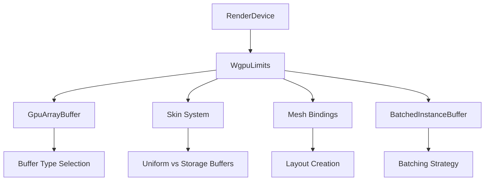

+++
title = "#21533 lift limits up a bit for bevy_material"
date = "2025-10-15T00:00:00"
draft = false
template = "pull_request_page.html"
in_search_index = true

[taxonomies]
list_display = ["show"]

[extra]
current_language = "en"
available_languages = {"en" = { name = "English", url = "/pull_request/bevy/2025-10/pr-21533-en-20251015" }, "zh-cn" = { name = "中文", url = "/pull_request/bevy/2025-10/pr-21533-zh-cn-20251015" }}
labels = ["A-Rendering"]
+++

# Title
lift limits up a bit for bevy_material

## Basic Information
- **Title**: lift limits up a bit for bevy_material
- **PR Link**: https://github.com/bevyengine/bevy/pull/21533
- **Author**: atlv24
- **Status**: MERGED
- **Labels**: A-Rendering, S-Ready-For-Final-Review
- **Created**: 2025-10-13T20:04:13Z
- **Merged**: 2025-10-14T21:21:17Z
- **Merged By**: alice-i-cecile

## Description Translation
# Objective

- prepare for bevy_material

## Solution

- lift up Limits through some api to use RenderDevice less

## Testing

- ci

## The Story of This Pull Request

This PR represents a systematic refactoring of how GPU device limits are accessed throughout Bevy's rendering system. The core problem being addressed is the tight coupling between rendering components and the `RenderDevice` - many functions only needed device limits information but were receiving the entire device object.

The solution approach is straightforward but impactful: instead of passing `RenderDevice` to functions that only need to check device capabilities, we now pass `&WgpuLimits` directly. This reduces dependencies and makes the code more focused. The implementation required changes across multiple rendering modules, consistently replacing `RenderDevice` parameter with `WgpuLimits` where only limits were being used.

The technical insight here is that many rendering decisions - particularly around buffer selection (uniform buffers vs storage buffers) and batching strategies - depend on device capabilities rather than the device itself. By abstracting this dependency, we make the code more testable and reduce unnecessary coupling. This is especially important for preparing the codebase for the upcoming `bevy_material` system, which will introduce more complex material handling.

The impact is primarily architectural: cleaner separation of concerns, reduced dependency coupling, and better testability. Performance remains unchanged since we're still accessing the same limits information, just through a more direct path.

## Visual Representation



## Key Files Changed

### `crates/bevy_render/src/render_resource/gpu_array_buffer.rs` (+7/-9)
This file contains the core logic for GPU array buffer management. The changes shift from device-based to limits-based initialization and configuration.

```rust
// Before:
pub fn new(device: &RenderDevice) -> Self {
    let limits = device.limits();
    if limits.max_storage_buffers_per_shader_stage == 0 {
        GpuArrayBuffer::Uniform(BatchedUniformBuffer::new(&limits))
    } else {
        GpuArrayBuffer::Storage(BufferVec::new(BufferUsages::STORAGE))
    }
}

// After:
pub fn new(limits: &Limits) -> Self {
    if limits.max_storage_buffers_per_shader_stage == 0 {
        GpuArrayBuffer::Uniform(BatchedUniformBuffer::new(limits))
    } else {
        GpuArrayBuffer::Storage(BufferVec::new(BufferUsages::STORAGE))
    }
}
```

### `crates/bevy_pbr/src/render/mesh_bindings.rs` (+21/-21)
This file handles mesh binding layouts. The changes propagate limits through all layout creation functions.

```rust
// Before:
pub(super) fn model(render_device: &RenderDevice) -> BindGroupLayoutEntryBuilder {
    GpuArrayBuffer::<MeshUniform>::binding_layout(render_device)
        .visibility(ShaderStages::VERTEX_FRAGMENT)
}

// After:
pub(super) fn model(limits: &WgpuLimits) -> BindGroupLayoutEntryBuilder {
    GpuArrayBuffer::<MeshUniform>::binding_layout(limits)
        .visibility(ShaderStages::VERTEX_FRAGMENT)
}
```

### `crates/bevy_pbr/src/render/skin.rs` (+6/-6)
The skinning system needed updates to use limits for buffer selection decisions.

```rust
// Before:
pub fn skins_use_uniform_buffers(render_device: &RenderDevice) -> bool {
    static SKINS_USE_UNIFORM_BUFFERS: OnceLock<bool> = OnceLock::new();
    *SKINS_USE_UNIFORM_BUFFERS
        .get_or_init(|| render_device.limits().max_storage_buffers_per_shader_stage == 0)
}

// After:
pub fn skins_use_uniform_buffers(limits: &WgpuLimits) -> bool {
    static SKINS_USE_UNIFORM_BUFFERS: OnceLock<bool> = OnceLock::new();
    *SKINS_USE_UNIFORM_BUFFERS.get_or_init(|| limits.max_storage_buffers_per_shader_stage == 0)
}
```

### `crates/bevy_pbr/src/render/mesh.rs` (+10/-7)
The main mesh rendering pipeline now uses limits for various configuration decisions.

```rust
// Changes in multiple locations from:
skins_use_uniform_buffers(&render_device)
// To:
skins_use_uniform_buffers(&render_device.limits())
```

### `crates/bevy_sprite_render/src/mesh2d/mesh.rs` (+8/-4)
The 2D mesh system follows the same pattern as the 3D system.

```rust
// Before:
commands.insert_resource(BatchedInstanceBuffer::<Mesh2dUniform>::new(&render_device));

// After:
commands.insert_resource(BatchedInstanceBuffer::<Mesh2dUniform>::new(
    &render_device.limits(),
));
```

## Further Reading

- [WebGPU Limits Documentation](https://gpuweb.github.io/gpuweb/#limits)
- [Bevy Rendering Architecture](https://bevyengine.org/learn/quick-start/rendering/)
- [WGSL Storage vs Uniform Buffers](https://sotrh.github.io/learn-wgpu/showcase/storage-buffers/)
- [Bevy ECS System Parameters](https://bevyengine.org/learn/quick-start/system-params/)