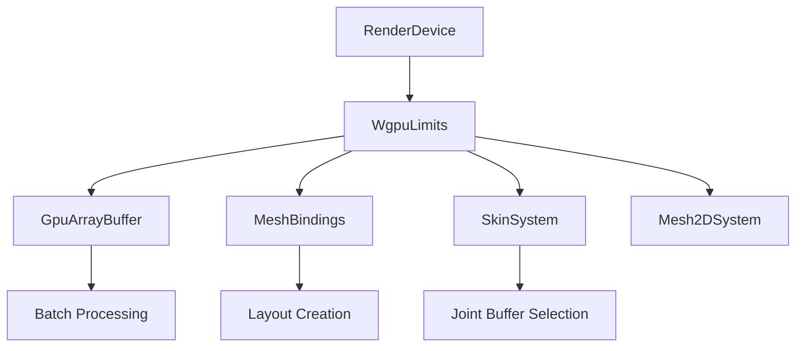

+++
title = "#21533 lift limits up a bit for bevy_material"
date = "2025-10-15T00:00:00"
draft = false
template = "pull_request_page.html"
in_search_index = false

[extra]
current_language = "zh-cn"
available_languages = {"en" = { name = "English", url = "/pull_request/bevy/2025-10/pr-21533-en-20251015" }, "zh-cn" = { name = "中文", url = "/pull_request/bevy/2025-10/pr-21533-zh-cn-20251015" }}
labels = ["A-Rendering"]
+++

# lift limits up a bit for bevy_material

## Basic Information
- **Title**: lift limits up a bit for bevy_material
- **PR Link**: https://github.com/bevyengine/bevy/pull/21533
- **Author**: atlv24
- **Status**: MERGED
- **Labels**: A-Rendering, S-Ready-For-Final-Review
- **Created**: 2025-10-13T20:04:13Z
- **Merged**: 2025-10-14T21:21:17Z
- **Merged By**: alice-i-cecile

## Description Translation
# 目标

- 为 bevy_material 做准备

## 解决方案

- 通过一些 API 将 Limits 向上传递以减少 RenderDevice 的使用

## 测试

- ci

## The Story of This Pull Request

这个 PR 的核心目标是重构 Bevy 渲染系统中对硬件限制的访问方式，为后续的 bevy_material 功能做准备。修改涉及将原本直接依赖 `RenderDevice` 获取硬件限制的代码，改为通过传递 `WgpuLimits` 参数的方式来减少对 `RenderDevice` 的直接依赖。

**问题背景**
在原始的代码实现中，多个渲染组件直接通过 `RenderDevice` 来查询硬件限制，这造成了不必要的耦合。当需要在不同上下文中使用这些限制信息时，代码必须传递完整的 `RenderDevice` 实例，而实际上只需要其中的限制信息。这种设计限制了代码的灵活性，特别是在为即将到来的 bevy_material 系统做准备时。

**解决方案**
开发者采用了参数化的方法，将硬件限制信息作为独立的参数传递。具体来说，将原本接受 `&RenderDevice` 参数的函数改为接受 `&WgpuLimits` 参数。这样，调用者只需传递 `render_device.limits()` 而不是整个设备实例。

**实现细节**
主要的修改集中在几个关键组件上：

在 `GpuArrayBuffer` 的实现中，构造函数和相关方法现在直接接收 `&Limits` 参数：
```rust
// 修改前
pub fn new(device: &RenderDevice) -> Self

// 修改后  
pub fn new(limits: &Limits) -> Self
```

类似的模式也应用到了皮肤系统和网格绑定系统中。例如，`skins_use_uniform_buffers` 函数现在接收 `&WgpuLimits` 而不是 `&RenderDevice`：
```rust
// 修改前
pub fn skins_use_uniform_buffers(render_device: &RenderDevice) -> bool

// 修改后
pub fn skins_use_uniform_buffers(limits: &WgpuLimits) -> bool
```

在网格绑定布局的创建过程中，所有的布局入口函数现在都接收 `&WgpuLimits` 参数：
```rust
// 修改前
pub(super) fn model(render_device: &RenderDevice) -> BindGroupLayoutEntryBuilder

// 修改后
pub(super) fn model(limits: &WgpuLimits) -> BindGroupLayoutEntryBuilder
```

**技术洞察**
这种重构体现了依赖注入的原则，通过将硬件限制信息抽象为独立的参数，提高了代码的可测试性和模块化程度。现在，这些函数不再依赖于具体的设备实例，而是依赖于纯数据结构的限制信息，这使得在测试环境中模拟不同的硬件配置变得更加容易。

**影响**
这个修改为后续的 bevy_material 系统铺平了道路，因为它减少了渲染组件之间的耦合。从性能角度来看，这个修改是中性的 - 它只是改变了参数传递的方式，并没有引入新的计算开销。从架构角度来看，这个修改使得代码更加清晰，职责更加明确。

## Visual Representation



## Key Files Changed

### `crates/bevy_render/src/render_resource/gpu_array_buffer.rs` (+7/-9)
这个文件包含了 `GpuArrayBuffer` 的核心实现修改，现在直接接收 `Limits` 参数而不是 `RenderDevice`。

```rust
// 修改前:
pub fn new(device: &RenderDevice) -> Self {
    let limits = device.limits();
    if limits.max_storage_buffers_per_shader_stage == 0 {
        GpuArrayBuffer::Uniform(BatchedUniformBuffer::new(&limits))
    } else {
        GpuArrayBuffer::Storage(BufferVec::new(BufferUsages::STORAGE))
    }
}

// 修改后:
pub fn new(limits: &Limits) -> Self {
    if limits.max_storage_buffers_per_shader_stage == 0 {
        GpuArrayBuffer::Uniform(BatchedUniformBuffer::new(limits))
    } else {
        GpuArrayBuffer::Storage(BufferVec::new(BufferUsages::STORAGE))
    }
}
```

### `crates/bevy_pbr/src/render/mesh_bindings.rs` (+21/-21)
网格绑定系统现在使用 `WgpuLimits` 来创建绑定组布局，减少了与 `RenderDevice` 的直接耦合。

```rust
// 修改前:
pub(super) fn model(render_device: &RenderDevice) -> BindGroupLayoutEntryBuilder {
    GpuArrayBuffer::<MeshUniform>::binding_layout(render_device)
        .visibility(ShaderStages::VERTEX_FRAGMENT)
}

// 修改后:
pub(super) fn model(limits: &WgpuLimits) -> BindGroupLayoutEntryBuilder {
    GpuArrayBuffer::<MeshUniform>::binding_layout(limits)
        .visibility(ShaderStages::VERTEX_FRAGMENT)
}
```

### `crates/bevy_pbr/src/render/skin.rs` (+6/-6)
皮肤系统现在基于 `WgpuLimits` 来决定使用 uniform buffers 还是 storage buffers。

```rust
// 修改前:
pub fn skins_use_uniform_buffers(render_device: &RenderDevice) -> bool {
    static SKINS_USE_UNIFORM_BUFFERS: OnceLock<bool> = OnceLock::new();
    *SKINS_USE_UNIFORM_BUFFERS
        .get_or_init(|| render_device.limits().max_storage_buffers_per_shader_stage == 0)
}

// 修改后:
pub fn skins_use_uniform_buffers(limits: &WgpuLimits) -> bool {
    static SKINS_USE_UNIFORM_BUFFERS: OnceLock<bool> = OnceLock::new();
    *SKINS_USE_UNIFORM_BUFFERS.get_or_init(|| limits.max_storage_buffers_per_shader_stage == 0)
}
```

### `crates/bevy_pbr/src/render/mesh.rs` (+10/-7)
网格渲染系统现在通过 `limits()` 方法获取硬件限制信息。

```rust
// 修改前:
per_object_buffer_batch_size: GpuArrayBuffer::<MeshUniform>::batch_size(&render_device),

// 修改后:
per_object_buffer_batch_size: GpuArrayBuffer::<MeshUniform>::batch_size(
    &render_device.limits(),
),
```

### `crates/bevy_sprite_render/src/mesh2d/mesh.rs` (+8/-4)
2D 网格系统也进行了相应的修改，使用相同的模式。

```rust
// 修改前:
commands.insert_resource(BatchedInstanceBuffer::<Mesh2dUniform>::new(&render_device));

// 修改后:
commands.insert_resource(BatchedInstanceBuffer::<Mesh2dUniform>::new(
    &render_device.limits(),
));
```

## Further Reading

- [WebGPU Limits Documentation](https://gpuweb.github.io/gpuweb/#limits)
- [Bevy Render Architecture](https://bevyengine.org/learn/quick-start/getting-started/systems/)
- [WGSL Storage vs Uniform Buffers](https://sotrh.github.io/learn-wgpu/showcase/storage-buffer/)
- [Dependency Injection Patterns](https://en.wikipedia.org/wiki/Dependency_injection)