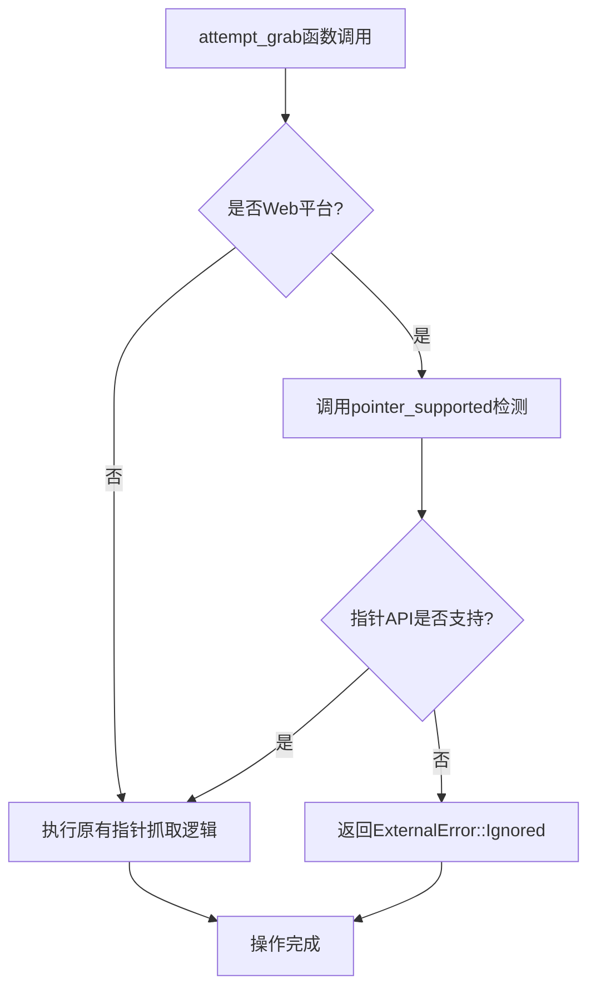

+++
title = "#21534 Do not attempt to grab pointer on web if unsupported."
date = "2025-10-15T00:00:00"
draft = false
template = "pull_request_page.html"
in_search_index = false

[extra]
current_language = "zh-cn"
available_languages = {"en" = { name = "English", url = "/pull_request/bevy/2025-10/pr-21534-en-20251015" }, "zh-cn" = { name = "中文", url = "/pull_request/bevy/2025-10/pr-21534-zh-cn-20251015" }}
labels = ["C-Bug", "A-Windowing", "P-Crash", "P-Regression", "X-Contentious"]
+++

# Title

## Basic Information
- **Title**: Do not attempt to grab pointer on web if unsupported.
- **PR Link**: https://github.com/bevyengine/bevy/pull/21534
- **Author**: rectalogic
- **Status**: MERGED
- **Labels**: C-Bug, A-Windowing, P-Crash, P-Regression, S-Ready-For-Final-Review, X-Contentious
- **Created**: 2025-10-13T21:02:57Z
- **Merged**: 2025-10-14T21:46:31Z
- **Merged By**: alice-i-cecile

## Description Translation
**目标**
修复 https://github.com/bevyengine/bevy/issues/21497

**解决方案**
移动端网页不支持指针API，如果使用会导致panic。在使用前检查它们是否存在。

**测试**
使用 https://github.com/rectalogic/pointerlock 在iOS Safari上进行了测试。

## The Story of This Pull Request

这个PR解决了一个在移动端网页浏览器上运行Bevy应用时出现的崩溃问题。问题的根源在于Bevy引擎试图在移动端网页环境中使用指针锁定API，但这些API在移动浏览器中并不支持。

### 问题背景

在Bevy引擎中，当应用程序需要捕获鼠标指针时（例如在游戏中实现鼠标锁定），会调用`attempt_grab`函数。这个函数在桌面平台上工作正常，但在移动端网页环境中，指针锁定API并不存在。当Bevy尝试调用这些不存在的API时，会导致JavaScript异常和应用程序崩溃。

这个问题被标记为回归(P-Regression)，说明它是在之前的某个版本中引入的新问题。考虑到移动端网页游戏的使用场景越来越普遍，这个崩溃问题严重影响了用户体验。

### 解决方案设计

开发者采用了特性检测(feature detection)的方法来解决这个问题。核心思路是在尝试使用指针API之前，先检查这些API在当前环境中是否可用。如果不可用，则提前返回错误而不是继续执行会崩溃的操作。

这种方法比用户代理(user agent)检测更可靠，因为它直接测试API的可用性，而不是依赖于浏览器版本字符串的解析。

### 实现细节

实现分为两个主要部分：

首先，在`Cargo.toml`中添加了`js-sys`依赖，这是必要的因为新的检测逻辑需要使用JavaScript反射API来检查方法是否存在。

其次，在`winit_windows.rs`中新增了两个关键部分：
1. `pointer_supported()`函数 - 专门用于检测指针API是否可用
2. 在`attempt_grab()`函数开头添加的条件检查

`pointer_supported()`函数的实现很巧妙：它通过检查`document.exitPointerLock`方法是否存在来判断指针锁定API的可用性。这个检查使用了JavaScript的反射API，如果任何一步失败（例如没有window对象或document对象），函数会返回`Err(ExternalError::Ignored)`。

在`attempt_grab()`函数中，添加了条件编译指令`#[cfg(target_arch = "wasm32")]`，确保这个检查只在WebAssembly目标平台上执行。如果检测到指针API不可用，函数会立即返回错误，避免后续会崩溃的操作。

### 技术考量

这个解决方案展示了几个重要的工程原则：

1. **防御性编程**：在调用可能不存在的API之前进行可用性检查
2. **平台特定处理**：使用条件编译确保只在相关平台上执行检测逻辑
3. **优雅降级**：当功能不可用时返回适当的错误而不是崩溃
4. **最小化影响**：改动范围很小，只影响有问题的代码路径

返回`ExternalError::Ignored`是一个合适的选择，因为它表示操作被有意忽略而不是发生了意外错误，这允许上层代码根据情况决定如何处理。

### 影响评估

这个修复解决了移动端网页上的崩溃问题，使得Bevy应用能够在iOS Safari等移动浏览器中正常运行。虽然指针锁定功能在这些平台上不可用，但应用程序至少能够启动和运行，而不是直接崩溃。

从代码质量角度看，这个解决方案保持了向后兼容性，对现有代码的影响很小，并且遵循了Rust和Web开发的最佳实践。

## Visual Representation



## Key Files Changed

### `crates/bevy_winit/Cargo.toml`
**更改描述**：添加了`js-sys`依赖，用于在WebAssembly环境中使用JavaScript反射API进行特性检测。

**代码片段**：
```toml
[target.'cfg(target_arch = "wasm32")'.dependencies]
wasm-bindgen = { version = "0.2" }
web-sys = "0.3"
+ js-sys = "0.3"
```

### `crates/bevy_winit/src/winit_windows.rs`
**更改描述**：新增指针支持检测函数，并在尝试抓取指针前进行可用性检查。

**代码片段**：
```rust
// 新增的指针支持检测函数
#[cfg(target_arch = "wasm32")]
fn pointer_supported() -> Result<bool, ExternalError> {
    Ok(js_sys::Reflect::has(
        web_sys::window()
            .ok_or(ExternalError::Ignored)?
            .document()
            .ok_or(ExternalError::Ignored)?
            .as_ref(),
        &"exitPointerLock".into(),
    )
    .unwrap_or(false))
}

// 在attempt_grab函数中添加的条件检查
pub(crate) fn attempt_grab(
    winit_window: &WinitWindow,
    grab_mode: CursorGrabMode,
) -> Result<(), ExternalError> {
    // Do not attempt to grab on web if unsupported (e.g. mobile)
    #[cfg(target_arch = "wasm32")]
    if !pointer_supported()? {
        return Err(ExternalError::Ignored);
    }

    let grab_result = match grab_mode {
        // ... 原有逻辑保持不变
    };
    // ... 其余代码
}
```

## Further Reading

- [MDN Web Docs: Pointer Lock API](https://developer.mozilla.org/en-US/docs/Web/API/Pointer_Lock_API) - 关于指针锁定API的完整文档
- [web-sys crate documentation](https://docs.rs/web-sys/) - Rust中Web API的绑定
- [js-sys crate documentation](https://docs.rs/js-sys/) - Rust中JavaScript内置对象的绑定
- [Feature Detection vs Browser Sniffing](https://developer.mozilla.org/en-US/docs/Learn/Tools_and_testing/Cross_browser_testing/Feature_detection) - 特性检测的最佳实践