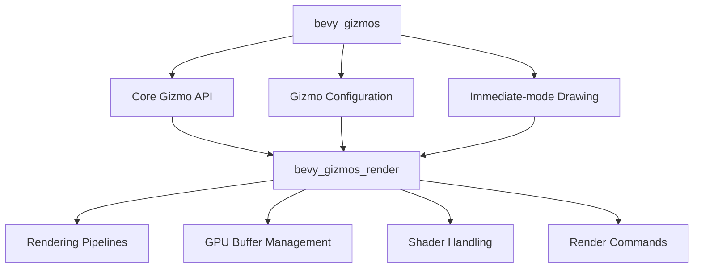

+++
title = "#21536 bevy_gizmos_render"
date = "2025-10-15T00:00:00"
draft = false
template = "pull_request_page.html"
in_search_index = true

[taxonomies]
list_display = ["show"]

[extra]
current_language = "en"
available_languages = {"en" = { name = "English", url = "/pull_request/bevy/2025-10/pr-21536-en-20251015" }, "zh-cn" = { name = "中文", url = "/pull_request/bevy/2025-10/pr-21536-zh-cn-20251015" }}
labels = ["A-Rendering", "A-Gizmos", "D-Modest"]
+++

# Title
bevy_gizmos_render

## Basic Information
- **Title**: bevy_gizmos_render
- **PR Link**: https://github.com/bevyengine/bevy/pull/21536
- **Author**: atlv24
- **Status**: MERGED
- **Labels**: A-Rendering, S-Ready-For-Final-Review, A-Gizmos, M-Needs-Release-Note, D-Modest
- **Created**: 2025-10-14T00:26:11Z
- **Merged**: 2025-10-14T22:06:21Z
- **Merged By**: alice-i-cecile

## Description Translation
# Objective

- make gizmos render agnostic

## Solution

- split crate

## Testing

- ci and a few examples

## The Story of This Pull Request

This PR addresses a fundamental architectural concern in the Bevy engine's gizmo system. The core issue was that the `bevy_gizmos` crate contained both the immediate-mode gizmo drawing API and the rendering implementation, creating tight coupling between the gizmo abstraction and the specific rendering backend.

The problem manifested in several ways. First, the `bevy_gizmos` crate had complex conditional compilation with features like `bevy_render`, `bevy_pbr`, and `bevy_sprite_render`, making it difficult to use gizmos in contexts without a full rendering setup. Second, this coupling limited the reusability of the gizmo system in different rendering contexts and made the codebase harder to maintain.

The solution approach was straightforward but impactful: split the monolithic `bevy_gizmos` crate into two separate crates. The new architecture separates concerns cleanly:
- `bevy_gizmos`: Contains the core gizmo API, configuration, and immediate-mode drawing functionality
- `bevy_gizmos_render`: Handles all rendering-specific implementation details

This architectural change required careful refactoring. The implementation involved moving approximately 567 lines of rendering code from `bevy_gizmos` to the new `bevy_gizmos_render` crate. This included:
- Rendering pipelines for 2D and 3D gizmos
- GPU buffer management and shader handling
- Render command implementations
- Vertex buffer layout definitions

The key technical insight was identifying which components were truly rendering-specific versus core gizmo functionality. For example, the `GizmoAsset` and configuration structures remained in the core crate, while the GPU-specific implementations like `GpuLineGizmo` and rendering pipelines moved to the render crate.

This separation brings several concrete improvements. It makes the core gizmo system render-agnostic, allowing it to be used in contexts without Bevy's renderer. The codebase becomes more maintainable with clearer separation of concerns. Additionally, the change enables future rendering backends to implement gizmo rendering without modifying the core gizmo API.

The migration was handled carefully to maintain backward compatibility. The existing `bevy_gizmos` feature now depends on the new `bevy_gizmos_render` feature, ensuring that existing code continues to work without changes. A migration guide was added to help users who were using `default-features = false` with custom rendering setups.

## Visual Representation



## Key Files Changed

### `crates/bevy_gizmos/src/lib.rs` (+22/-567)
This file was significantly refactored to remove all rendering-specific code. The core gizmo API and asset management remain, while rendering systems, pipelines, and GPU buffer management were extracted.

```rust
// Before: Rendering systems and pipelines were defined here
#[cfg(feature = "bevy_render")]
mod pipeline_2d;
#[cfg(feature = "bevy_render")]
mod pipeline_3d;

// After: Only core gizmo functionality remains
pub mod aabb;
pub mod arcs;
pub mod arrows;
// ... other core modules
```

### `crates/bevy_gizmos_render/src/lib.rs` (+547/-0)
This new file contains all the rendering functionality extracted from the main gizmos crate, including render pipelines, GPU buffer management, and shader handling.

```rust
// The new render plugin that handles all rendering setup
#[derive(Default)]
pub struct GizmoRenderPlugin;

impl Plugin for GizmoRenderPlugin {
    fn build(&self, app: &mut App) {
        // Rendering-specific initialization
        app.add_plugins(UniformComponentPlugin::<LineGizmoUniform>::default())
            .add_plugins(RenderAssetPlugin::<GpuLineGizmo>::default());
        // ... more rendering setup
    }
}
```

### `crates/bevy_gizmos/src/config.rs` (Structural changes)
The configuration system was refactored to be render-agnostic, removing conditional compilation for rendering features.

```rust
// Before: Conditional compilation for render features
#[cfg(all(
    feature = "bevy_render",
    any(feature = "bevy_pbr", feature = "bevy_sprite_render")
))]
pub(crate) struct GizmoMeshConfig {
    pub line_perspective: bool,
    // ... other fields
}

// After: Configuration is always available and public
#[derive(Component)]
pub struct GizmoMeshConfig {
    pub line_perspective: bool,
    // ... other fields now public
}
```

### `crates/bevy_gizmos/src/gizmos.rs` (API exposure changes)
Internal buffer fields were made public to allow the render crate to access them.

```rust
// Before: Private internal fields
pub(crate) list_positions: Vec<Vec3>,
pub(crate) list_colors: Vec<LinearRgba>,

// After: Public fields for render crate access
pub list_positions: Vec<Vec3>,
pub list_colors: Vec<LinearRgba>,
```

### `crates/bevy_gizmos_render/src/retained.rs` (+76/-0)
This file contains the rendering extraction logic for retained gizmos, moved from the original crate.

```rust
pub(crate) fn extract_linegizmos(
    mut commands: Commands,
    mut previous_len: Local<usize>,
    query: Extract<Query<(Entity, &Gizmo, &GlobalTransform, Option<&RenderLayers>)>>,
) {
    // Rendering extraction logic for retained gizmos
}
```

## Further Reading

- [Bevy Engine Architecture](https://bevyengine.org/learn/quick-start/getting-started/setup/)
- [Rendering Abstraction Patterns](https://github.com/bevyengine/bevy/blob/main/ARCHITECTURE.md)
- [WGSL Shader Language](https://gpuweb.github.io/gpuweb/wgsl/)
- [Entity Component System Pattern](https://en.wikipedia.org/wiki/Entity_component_system)