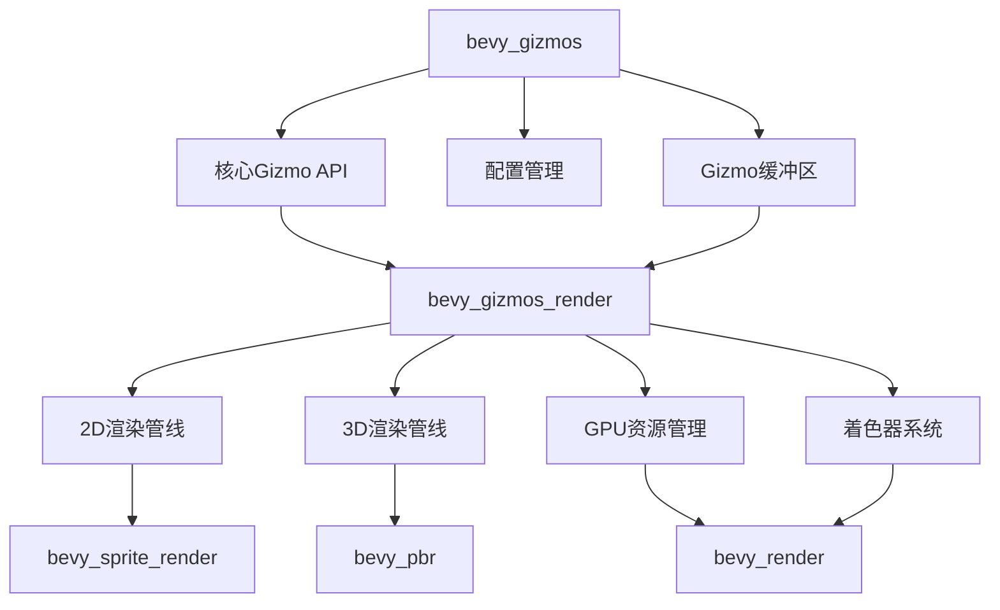

+++
title = "#21536 bevy_gizmos_render"
date = "2025-10-15T00:00:00"
draft = false
template = "pull_request_page.html"
in_search_index = false

[extra]
current_language = "zh-cn"
available_languages = {"en" = { name = "English", url = "/pull_request/bevy/2025-10/pr-21536-en-20251015" }, "zh-cn" = { name = "中文", url = "/pull_request/bevy/2025-10/pr-21536-zh-cn-20251015" }}
labels = ["A-Rendering", "A-Gizmos", "D-Modest"]
+++

# Title
bevy_gizmos_render

## Basic Information
- **Title**: bevy_gizmos_render  
- **PR Link**: https://github.com/bevyengine/bevy/pull/21536
- **Author**: atlv24
- **Status**: MERGED
- **Labels**: A-Rendering, S-Ready-For-Final-Review, A-Gizmos, M-Needs-Release-Note, D-Modest
- **Created**: 2025-10-14T00:26:11Z
- **Merged**: 2025-10-14T22:06:21Z
- **Merged By**: alice-i-cecile

## Description Translation
# 目标

- 使gizmos渲染与具体实现无关

## 解决方案

- 拆分crate

## 测试

- CI和几个示例

## The Story of This Pull Request

这个PR的核心目标是将Bevy引擎中的gizmos功能进行模块化分离，具体来说是将渲染相关的代码从`bevy_gizmos`crate中分离出来，创建一个新的`bevy_gizmos_render`crate。这种架构调整体现了现代游戏引擎设计中关注点分离的原则。

### 问题背景

在原始的`bevy_gizmos`实现中，gizmos的逻辑功能和渲染功能紧密耦合在一起。这种设计存在几个问题：

1. **依赖关系复杂**：`bevy_gizmos`直接依赖多个渲染相关的crate，如`bevy_render`、`bevy_pbr`、`bevy_sprite_render`等
2. **功能边界模糊**：gizmos的核心API与渲染实现混杂在一起
3. **配置管理困难**：渲染配置与非渲染配置没有清晰的分离

### 解决方案架构

开发者采用了模块化重构的方法，将渲染相关的功能提取到独立的crate中。这种分离允许：

- `bevy_gizmos`专注于gizmos的核心API和逻辑
- `bevy_gizmos_render`专门处理与渲染后端相关的实现

### 实现细节

重构过程涉及多个关键方面的代码迁移：

**依赖关系调整**：
```toml
# Before: bevy_gizmos/Cargo.toml 包含大量渲染依赖
[dependencies]
bevy_pbr = { path = "../bevy_pbr", version = "0.18.0-dev", optional = true }
bevy_sprite_render = { path = "../bevy_sprite_render", version = "0.18.0-dev", optional = true }
# ... 其他渲染相关依赖

# After: 移除了所有渲染依赖，只保留核心功能依赖
[dependencies]
bevy_app = { path = "../bevy_app", version = "0.18.0-dev" }
bevy_camera = { path = "../bevy_camera", version = "0.18.0-dev" }
# ... 核心功能依赖
```

**API边界清晰化**：
在`bevy_gizmos`中，之前被条件编译(`#[cfg(feature = "bevy_render")]`)包围的渲染相关API现在被完全移除，包括：
- `GizmoRenderSystems`系统集定义
- 渲染管线相关的模块(`pipeline_2d`, `pipeline_3d`)
- 所有与WebGPU渲染相关的类型和函数

**配置结构改进**：
`GizmoMeshConfig`从内部类型变为公共API，增强了配置的可访问性：
```rust
// 之前是内部类型，现在变为公共API
#[derive(Component)]
pub struct GizmoMeshConfig {
    pub line_perspective: bool,
    pub line_style: GizmoLineStyle,
    pub line_joints: GizmoLineJoint,
    pub render_layers: RenderLayers,
    pub handle: Handle<GizmoAsset>,
}
```

**新的渲染crate结构**：
新创建的`bevy_gizmos_render`包含了所有渲染相关的实现：
- 渲染管线系统(`pipeline_2d.rs`, `pipeline_3d.rs`)
- 着色器资源管理
- GPU缓冲区管理
- 渲染命令实现

### 技术洞察

这种架构分离带来了几个重要的技术优势：

1. **编译时优化**：非渲染应用现在可以只依赖`bevy_gizmos`而不引入渲染相关的依赖，减少了编译时间和二进制大小

2. **清晰的抽象边界**：渲染相关的复杂性被隔离在专门的crate中，使得核心gizmos API更加稳定和易于维护

3. **插件系统集成**：新的`GizmoRenderPlugin`可以独立启用或禁用，提供了更好的灵活性

4. **向后兼容性**：通过适当的特性标志和依赖管理，现有代码可以继续工作，只需要在需要渲染功能时启用新的crate

### 影响评估

这次重构对Bevy生态系统的长期健康有积极影响：

- **模块化程度提高**：为将来支持不同的渲染后端奠定了基础
- **代码可维护性**：每个crate的职责更加单一，降低了认知负担
- **开发者体验**：清晰的模块边界使得新贡献者更容易理解代码结构

迁移指南已经准备，指导用户如何调整他们的依赖配置，特别是那些使用`default-features = false`的用户。

## Visual Representation



## Key Files Changed

### `crates/bevy_gizmos/src/lib.rs` (+22/-567)
这是主要的重构文件，移除了所有渲染相关的代码：

**关键变更**：
- 移除了`GizmoRenderSystems`系统集定义
- 移除了所有`#[cfg(feature = "bevy_render")]`条件编译块
- 移除了渲染管线模块(`pipeline_2d`, `pipeline_3d`)
- 简化了`GizmoPlugin`，只保留核心功能

```rust
// Before: 包含复杂的渲染系统设置
#[cfg(feature = "bevy_render")]
if let Some(render_app) = app.get_sub_app_mut(RenderApp) {
    // 大量的渲染系统注册...
}

// After: 简化的插件实现
impl Plugin for GizmoPlugin {
    fn build(&self, app: &mut App) {
        app.init_asset::<GizmoAsset>()
            .init_resource::<GizmoHandles>()
            .init_gizmo_group::<DefaultGizmoConfigGroup>();
        // ... 简化的插件设置
    }
}
```

### `crates/bevy_gizmos_render/src/lib.rs` (+547/-0)
新创建的渲染crate，包含了所有从原crate迁移过来的渲染代码：

**主要组件**：
- `GizmoRenderPlugin`：新的渲染插件
- 渲染系统集定义
- GPU缓冲区管理
- 渲染管线实现

```rust
// 新的渲染插件结构
#[derive(Default)]
pub struct GizmoRenderPlugin;

impl Plugin for GizmoRenderPlugin {
    fn build(&self, app: &mut App) {
        app.add_plugins(UniformComponentPlugin::<LineGizmoUniform>::default())
            .add_plugins(RenderAssetPlugin::<GpuLineGizmo>::default());
        
        if let Some(render_app) = app.get_sub_app_mut(RenderApp) {
            // 渲染系统设置...
        }
    }
}
```

### `crates/bevy_gizmos/src/retained.rs` (+0/-77)
移除了渲染提取函数，该功能被迁移到新的render crate中：

```rust
// 这个函数被移动到 bevy_gizmos_render
#[cfg(feature = "bevy_render")]
pub(crate) fn extract_linegizmos(
    mut commands: Commands,
    mut previous_len: Local<usize>,
    query: Extract<Query<(Entity, &Gizmo, &GlobalTransform, Option<&RenderLayers>)>>,
) {
    // 实现被移动到新crate
}
```

### `crates/bevy_gizmos_render/src/retained.rs` (+76/-0)
在新的render crate中重新实现了渲染提取功能：

```rust
pub(crate) fn extract_linegizmos(
    mut commands: Commands,
    mut previous_len: Local<usize>,
    query: Extract<Query<(Entity, &Gizmo, &GlobalTransform, Option<&RenderLayers>)>>,
) {
    // 重新实现的渲染提取逻辑
}
```

### 配置和依赖更新
多个配置文件被更新以反映新的crate结构：
- `Cargo.toml`：添加了新的crate特性
- `bevy_internal/Cargo.toml`：更新了特性依赖关系
- 文档和迁移指南更新

## Further Reading

- [Bevy官方文档 - 插件系统](https://bevyengine.org/learn/quick-start/plugins/)
- [Rust模块系统最佳实践](https://doc.rust-lang.org/book/ch07-02-defining-modules-to-control-scope-and-privacy.html)
- [游戏引擎架构中的关注点分离](https://gameprogrammingpatterns.com/component.html)
- [Bevy ECS系统与调度](https://bevyengine.org/learn/quick-start/ecs/)