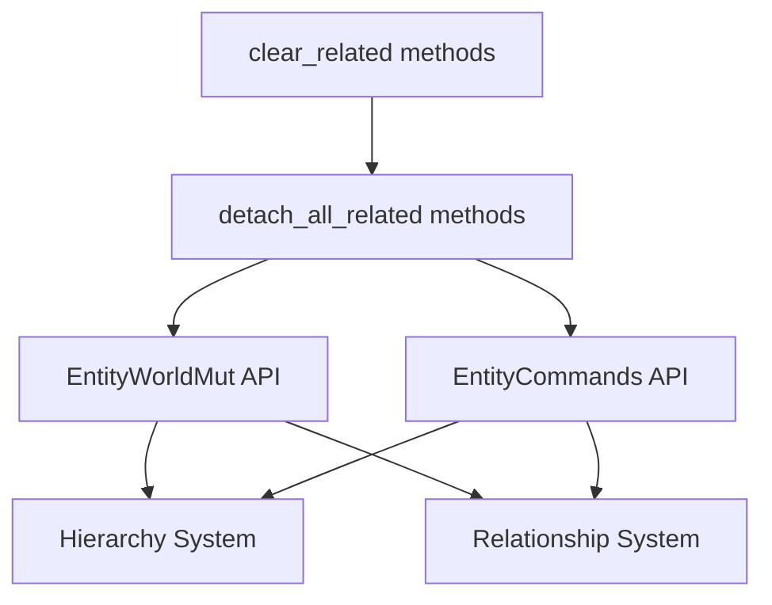

+++
title = "#21537 Rename clear_related methods to detach_related"
date = "2025-10-16T00:00:00"
draft = false
template = "pull_request_page.html"
in_search_index = true

[taxonomies]
list_display = ["show"]

[extra]
current_language = "en"
available_languages = {"en" = { name = "English", url = "/pull_request/bevy/2025-10/pr-21537-en-20251016" }, "zh-cn" = { name = "中文", url = "/pull_request/bevy/2025-10/pr-21537-zh-cn-20251016" }}
labels = ["D-Trivial", "A-ECS", "C-Usability"]
+++

# Title

## Basic Information
- **Title**: Rename clear_related methods to detach_related
- **PR Link**: https://github.com/bevyengine/bevy/pull/21537
- **Author**: WaterWhisperer
- **Status**: MERGED
- **Labels**: D-Trivial, A-ECS, C-Usability, S-Ready-For-Final-Review, M-Needs-Migration-Guide
- **Created**: 2025-10-14T06:06:44Z
- **Merged**: 2025-10-16T18:48:39Z
- **Merged By**: alice-i-cecile

## Description Translation

# Objective

Fixes #21527 

## Solution

Rename clear_related methods to detach_related

## Testing

Related tests passed


## The Story of This Pull Request

This PR addresses a naming inconsistency in Bevy's ECS relationship API that was creating confusion for developers. The core issue was that method names containing "clear" didn't accurately convey what the methods actually did - they detached entities from relationships without destroying the entities themselves.

The problem originated from an earlier change (PR #21470) that renamed `clear_children` to `detach_all_children` for better clarity. However, this change was incomplete - it missed the more general `clear_related` methods that handle all types of relationships, not just parent-child hierarchies. This left the API with inconsistent naming where some methods used the new "detach" terminology while others still used the ambiguous "clear" terminology.

The solution approach was straightforward but important: systematically rename all remaining `clear_related` methods to `detach_all_related` throughout the codebase. This change affects two primary areas of the ECS system:

1. **The hierarchy system** - where parent-child relationships are managed
2. **The general relationship system** - which handles all types of entity relationships

In the hierarchy system, both `EntityWorldMut` and `EntityCommands` had their `detach_all_children` methods updated to call the newly renamed `detach_all_related::<ChildOf>()` instead of the old `clear_related::<ChildOf>()`. This is significant because it shows how the parent-child relationship is implemented as a specific case of the more general relationship system, using the `ChildOf` relationship type.

The implementation also required updating the migration guide to document this change alongside the previous child-related renames. This ensures developers have clear upgrade instructions when moving between Bevy versions.

From a technical perspective, this change improves API consistency and reduces cognitive load for developers. The term "detach" more accurately describes the operation - it removes the relationship between entities without affecting the entities' existence. In contrast, "clear" could be misinterpreted as removing or destroying the related entities, which is not what happens.

The testing approach was comprehensive, with the PR author including screenshots showing that all related tests passed. This demonstrates that the renaming didn't change any functionality - it only improved the API clarity.

## Visual Representation



## Key Files Changed

### `crates/bevy_ecs/src/hierarchy.rs` (+6/-6)
This file handles parent-child relationships in the ECS. The changes update method calls and documentation to use the new naming convention.

```rust
// Before:
pub fn detach_all_children(&mut self) -> &mut Self {
    self.clear_related::<ChildOf>()
}

// After:
pub fn detach_all_children(&mut self) -> &mut Self {
    self.detach_all_related::<ChildOf>()
}
```

### `crates/bevy_ecs/src/relationship/related_methods.rs` (+4/-4)
This is the core relationship system where the main method renaming occurs. Both `EntityWorldMut` and `EntityCommands` implementations are updated.

```rust
// Before:
pub fn clear_related<R: Relationship>(&mut self) -> &mut Self {
    self.remove::<R::RelationshipTarget>()
}

// After:
pub fn detach_all_related<R: Relationship>(&mut self) -> &mut Self {
    self.remove::<R::RelationshipTarget>()
}
```

### `release-content/migration-guides/rename-clear_children.md` (+5/-3)
The migration guide is updated to include the new method renames alongside the existing ones.

```markdown
# Before:
title: Renamed `clear_children` methods to `detach_all_children`
pull_requests: [21470]

# After:
title: Renamed `clear_children` and `clear_related` methods to `detach_*`
pull_requests: [21470, 21537]
```

## Further Reading

- [Bevy ECS Relationships Documentation](https://bevyengine.org/learn/advanced-topics/ecs-relationships/)
- [API Design Guidelines - Method Naming](https://rust-lang.github.io/api-guidelines/naming.html)
- [Previous PR #21470 - Rename clear_children to detach_all_children](https://github.com/bevyengine/bevy/pull/21470)