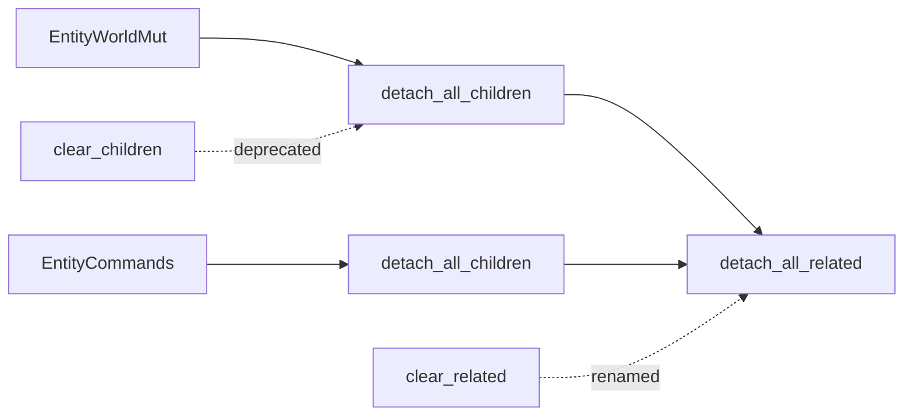

+++
title = "#21537 Rename clear_related methods to detach_related"
date = "2025-10-16T00:00:00"
draft = false
template = "pull_request_page.html"
in_search_index = false

[extra]
current_language = "zh-cn"
available_languages = {"en" = { name = "English", url = "/pull_request/bevy/2025-10/pr-21537-en-20251016" }, "zh-cn" = { name = "中文", url = "/pull_request/bevy/2025-10/pr-21537-zh-cn-20251016" }}
labels = ["D-Trivial", "A-ECS", "C-Usability"]
+++

# Rename clear_related methods to detach_related

## Basic Information
- **Title**: Rename clear_related methods to detach_related
- **PR Link**: https://github.com/bevyengine/bevy/pull/21537
- **Author**: WaterWhisperer
- **Status**: MERGED
- **Labels**: D-Trivial, A-ECS, C-Usability, S-Ready-For-Final-Review, M-Needs-Migration-Guide
- **Created**: 2025-10-14T06:06:44Z
- **Merged**: 2025-10-16T18:48:39Z
- **Merged By**: alice-i-cecile

## Description Translation
**目标**
修复 #21527

**解决方案**
将 clear_related 方法重命名为 detach_related

**测试**
相关测试通过


## The Story of This Pull Request

这个PR主要解决API命名清晰度的问题。在Bevy的ECS系统中，存在一系列用于管理实体间关系的方法，其中`clear_related`方法的命名容易引起误解，让开发者误以为它会删除相关实体，而实际上它只是解除关系链接。

问题的根源在于"clear"这个术语在编程中通常暗示完全清除或删除内容，但在Bevy的关系系统中，这些方法的功能是分离(detach)实体间的关系，而不是删除实体本身。这种命名上的不匹配可能导致开发者错误使用API，造成意外的行为。

开发者采用了一种直接且有效的解决方案：将`clear_related`重命名为`detach_all_related`。这个新的命名更准确地反映了方法的实际行为——分离所有相关实体，而不是清除它们。这种命名方式与之前已经完成的`clear_children`到`detach_all_children`的重命名保持一致，维护了API的一致性。

在实现层面，这个PR涉及两个核心文件。在`hierarchy.rs`中，修改了实体层次结构相关的方法，将`detach_all_children`方法的实现从调用`clear_related`改为调用`detach_all_related`。在`related_methods.rs`中，直接重命名了核心的关系管理方法。

```rust
// 修改前：
pub fn clear_related<R: Relationship>(&mut self) -> &mut Self {
    self.remove::<R::RelationshipTarget>()
}

// 修改后：
pub fn detach_all_related<R: Relationship>(&mut self) -> &mut Self {
    self.remove::<R::RelationshipTarget>()
}
```

这种重命名不仅提高了代码的可读性，还确保了API的意图更加明确。当开发者看到`detach_all_related`时，能够立即理解这个方法会分离关系但不会删除实体，而`clear_related`则可能被误解为会删除相关实体。

从技术角度来看，这个PR展示了良好的API设计原则：方法名应该准确反映其行为，避免歧义。同时，它也体现了向后兼容性的考虑——虽然进行了重命名，但通过迁移指南来帮助开发者过渡。

## Visual Representation



## Key Files Changed

### 1. `crates/bevy_ecs/src/hierarchy.rs` (+6/-6)
这个文件包含了实体层次结构的管理方法。主要修改是将`clear_related`的引用更新为`detach_all_related`。

```rust
// 修改前：
pub fn detach_all_children(&mut self) -> &mut Self {
    self.clear_related::<ChildOf>()
}

// 修改后：
pub fn detach_all_children(&mut self) -> &mut Self {
    self.detach_all_related::<ChildOf>()
}
```

### 2. `crates/bevy_ecs/src/relationship/related_methods.rs` (+4/-4)
这是核心的关系管理文件，直接重命名了关系处理方法。

```rust
// 修改前：
pub fn clear_related<R: Relationship>(&mut self) -> &mut Self {
    self.remove::<R::RelationshipTarget>()
}

// 修改后：
pub fn detach_all_related<R: Relationship>(&mut self) -> &mut Self {
    self.remove::<R::RelationshipTarget>()
}
```

### 3. `release-content/migration-guides/rename-clear_children.md` (+5/-3)
更新了迁移指南，包含了新的重命名信息。

```markdown
# 修改前：
title: Renamed `clear_children` methods to `detach_all_children`
pull_requests: [21470]

# 修改后：
title: Renamed `clear_children` and `clear_related` methods to `detach_*`
pull_requests: [21470, 21537]
```

## Further Reading

- [Bevy ECS Relationships Documentation](https://bevyengine.org/learn/advanced-topics/relationships/)
- [API Design Principles](https://martinfowler.com/bliki/ApiDesign.html)
- [Semantic Versioning and Breaking Changes](https://semver.org/)