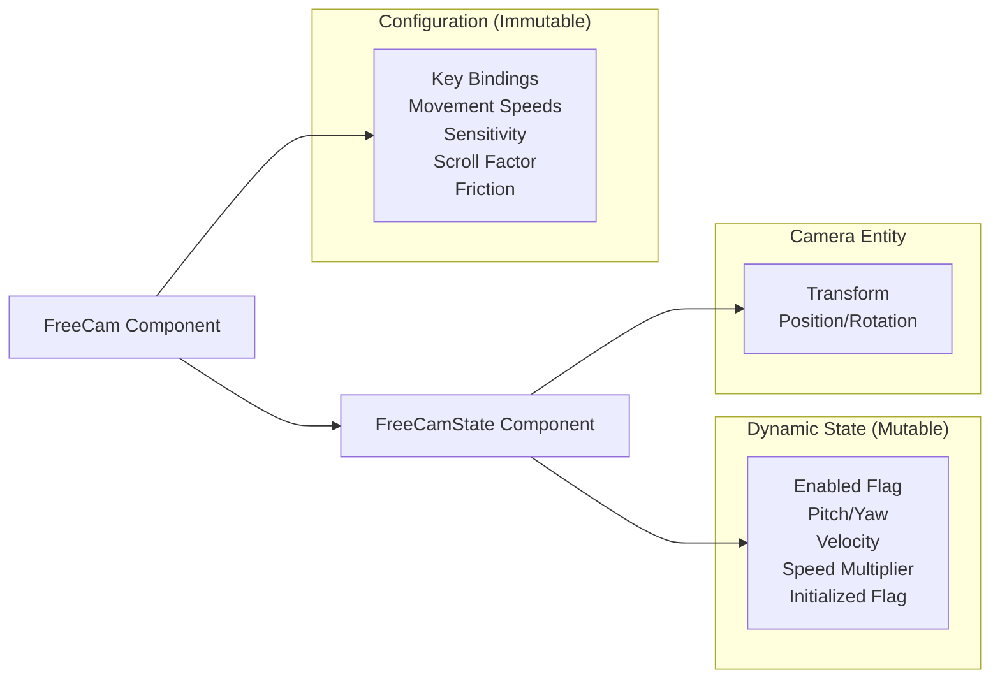

+++
title = "#21538 refactor(free-cam): separate configuration settings and dynamic state for the free camera controller"
date = "2025-10-16T00:00:00"
draft = false
template = "pull_request_page.html"
in_search_index = true

[taxonomies]
list_display = ["show"]

[extra]
current_language = "en"
available_languages = {"en" = { name = "English", url = "/pull_request/bevy/2025-10/pr-21538-en-20251016" }, "zh-cn" = { name = "中文", url = "/pull_request/bevy/2025-10/pr-21538-zh-cn-20251016" }}
labels = ["C-Usability", "A-Camera"]
+++

# Title

## Basic Information
- **Title**: refactor(free-cam): separate configuration settings and dynamic state for the free camera controller
- **PR Link**: https://github.com/bevyengine/bevy/pull/21538
- **Author**: syszery
- **Status**: MERGED
- **Labels**: C-Usability, S-Ready-For-Final-Review, A-Camera
- **Created**: 2025-10-14T11:01:51Z
- **Merged**: 2025-10-16T22:14:15Z
- **Merged By**: alice-i-cecile

## Description Translation
# Objective

This PR refactors the `FreeCam` controller to improve its modularity and flexibility. Happy to adjust based on feedback or suggestions!

Fixes #21456

## Solution

* **Splits the `FreeCam` system into two components**:
  * `FreeCam`: Stores the **configuration** of the camera controller, including key bindings, movement speeds, and sensitivity. This struct is immutable during runtime, ensuring that the core settings stay consistent.
  * `FreeCamState`: Manages the **dynamic runtime state** of the camera, such as the current pitch, yaw, velocity, and speed multiplier. This component allows for real-time adjustments to camera behavior without altering the original settings.
* **Improves the example for debugging and testing**:
  A simplified example (`free_cam_simple`) has been introduced, allowing for easy testing and showcasing of the new FreeCam controller system.
* **Fixes the bug with translation speed**:
  As noted in #21483, the camera's translation speed would "stick" after excessive scrolling. This bug was still present in the `free_cam_controller` example. Following the approach suggested in #21486, the bug has been resolved in the new `free_cam_simple` example (I did not yet verify the existing ones).
* **Clarifies documentation**:
  Documentation has been updated to reflect the new structure, clearly describing the roles of both `FreeCam` (static settings) and `FreeCamState` (dynamic state).

## Testing

* For testing, I added a simple example `free_cam_simple` as a POC (this can be removed later if no longer needed).
* Run with: `cargo run --example free_cam_simple --features="free_cam"`

## The Story of This Pull Request

The FreeCam controller in Bevy was facing a fundamental architectural issue where configuration and runtime state were mixed together in a single component. This created problems with code organization, maintainability, and introduced subtle bugs in camera behavior.

The original `FreeCam` component contained both static configuration settings (like key bindings, movement speeds, and sensitivity) and dynamic runtime state (like current pitch, yaw, velocity, and enabled status). This mixing of concerns made the system difficult to reason about and modify. For example, if a developer wanted to change camera settings at runtime through a menu system, they would be modifying the same component that contained critical runtime state, potentially causing unexpected behavior.

The solution approach was to apply the separation of concerns principle by splitting the monolithic `FreeCam` component into two distinct components. The `FreeCam` component now exclusively handles configuration settings that are meant to be relatively stable during gameplay, while the new `FreeCamState` component manages all the dynamic state that changes frequently during camera operation.

Looking at the implementation, the key change was restructuring the component definitions:

```rust
// Before: Mixed configuration and state
pub struct FreeCam {
    pub enabled: bool,
    pub initialized: bool,
    pub sensitivity: f32,
    pub key_forward: KeyCode,
    // ... more config fields
    pub pitch: f32,
    pub yaw: f32,
    pub velocity: Vec3,
}

// After: Separate components
pub struct FreeCam {
    pub sensitivity: f32,
    pub key_forward: KeyCode,
    // ... only config fields
}

pub struct FreeCamState {
    pub enabled: bool,
    initialized: bool,
    pub pitch: f32,
    pub yaw: f32,
    pub speed_multiplier: f32,
    pub velocity: Vec3,
}
```

This separation had significant technical benefits. The `FreeCam` component can now be treated as essentially immutable from the controller's perspective, while `FreeCamState` handles all the volatile data. The relationship between these components is enforced using Bevy's `#[require(FreeCamState)]` attribute, ensuring that any entity with a `FreeCam` component automatically gets the necessary state component.

The system logic was updated to query for both components:

```rust
// Before:
mut query: Query<(&mut Transform, &mut FreeCam), With<Camera>>

// After:  
mut query: Query<(&mut Transform, &mut FreeCamState, &FreeCam), With<Camera>>
```

This change also fixed a known bug with camera translation speed. The original implementation directly modified the `walk_speed` and `run_speed` configuration values when scrolling, which could lead to the speed "sticking" at extreme values. The new approach introduces a `speed_multiplier` in the state component:

```rust
// Fixed scroll handling:
state.speed_multiplier += scroll * controller.scroll_factor;
state.speed_multiplier = state.speed_multiplier.clamp(0.0, f32::MAX);
```

The speed calculation then uses this multiplier:

```rust
let max_speed = if key_input.pressed(controller.key_run) {
    controller.run_speed * state.speed_multiplier
} else {
    controller.walk_speed * state.speed_multiplier
};
```

This approach keeps the base configuration values intact while allowing temporary speed adjustments through the state component.

The architectural impact of this change is substantial. It makes the camera controller more modular and easier to extend. For example, implementing features like camera presets, save/load functionality, or runtime configuration changes becomes much simpler because the configuration is cleanly separated from the operational state.

The example code was also updated to reflect these changes, with queries now needing to access both components where previously only one was needed. This demonstrates how the separation affects client code and ensures that the examples remain functional and educational.

## Visual Representation



## Key Files Changed

### `crates/bevy_camera_controller/src/free_cam.rs` (+84/-50)

This file contains the core refactoring that separates configuration from state. The main changes include:

1. **Component Separation**: Split the original `FreeCam` struct into `FreeCam` (configuration) and `FreeCamState` (runtime state)
2. **System Updates**: Modified the `run_freecam_controller` system to work with both components
3. **Bug Fixes**: Implemented proper speed multiplier handling to fix scroll wheel issues
4. **Documentation**: Updated comments to clearly explain the new architecture

Key code changes:

```rust
// Before: Single component with mixed concerns
pub struct FreeCam {
    pub enabled: bool,
    pub initialized: bool,
    pub sensitivity: f32,
    // ... config fields
    pub pitch: f32,
    pub yaw: f32, 
    pub velocity: Vec3,
}

// After: Separate configuration component  
#[derive(Component)]
#[require(FreeCamState)]
pub struct FreeCam {
    pub sensitivity: f32,
    // ... only configuration fields
    // Removed: enabled, initialized, pitch, yaw, velocity
}

// New state component
#[derive(Component)]
pub struct FreeCamState {
    pub enabled: bool,
    initialized: bool,
    pub pitch: f32,
    pub yaw: f32,
    pub speed_multiplier: f32,
    pub velocity: Vec3,
}
```

### `examples/camera/free_cam_controller.rs` (+14/-8)

This example file was updated to work with the new component structure. The changes demonstrate how to properly query and modify both components in user code.

Key code changes:

```rust
// Before: Single component query
fn update_camera_settings(mut camera_query: Query<&mut FreeCam>, input: Res<ButtonInput<KeyCode>>) {
    let mut free_cam = camera_query.single_mut().unwrap();
    // ... modify free_cam fields
}

// After: Query both components
fn update_camera_settings(
    mut camera_query: Query<(&mut FreeCam, &mut FreeCamState)>,
    input: Res<ButtonInput<KeyCode>>,
) {
    let (mut free_cam, mut free_cam_state) = camera_query.single_mut().unwrap();
    // ... modify free_cam for config, free_cam_state for runtime state
}
```

## Further Reading

- [Bevy ECS Documentation](https://bevyengine.org/learn/book/ecs/) - Understanding component composition and queries
- [Separation of Concerns Principle](https://en.wikipedia.org/wiki/Separation_of_concerns) - Architectural pattern demonstrated in this PR
- [Entity Component System Pattern](https://en.wikipedia.org/wiki/Entity_component_system) - Core architectural pattern used by Bevy
- [Bevy Camera Controller Documentation](https://docs.rs/bevy_camera_controller/latest/bevy_camera_controller/) - Official documentation for the camera controller crate

# Full Code Diff
diff --git a/crates/bevy_camera_controller/src/free_cam.rs b/crates/bevy_camera_controller/src/free_cam.rs
index b640786b18bdc..37a064d00ba98 100644
--- a/crates/bevy_camera_controller/src/free_cam.rs
+++ b/crates/bevy_camera_controller/src/free_cam.rs
@@ -10,7 +10,8 @@
 //! By contrast, the default settings of this particular free cam are optimized for precise control.
 //!
 //! To use this controller, add [`FreeCamPlugin`] to your app,
-//! and [`FreeCam`] to your camera entity.
+//! and attach the [`FreeCam`] component to your camera entity.
+//! The required [`FreeCamState`] component will be added automatically.
 //!
 //! To configure the settings of this controller, modify the fields of the [`FreeCam`] component.
 
@@ -32,8 +33,8 @@ use core::{f32::consts::*, fmt};
 
 /// A freecam-style camera controller plugin.
 ///
-/// Use [`FreeCam`] to add a freecam controller to a camera entity,
-/// and change its values to customize the controls and change its behavior.
+/// Use the [`FreeCam`] struct to add and customize the controller for a camera entity.
+/// The camera's dynamic state is managed by the [`FreeCamState`] struct.
 pub struct FreeCamPlugin;
 
 impl Plugin for FreeCamPlugin {
@@ -53,16 +54,22 @@ impl Plugin for FreeCamPlugin {
 /// it because it felt nice.
 const RADIANS_PER_DOT: f32 = 1.0 / 180.0;
 
-/// Freecam controller settings and state.
+/// Stores the settings for the [`FreeCam`] controller.
 ///
-/// Add this component to a [`Camera`] entity and add [`FreeCamPlugin`]
-/// to your [`App`] to enable freecam controls.
+/// This component defines static configuration for camera controls,
+/// including movement speed, sensitivity, and input bindings.
+///
+/// From the controller's perspective, this data is treated as immutable,
+/// but it may be modified externally (e.g., by a settings UI) at runtime.
+///
+/// Add this component to a [`Camera`] entity to enable freecam controls.
+/// The associated dynamic state is automatically handled by [`FreeCamState`],
+/// which is added to the entity as a required component.
+///
+/// To activate the controller, add the [`FreeCamPlugin`] to your [`App`].
 #[derive(Component)]
+#[require(FreeCamState)]
 pub struct FreeCam {
-    /// Enables this [`FreeCam`] when `true`.
-    pub enabled: bool,
-    /// Indicates if this controller has been initialized by the [`FreeCamPlugin`].
-    pub initialized: bool,
     /// Multiplier for pitch and yaw rotation speed.
     pub sensitivity: f32,
     /// [`KeyCode`] for forward translation.
@@ -84,28 +91,20 @@ pub struct FreeCam {
     pub mouse_key_cursor_grab: MouseButton,
     /// [`KeyCode`] for grabbing the keyboard focus.
     pub keyboard_key_toggle_cursor_grab: KeyCode,
-    /// Multiplier for unmodified translation speed.
+    /// Base multiplier for unmodified translation speed.
     pub walk_speed: f32,
-    /// Multiplier for running translation speed.
+    /// Base multiplier for running translation speed.
     pub run_speed: f32,
     /// Multiplier for how the mouse scroll wheel modifies [`walk_speed`](FreeCam::walk_speed)
     /// and [`run_speed`](FreeCam::run_speed).
     pub scroll_factor: f32,
-    /// Friction factor used to exponentially decay [`velocity`](FreeCam::velocity) over time.
+    /// Friction factor used to exponentially decay [`velocity`](FreeCamState::velocity) over time.
     pub friction: f32,
-    /// This [`FreeCam`]'s pitch rotation.
-    pub pitch: f32,
-    /// This [`FreeCam`]'s yaw rotation.
-    pub yaw: f32,
-    /// This [`FreeCam`]'s translation velocity.
-    pub velocity: Vec3,
 }
 
 impl Default for FreeCam {
     fn default() -> Self {
         Self {
-            enabled: true,
-            initialized: false,
             sensitivity: 0.2,
             key_forward: KeyCode::KeyW,
             key_back: KeyCode::KeyS,
@@ -120,9 +119,6 @@ impl Default for FreeCam {
             run_speed: 15.0,
             scroll_factor: 0.5,
             friction: 40.0,
-            pitch: 0.0,
-            yaw: 0.0,
-            velocity: Vec3::ZERO,
         }
     }
 }
@@ -154,10 +150,48 @@ Freecam Controls:
     }
 }
 
-/// This system is typically added via the [`FreeCamPlugin`].
+/// Tracks the runtime state of a [`FreeCam`] controller.
 ///
-/// Reads inputs and then moves the camera entity according
-/// to the settings given in [`FreeCam`].
+/// This component holds dynamic data that changes during camera operation,
+/// such as pitch, yaw, velocity, and whether the controller is currently enabled.
+///
+/// It is automatically added to any entity that has a [`FreeCam`] component,
+/// and is updated by the [`FreeCamPlugin`] systems in response to user input.
+#[derive(Component)]
+pub struct FreeCamState {
+    /// Enables [`FreeCam`] controls when `true`.
+    pub enabled: bool,
+    /// Internal flag indicating if this controller has been initialized by the [`FreeCamPlugin`].
+    initialized: bool,
+    /// This [`FreeCam`]'s pitch rotation.
+    pub pitch: f32,
+    /// This [`FreeCam`]'s yaw rotation.
+    pub yaw: f32,
+    /// Multiplier applied to movement speed.
+    pub speed_multiplier: f32,
+    /// This [`FreeCam`]'s translation velocity.
+    pub velocity: Vec3,
+}
+
+impl Default for FreeCamState {
+    fn default() -> Self {
+        Self {
+            enabled: true,
+            initialized: false,
+            pitch: 0.0,
+            yaw: 0.0,
+            speed_multiplier: 1.0,
+            velocity: Vec3::ZERO,
+        }
+    }
+}
+
+/// Updates the camera's position and orientation based on user input.
+///
+/// - [`FreeCam`] contains static configuration such as key bindings, movement speed, and sensitivity.
+/// - [`FreeCamState`] stores the dynamic runtime state, including pitch, yaw, velocity, and enable flags.
+///
+/// This system is typically added via the [`FreeCamPlugin`].
 pub fn run_freecam_controller(
     time: Res<Time<Real>>,
     mut windows: Query<(&Window, &mut CursorOptions)>,
@@ -167,23 +201,23 @@ pub fn run_freecam_controller(
     key_input: Res<ButtonInput<KeyCode>>,
     mut toggle_cursor_grab: Local<bool>,
     mut mouse_cursor_grab: Local<bool>,
-    mut query: Query<(&mut Transform, &mut FreeCam), With<Camera>>,
+    mut query: Query<(&mut Transform, &mut FreeCamState, &FreeCam), With<Camera>>,
 ) {
     let dt = time.delta_secs();
 
-    let Ok((mut transform, mut controller)) = query.single_mut() else {
+    let Ok((mut transform, mut state, controller)) = query.single_mut() else {
         return;
     };
 
-    if !controller.initialized {
+    if !state.initialized {
         let (yaw, pitch, _roll) = transform.rotation.to_euler(EulerRot::YXZ);
-        controller.yaw = yaw;
-        controller.pitch = pitch;
-        controller.initialized = true;
+        state.yaw = yaw;
+        state.pitch = pitch;
+        state.initialized = true;
         info!("{}", *controller);
     }
 
-    if !controller.enabled {
+    if !state.enabled {
         // don't keep the cursor grabbed if the controller was disabled.
         if *toggle_cursor_grab || *mouse_cursor_grab {
             *toggle_cursor_grab = false;
@@ -206,8 +240,9 @@ pub fn run_freecam_controller(
         }
     };
     scroll += amount;
-    controller.walk_speed += scroll * controller.scroll_factor * controller.walk_speed;
-    controller.run_speed = controller.walk_speed * 3.0;
+    state.speed_multiplier += scroll * controller.scroll_factor;
+    // Clamp the speed multiplier for safety
+    state.speed_multiplier = state.speed_multiplier.clamp(0.0, f32::MAX);
 
     // Handle key input
     let mut axis_input = Vec3::ZERO;
@@ -248,26 +283,26 @@ pub fn run_freecam_controller(
     // Update velocity
     if axis_input != Vec3::ZERO {
         let max_speed = if key_input.pressed(controller.key_run) {
-            controller.run_speed
+            controller.run_speed * state.speed_multiplier
         } else {
-            controller.walk_speed
+            controller.walk_speed * state.speed_multiplier
         };
-        controller.velocity = axis_input.normalize() * max_speed;
+        state.velocity = axis_input.normalize() * max_speed;
     } else {
         let friction = controller.friction.clamp(0.0, f32::MAX);
-        controller.velocity.smooth_nudge(&Vec3::ZERO, friction, dt);
-        if controller.velocity.length_squared() < 1e-6 {
-            controller.velocity = Vec3::ZERO;
+        state.velocity.smooth_nudge(&Vec3::ZERO, friction, dt);
+        if state.velocity.length_squared() < 1e-6 {
+            state.velocity = Vec3::ZERO;
         }
     }
 
     // Apply movement update
-    if controller.velocity != Vec3::ZERO {
+    if state.velocity != Vec3::ZERO {
         let forward = *transform.forward();
         let right = *transform.right();
-        transform.translation += controller.velocity.x * dt * right
-            + controller.velocity.y * dt * Vec3::Y
-            + controller.velocity.z * dt * forward;
+        transform.translation += state.velocity.x * dt * right
+            + state.velocity.y * dt * Vec3::Y
+            + state.velocity.z * dt * forward;
     }
 
     // Handle cursor grab
@@ -292,11 +327,10 @@ pub fn run_freecam_controller(
     // Handle mouse input
     if accumulated_mouse_motion.delta != Vec2::ZERO && cursor_grab {
         // Apply look update
-        controller.pitch = (controller.pitch
+        state.pitch = (state.pitch
             - accumulated_mouse_motion.delta.y * RADIANS_PER_DOT * controller.sensitivity)
             .clamp(-PI / 2., PI / 2.);
-        controller.yaw -=
-            accumulated_mouse_motion.delta.x * RADIANS_PER_DOT * controller.sensitivity;
-        transform.rotation = Quat::from_euler(EulerRot::ZYX, 0.0, controller.yaw, controller.pitch);
+        state.yaw -= accumulated_mouse_motion.delta.x * RADIANS_PER_DOT * controller.sensitivity;
+        transform.rotation = Quat::from_euler(EulerRot::ZYX, 0.0, state.yaw, state.pitch);
     }
 }
diff --git a/examples/camera/free_cam_controller.rs b/examples/camera/free_cam_controller.rs
index 1443dda8519f3..05240e5c4e9c4 100644
--- a/examples/camera/free_cam_controller.rs
+++ b/examples/camera/free_cam_controller.rs
@@ -41,7 +41,7 @@
 use std::f32::consts::{FRAC_PI_4, PI};
 
 use bevy::{
-    camera_controller::free_cam::{FreeCam, FreeCamPlugin},
+    camera_controller::free_cam::{FreeCam, FreeCamPlugin, FreeCamState},
     color::palettes::tailwind,
     prelude::*,
 };
@@ -130,8 +130,11 @@ fn spawn_text(mut commands: Commands, freecam_query: Query<&FreeCam>) {
     ));
 }
 
-fn update_camera_settings(mut camera_query: Query<&mut FreeCam>, input: Res<ButtonInput<KeyCode>>) {
-    let mut free_cam = camera_query.single_mut().unwrap();
+fn update_camera_settings(
+    mut camera_query: Query<(&mut FreeCam, &mut FreeCamState)>,
+    input: Res<ButtonInput<KeyCode>>,
+) {
+    let (mut free_cam, mut free_cam_state) = camera_query.single_mut().unwrap();
 
     if input.pressed(KeyCode::KeyZ) {
         free_cam.sensitivity = (free_cam.sensitivity - 0.005).max(0.005);
@@ -152,24 +155,27 @@ fn update_camera_settings(mut camera_query: Query<&mut FreeCam>, input: Res<Butt
         free_cam.scroll_factor += 0.02;
     }
     if input.just_pressed(KeyCode::KeyB) {
-        free_cam.enabled = !free_cam.enabled;
+        free_cam_state.enabled = !free_cam_state.enabled;
     }
 }
 
-fn update_text(mut text_query: Query<&mut Text, With<InfoText>>, camera_query: Query<&FreeCam>) {
+fn update_text(
+    mut text_query: Query<&mut Text, With<InfoText>>,
+    camera_query: Query<(&FreeCam, &FreeCamState)>,
+) {
     let mut text = text_query.single_mut().unwrap();
 
-    let free_cam = camera_query.single().unwrap();
+    let (free_cam, free_cam_state) = camera_query.single().unwrap();
 
     text.0 = format!(
         "Enabled: {},\nSensitivity: {:.03}\nFriction: {:.01}\nScroll factor: {:.02}\nWalk Speed: {:.02}\nRun Speed: {:.02}\nSpeed: {:.02}",
-        free_cam.enabled,
+        free_cam_state.enabled,
         free_cam.sensitivity,
         free_cam.friction,
         free_cam.scroll_factor,
         free_cam.walk_speed,
         free_cam.run_speed,
-        free_cam.velocity.length(),
+        free_cam_state.velocity.length(),
     );
 }
