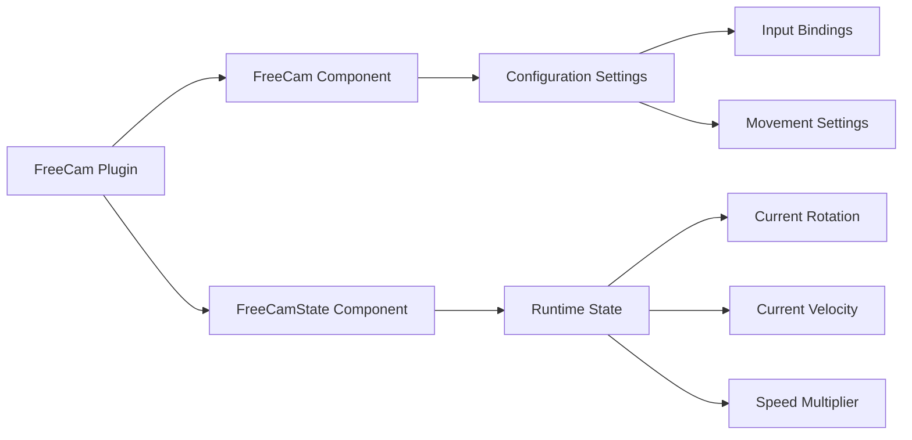

+++
title = "#21538 refactor(free-cam): separate configuration settings and dynamic state for the free camera controller"
date = "2025-10-16T00:00:00"
draft = false
template = "pull_request_page.html"
in_search_index = false

[extra]
current_language = "zh-cn"
available_languages = {"en" = { name = "English", url = "/pull_request/bevy/2025-10/pr-21538-en-20251016" }, "zh-cn" = { name = "中文", url = "/pull_request/bevy/2025-10/pr-21538-zh-cn-20251016" }}
labels = ["C-Usability", "A-Camera"]
+++

# Title

## Basic Information
- **Title**: refactor(free-cam): separate configuration settings and dynamic state for the free camera controller
- **PR Link**: https://github.com/bevyengine/bevy/pull/21538
- **Author**: syszery
- **Status**: MERGED
- **Labels**: C-Usability, S-Ready-For-Final-Review, A-Camera
- **Created**: 2025-10-14T11:01:51Z
- **Merged**: 2025-10-16T22:14:15Z
- **Merged By**: alice-i-cecile

## Description Translation
**目标**

此PR重构了`FreeCam`控制器以提高其模块化和灵活性。很乐意根据反馈或建议进行调整！

修复 #21456

**解决方案**

* **将`FreeCam`系统拆分为两个组件**：
  * `FreeCam`：存储相机控制器的**配置**，包括按键绑定、移动速度和灵敏度。该结构体在运行时是不可变的，确保核心设置保持一致。
  * `FreeCamState`：管理相机的**动态运行时状态**，例如当前俯仰角、偏航角、速度和速度乘数。该组件允许在不更改原始设置的情况下实时调整相机行为。
* **改进用于调试和测试的示例**：
  引入了一个简化示例（`free_cam_simple`），便于测试和展示新的FreeCam控制器系统。
* **修复平移速度相关的bug**：
  如 #21483 所述，在过度滚动后相机的平移速度会"卡住"。这个bug在`free_cam_controller`示例中仍然存在。按照 #21486 中建议的方法，新的`free_cam_simple`示例中已修复此bug（我尚未验证现有示例）。
* **澄清文档**：
  文档已更新以反映新的结构，清晰描述了`FreeCam`（静态设置）和`FreeCamState`（动态状态）的作用。

**测试**

* 为了测试，我添加了一个简单示例`free_cam_simple`作为概念验证（如果不再需要，可以稍后移除）。
* 运行方式：`cargo run --example free_cam_simple --features="free_cam"`

## The Story of This Pull Request

这个PR的核心问题是FreeCam控制器在架构上存在设计缺陷。原来的实现将配置设置和运行时状态混合在同一个组件中，这导致了几个问题。

**问题分析**

原来的`FreeCam`组件同时包含了静态配置（如按键绑定、移动速度）和动态状态（如当前旋转角度、速度向量）。这种混合设计存在几个问题：

1. **职责不清晰**：单个组件承担了配置管理和状态跟踪两种不同的职责
2. **状态管理混乱**：配置参数在运行时被意外修改的风险增加
3. **bug修复困难**：在#21483中报告的平移速度"卡住"问题，部分原因是状态管理不够清晰

**解决方案设计**

开发者采用了清晰的责任分离策略：

- `FreeCam`：专门处理静态配置，使用`#[require(FreeCamState)]`属性确保两个组件的关联性
- `FreeCamState`：专门管理运行时状态，包括启用状态、旋转角度、速度等

这种分离遵循了单一职责原则，使得配置可以在运行时保持稳定，而状态可以根据用户输入自由变化。

**实现细节**

在`free_cam.rs`中，关键的改变是重构了查询系统：

```rust
// 之前：
mut query: Query<(&mut Transform, &mut FreeCam), With<Camera>>

// 之后：
mut query: Query<(&mut Transform, &mut FreeCamState, &FreeCam), With<Camera>>
```

这种改变使得系统可以分别访问可变的动态状态和不可变的配置。在速度计算方面，实现也进行了重要改进：

```rust
// 之前的速度计算存在bug：
controller.walk_speed += scroll * controller.scroll_factor * controller.walk_speed;
controller.run_speed = controller.walk_speed * 3.0;

// 修复后的实现：
state.speed_multiplier += scroll * controller.scroll_factor;
state.speed_multiplier = state.speed_multiplier.clamp(0.0, f32::MAX);
```

新的实现引入了一个独立的速度乘数，而不是直接修改基础速度值，这解决了速度"卡住"的问题。

**架构影响**

这种分离带来了几个技术优势：

1. **更好的数据隔离**：配置可以在运行时被UI系统安全地读取，而不会干扰控制器状态
2. **改进的可测试性**：可以单独测试配置逻辑和状态管理逻辑
3. **清晰的API边界**：其他系统可以明确知道哪些数据是配置，哪些是状态

**示例更新**

在`free_cam_controller.rs`示例中，查询也需要相应更新：

```rust
// 之前：
fn update_camera_settings(mut camera_query: Query<&mut FreeCam>, input: Res<ButtonInput<KeyCode>>)

// 之后：
fn update_camera_settings(
    mut camera_query: Query<(&mut FreeCam, &mut FreeCamState)>,
    input: Res<ButtonInput<KeyCode>>,
)
```

这种更新确保了示例代码与新的组件结构保持一致。

## Visual Representation



## Key Files Changed

### `crates/bevy_camera_controller/src/free_cam.rs` (+84/-50)

**主要变化**：
- 将原来的`FreeCam`组件拆分为`FreeCam`（配置）和`FreeCamState`（状态）
- 更新了控制系统以使用新的组件结构
- 修复了速度计算相关的bug

**关键代码片段**：
```rust
// 新的FreeCam组件 - 只包含配置
#[derive(Component)]
#[require(FreeCamState)]
pub struct FreeCam {
    pub sensitivity: f32,
    pub key_forward: KeyCode,
    pub key_back: KeyCode,
    // ... 其他配置字段，移除了状态字段
}

// 新的FreeCamState组件 - 只包含状态
#[derive(Component)]
pub struct FreeCamState {
    pub enabled: bool,
    initialized: bool,
    pub pitch: f32,
    pub yaw: f32,
    pub speed_multiplier: f32,
    pub velocity: Vec3,
}
```

### `examples/camera/free_cam_controller.rs` (+14/-8)

**主要变化**：
- 更新示例代码以适应新的组件结构
- 修改查询以同时访问`FreeCam`和`FreeCamState`

**关键代码片段**：
```rust
// 更新后的函数签名
fn update_camera_settings(
    mut camera_query: Query<(&mut FreeCam, &mut FreeCamState)>,
    input: Res<ButtonInput<KeyCode>>,
) {
    let (mut free_cam, mut free_cam_state) = camera_query.single_mut().unwrap();
    
    // 配置修改作用于free_cam
    if input.pressed(KeyCode::KeyZ) {
        free_cam.sensitivity = (free_cam.sensitivity - 0.005).max(0.005);
    }
    
    // 状态修改作用于free_cam_state
    if input.just_pressed(KeyCode::KeyB) {
        free_cam_state.enabled = !free_cam_state.enabled;
    }
}
```

## Further Reading

- [Bevy ECS Component Documentation](https://bevyengine.org/learn/book/ecs/components/)
- [Entity Component System Pattern](https://en.wikipedia.org/wiki/Entity_component_system)
- [Single Responsibility Principle](https://en.wikipedia.org/wiki/Single-responsibility_principle)
- [Rust Ownership and Borrowing](https://doc.rust-lang.org/book/ch04-00-understanding-ownership.html)