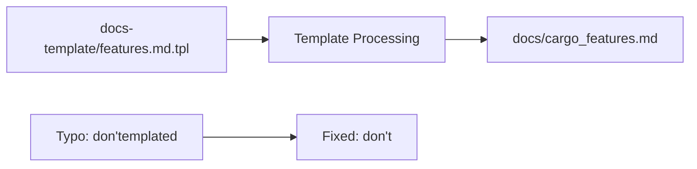

+++
title = "#21546 Fix typo in features.md.tpl"
date = "2025-10-15T00:00:00"
draft = false
template = "pull_request_page.html"
in_search_index = true

[taxonomies]
list_display = ["show"]

[extra]
current_language = "en"
available_languages = {"en" = { name = "English", url = "/pull_request/bevy/2025-10/pr-21546-en-20251015" }, "zh-cn" = { name = "中文", url = "/pull_request/bevy/2025-10/pr-21546-zh-cn-20251015" }}
labels = ["C-Bug", "C-Docs", "D-Trivial"]
+++

# Fix typo in features.md.tpl

## Basic Information
- **Title**: Fix typo in features.md.tpl
- **PR Link**: https://github.com/bevyengine/bevy/pull/21546
- **Author**: cart
- **Status**: MERGED
- **Labels**: C-Bug, C-Docs, D-Trivial, S-Ready-For-Final-Review
- **Created**: 2025-10-14T21:39:28Z
- **Merged**: 2025-10-14T22:50:02Z
- **Merged By**: alice-i-cecile

## Description Translation
# Objective

Fix typo

## Solution

Fix typo

## The Story of This Pull Request

This PR addresses a straightforward but important documentation issue in the Bevy engine's cargo features documentation. The problem was a typo in the template file that generates the cargo features documentation page.

The issue occurred in the documentation for Bevy's feature collections system. Feature collections are mid-level groups of cargo features that compose high-level profiles. When the default profiles don't meet specific use cases - such as using a custom renderer, building a headless app, or targeting no_std environments - developers can use these collections to build custom profile equivalents without manually managing every single feature.

The typo was introduced in a sentence explaining this concept. The word "don't" was incorrectly written as "don'templated", which appears to be a merge artifact or copy-paste error where "templated" from the file extension (.tpl) was accidentally appended to the word.

The fix involved removing the extraneous "emplated" text from two locations:
1. The source template file (`docs-template/features.md.tpl`)
2. The generated documentation file (`docs/cargo_features.md`)

This is a classic example of why documentation quality matters in open source projects. Even minor typos can confuse users and detract from the professional appearance of the project. The fix was trivial from a technical standpoint but important for maintaining clear and professional documentation.

The changes were reviewed and merged quickly, reflecting the straightforward nature of the fix and the project's commitment to documentation quality.

## Visual Representation



## Key Files Changed

### `docs-template/features.md.tpl` (+1/-1)

This is the template file used to generate the cargo features documentation. The change fixes a typo in the explanatory text about feature collections.

```markdown
# Before:
"If the default profiles don'templated"

# After:
"If the default profiles don't"
```

### `docs/cargo_features.md` (+1/-1)

This is the generated documentation file that contains the same typo, which needed to be fixed to maintain consistency between the template and output.

```markdown
# Before:
"If the default profiles don'templated"

# After:
"If the default profiles don't"
```

## Further Reading

- [Bevy Cargo Features Documentation](https://github.com/bevyengine/bevy/blob/main/docs/cargo_features.md)
- [Cargo Features Guide](https://doc.rust-lang.org/cargo/reference/features.html)
- [Bevy Engine Documentation Practices](https://github.com/bevyengine/bevy/blob/main/docs/README.md)

# Full Code Diff
```
diff --git a/docs-template/features.md.tpl b/docs-template/features.md.tpl
index 2d96fe7f3cf92..335c8c12ddc84 100644
--- a/docs-template/features.md.tpl
+++ b/docs-template/features.md.tpl
@@ -27,7 +27,7 @@ By default, the `bevy` crate enables the {% if feat
 
 ### Collections
 
-"Collections" are mid-level groups of cargo features. These are used to compose the high-level "profiles". If the default profiles don'templated
+"Collections" are mid-level groups of cargo features. These are used to compose the high-level "profiles". If the default profiles don't
 suit your use case (ex: you want to use a custom renderer, you want to build a "headless" app, you want to target no_std, etc), then you can use these
 collections to build your own "profile" equivalent, without needing to manually manage _every single_ feature.
 
diff --git a/docs/cargo_features.md b/docs/cargo_features.md
index fb36c8f225000..608b741ddbb4a 100644
--- a/docs/cargo_features.md
+++ b/docs/cargo_features.md
@@ -30,7 +30,7 @@ By default, the `bevy` crate enables the  features.
 
 ### Collections
 
-"Collections" are mid-level groups of cargo features. These are used to compose the high-level "profiles". If the default profiles don'templated
+"Collections" are mid-level groups of cargo features. These are used to compose the high-level "profiles". If the default profiles don't
 suit your use case (ex: you want to use a custom renderer, you want to build a "headless" app, you want to target no_std, etc), then you can use these
 collections to build your own "profile" equivalent, without needing to manually manage _every single_ feature.
 
```