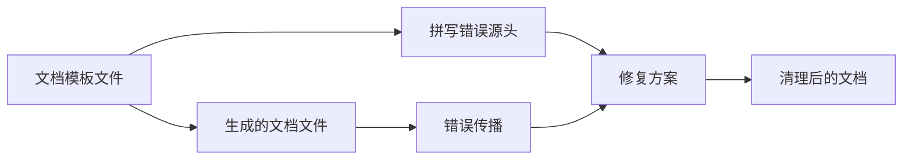

+++
title = "#21546 Fix typo in features.md.tpl"
date = "2025-10-15T00:00:00"
draft = false
template = "pull_request_page.html"
in_search_index = false

[extra]
current_language = "zh-cn"
available_languages = {"en" = { name = "English", url = "/pull_request/bevy/2025-10/pr-21546-en-20251015" }, "zh-cn" = { name = "中文", url = "/pull_request/bevy/2025-10/pr-21546-zh-cn-20251015" }}
+++

# Fix typo in features.md.tpl

## 基本信息
- **标题**: Fix typo in features.md.tpl
- **PR链接**: https://github.com/bevyengine/bevy/pull/21546
- **作者**: cart
- **状态**: 已合并
- **标签**: C-Bug, C-Docs, D-Trivial, S-Ready-For-Final-Review
- **创建时间**: 2025-10-14T21:39:28Z
- **合并时间**: 2025-10-14T22:50:02Z
- **合并者**: alice-i-cecile

## 描述翻译
# Objective

修复拼写错误

## Solution

修复拼写错误

## 本次Pull Request的故事

这是一个典型的文档维护案例，展示了开源项目中常见的简单但重要的维护工作。问题出现在Bevy引擎的文档模板中，一个明显的拼写错误影响了文档的专业性和可读性。

问题的核心在于文档模板文件`docs-template/features.md.tpl`中出现了单词拼接错误。在描述"Collections"功能的部分，原文写道：

```markdown
"If the default profiles don'templated"
```

这里明显缺少了空格，应该是"don't"和"templated"两个单词被错误地连接在了一起。正确的写法应该是：

```markdown
"If the default profiles don't"
```

这个错误不仅影响了文档的可读性，还可能让读者感到困惑。考虑到Bevy是一个广泛使用的游戏引擎，其文档质量直接影响开发者的使用体验。

修复方案直接明了：在两个文件中的相同位置删除多余的"emplated"单词。有趣的是，这个错误同时存在于模板文件和生成的文档文件中，这说明要么是模板生成过程中出现了问题，要么是错误在多个地方被复制了。

从技术角度来看，这种类型的修复虽然简单，但对于维护项目的专业形象至关重要。文档中的拼写错误会给用户留下不专业的印象，特别是对于像Bevy这样的大型开源项目。

这个PR的处理流程也体现了开源项目的标准工作流：作者发现问题、提交修复、经过代码审查后快速合并。整个处理过程在1小时10分钟内完成，显示了项目维护团队对文档质量的重视。

## 可视化表示



## 关键文件变更

### `docs-template/features.md.tpl` (+1/-1)
这是文档模板文件，用于生成最终的文档内容。

**变更内容：**
```markdown
# 修复前：
"If the default profiles don'templated"

# 修复后：
"If the default profiles don't"
```

### `docs/cargo_features.md` (+1/-1)
这是由模板生成的最终文档文件，包含了相同的拼写错误。

**变更内容：**
```markdown
# 修复前：
"If the default profiles don'templated"

# 修复后：
"If the default profiles don't"
```

这两个文件的变更完全相同，都是删除多余的"emplated"单词，使句子恢复正确的语法结构。

## 扩展阅读

- [Bevy引擎官方文档](https://bevyengine.org/learn/)
- [Rust Cargo Features文档](https://doc.rust-lang.org/cargo/reference/features.html)
- [开源项目文档维护最佳实践](https://opensource.guide/best-practices/)

# 完整代码差异
```diff
diff --git a/docs-template/features.md.tpl b/docs-template/features.md.tpl
index 2d96fe7f3cf92..335c8c12ddc84 100644
--- a/docs-template/features.md.tpl
+++ b/docs-template/features.md.tpl
@@ -27,7 +27,7 @@ By default, the `bevy` crate enables the {% if feat
 
 ### Collections
 
-"Collections" are mid-level groups of cargo features. These are used to compose the high-level "profiles". If the default profiles don'templated
+"Collections" are mid-level groups of cargo features. These are used to compose the high-level "profiles". If the default profiles don't
 suit your use case (ex: you want to use a custom renderer, you want to build a "headless" app, you want to target no_std, etc), then you can use these
 collections to build your own "profile" equivalent, without needing to manually manage _every single_ feature.
 
diff --git a/docs/cargo_features.md b/docs/cargo_features.md
index fb36c8f225000..608b741ddbb4a 100644
--- a/docs/cargo_features.md
+++ b/docs/cargo_features.md
@@ -30,7 +30,7 @@ By default, the `bevy` crate enables the  features.
 
 ### Collections
 
-"Collections" are mid-level groups of cargo features. These are used to compose the high-level "profiles". If the default profiles don'templated
+"Collections" are mid-level groups of cargo features. These are used to compose the high-level "profiles". If the default profiles don't
 suit your use case (ex: you want to use a custom renderer, you want to build a "headless" app, you want to target no_std, etc), then you can use these
 collections to build your own "profile" equivalent, without needing to manually manage _every single_ feature.
 
```