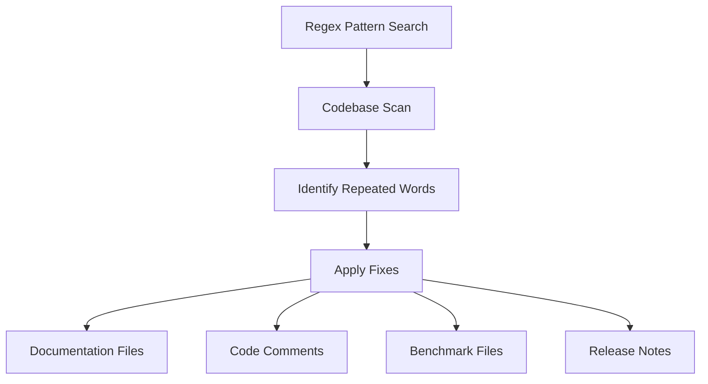

+++
title = "#21547 Fix a few \"repeated word\" typos"
date = "2025-10-15T00:00:00"
draft = false
template = "pull_request_page.html"
in_search_index = true

[taxonomies]
list_display = ["show"]

[extra]
current_language = "en"
available_languages = {"en" = { name = "English", url = "/pull_request/bevy/2025-10/pr-21547-en-20251015" }, "zh-cn" = { name = "中文", url = "/pull_request/bevy/2025-10/pr-21547-zh-cn-20251015" }}
labels = ["C-Docs", "D-Trivial", "A-Cross-Cutting"]
+++

# Title
Fix a few "repeated word" typos

## Basic Information
- **Title**: Fix a few "repeated word" typos
- **PR Link**: https://github.com/bevyengine/bevy/pull/21547
- **Author**: rparrett
- **Status**: MERGED
- **Labels**: C-Docs, D-Trivial, S-Ready-For-Final-Review, A-Cross-Cutting
- **Created**: 2025-10-14T22:11:21Z
- **Merged**: 2025-10-14T23:29:43Z
- **Merged By**: alice-i-cecile

## Description Translation
# Objective

Fix some typos

## Solution

Have a lovely stroll through the codebase with my friend `\b(\w+)\s+\1\b` and

```diff
- word word
+ word
```

## The Story of This Pull Request

This PR addresses a common but pervasive issue in code documentation and comments: repeated word typos. The author took a systematic approach to identifying these issues using a regular expression pattern `\b(\w+)\s+\1\b` that matches consecutive identical words separated by whitespace.

The problem is straightforward - repeated words in documentation and comments reduce readability and professionalism. While these typos don't affect code execution, they impact the developer experience and the project's overall quality. The author recognized that these issues accumulate over time as multiple contributors add documentation without noticing these subtle mistakes.

The solution approach was methodical and comprehensive. By using a regex pattern, the author could systematically scan the entire codebase for this specific class of typos. This automated approach ensured consistency and completeness, avoiding the human error that might occur with manual review.

The implementation involved scanning 13 crates, 2 benchmark files, and 2 release content files. The changes are purely textual - removing duplicate words from comments, documentation strings, and code annotations. The pattern identified various types of repeated words including "an an", "for for", "the the", "to to", and "strongly strongly".

From a technical perspective, this PR demonstrates several good practices:
- Using automated tools (regex) for code quality improvements
- Maintaining consistency across the entire codebase
- Addressing documentation quality alongside code quality
- Making small, focused improvements that collectively enhance the project

The impact of these changes is primarily on code readability and maintainability. Developers reading the documentation will encounter fewer distractions and clearer explanations. While the changes don't affect runtime behavior, they contribute to the overall quality of the codebase and make it more approachable for new contributors.

This type of maintenance work is essential for large codebases like Bevy, where clear documentation is crucial for the ecosystem's health. The systematic approach ensures that similar issues can be caught in code reviews or through automated tooling in the future.

## Visual Representation



## Key Files Changed

### `crates/bevy_ptr/src/lib.rs` (+8/-8)
This file contains core pointer abstractions for Bevy's ECS system. The changes fix repeated words in safety documentation for various pointer types.

```rust
// Before:
// - If the `A` type parameter is [`Aligned`] then `inner` must be be [properly aligned] for `T`.

// After:
// - If the `A` type parameter is [`Aligned`] then `inner` must be [properly aligned] for `T`.
```

### `crates/bevy_ecs/src/world/mod.rs` (+3/-3)
Core ECS world implementation. The changes fix deprecated test annotations.

```rust
// Before:
#[expect(deprecated, reason = "remove this test in in 0.17.0")]

// After:
#[expect(deprecated, reason = "remove this test in 0.17.0")]
```

### `benches/benches/bevy_ecs/entity_cloning.rs` (+2/-2)
Benchmark files for entity cloning performance. The changes fix documentation comments.

```rust
// Before:
/// Benchmarks cloning an an entity and its 50 descendents

// After:
/// Benchmarks cloning an entity and its 50 descendents
```

### `crates/bevy_ecs/src/schedule/graph/tarjan_scc.rs` (+2/-2)
Implementation of Tarjan's algorithm for strongly connected components. The changes fix algorithm documentation.

```rust
// Before:
/// Returns each strongly strongly connected component (scc).

// After:
/// Returns each strongly connected component (scc).
```

### `crates/bevy_ecs/src/storage/table/column.rs` (+2/-2)
ECS table column storage implementation. The changes fix safety documentation.

```rust
// Before:
// -   The caller should update the their saved length to reflect the change

// After:
// -   The caller should update their saved length to reflect the change
```

## Further Reading

- [Regular Expressions for Code Quality](https://docs.rs/regex/latest/regex/)
- [Bevy Engine Documentation Standards](https://bevyengine.org/learn/book/contributing/documentation/)
- [Rust API Guidelines on Documentation](https://rust-lang.github.io/api-guidelines/documentation.html)
- [Code Review Best Practices](https://google.github.io/eng-practices/review/reviewer/)