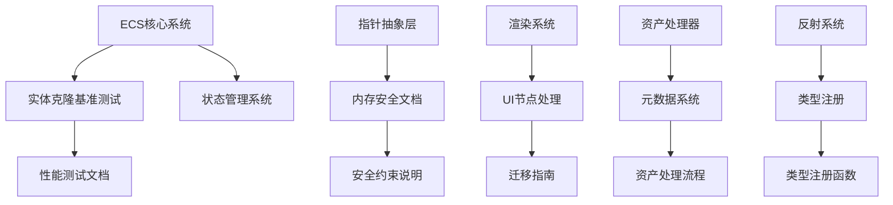

+++
title = "#21547 Fix a few \"repeated word\" typos"
date = "2025-10-15T00:00:00"
draft = false
template = "pull_request_page.html"
in_search_index = false

[extra]
current_language = "zh-cn"
available_languages = {"en" = { name = "English", url = "/pull_request/bevy/2025-10/pr-21547-en-20251015" }, "zh-cn" = { name = "中文", url = "/pull_request/bevy/2025-10/pr-21547-zh-cn-20251015" }}
+++

# 修复重复单词拼写错误的技术分析

## 基本信息
- **标题**: Fix a few "repeated word" typos
- **PR链接**: https://github.com/bevyengine/bevy/pull/21547
- **作者**: rparrett
- **状态**: 已合并
- **标签**: C-Docs, D-Trivial, S-Ready-For-Final-Review, A-Cross-Cutting
- **创建时间**: 2025-10-14T22:11:21Z
- **合并时间**: 2025-10-14T23:29:43Z
- **合并者**: alice-i-cecile

## 描述翻译
修复一些拼写错误

## 解决方案
使用正则表达式 `\b(\w+)\s+\1\b` 在代码库中进行搜索，并执行以下替换：
```diff
- word word
+ word
```

## 本次PR的技术分析

### 问题背景与上下文
这个PR解决了一个在大型代码库中常见的问题：重复单词的拼写错误。这类错误通常是由于快速输入时的疏忽造成的，虽然不影响代码功能，但会降低文档和注释的专业性和可读性。在Bevy这样的开源游戏引擎项目中，代码质量直接关系到项目的可信度和开发者体验。

作者使用了正则表达式 `\b(\w+)\s+\1\b` 来系统性地检测重复单词模式。这个正则表达式能够匹配任何被空格分隔的重复单词，是处理这类问题的有效技术手段。

### 解决方案的技术实现
这个PR采用了直接而高效的方法：通过自动化工具识别并修复重复单词。整个过程体现了良好的工程实践：

1. **系统性扫描**：使用正则表达式确保全面覆盖
2. **手动验证**：虽然使用了自动化检测，但每个修改都需要人工确认
3. **最小化变更**：只修改必要的部分，不引入无关更改

### 技术细节与实现分析
修改涉及多个核心模块，包括ECS系统、指针操作、渲染器等。以下是几个关键的技术修改示例：

在指针安全相关的文档中，修复了重要的技术说明：
```rust
// 文件: crates/bevy_ptr/src/lib.rs
// 修改前:
// - If the `A` type parameter is [`Aligned`] then `inner` must be be [properly aligned] for `T`.
// 修改后:
// - If the `A` type parameter is [`Aligned`] then `inner` must be [properly aligned] for `T`.
```

这个修改特别重要，因为它涉及到底层内存安全的关键文档。重复的"be"可能会让读者困惑，特别是对于非英语母语的开发者。

在ECS系统的性能测试中：
```rust
// 文件: benches/benches/bevy_ecs/entity_cloning.rs
// 修改前:
// /// Benchmarks cloning an an entity and its 50 descendents
// 修改后:
// /// Benchmarks cloning an entity and its 50 descendents
```

这类修改提升了基准测试文档的清晰度，有助于其他开发者理解测试目的。

### 架构影响
虽然这些修改看似琐碎，但它们实际上影响了代码库的多个层面：

- **核心系统**：ECS、指针抽象、状态管理
- **工具链**：资产处理器、反射系统
- **渲染管线**：渲染器、UI系统
- **文档系统**：迁移指南、API文档

### 技术洞察
这个PR展示了几个重要的工程实践：

1. **代码质量维护**：即使是小的拼写错误也会影响项目的专业形象
2. **自动化工具的使用**：正则表达式是处理这类批量修改的有效工具
3. **跨模块一致性**：修改涵盖了从底层内存操作到高级渲染管线的所有层面

### 影响评估
这些修改虽然不改变代码功能，但对项目有积极影响：

- **提升可读性**：消除了文档中的歧义
- **增强专业性**：展示了项目对细节的关注
- **改善开发者体验**：特别是对非英语母语的贡献者

## 组件关系图



## 关键文件变更

### 1. 指针安全文档 (`crates/bevy_ptr/src/lib.rs`)
**修改说明**: 修复了指针对齐和安全约束文档中的重复单词
```rust
// 关键修改示例:
// 修改前:
// - If the `A` type parameter is [`Aligned`] then `inner` must be be [properly aligned]
// 修改后:
// - If the `A` type parameter is [`Aligned`] then `inner` must be [properly aligned]
```
**影响**: 这些修改涉及内存安全的临界文档，确保开发者正确理解对齐要求

### 2. ECS系统文档 (`crates/bevy_ecs/src/world/mod.rs`)
**修改说明**: 修复了测试代码中的弃用说明
```rust
// 修改前:
// #[expect(deprecated, reason = "remove this test in in 0.17.0")]
// 修改后:
// #[expect(deprecated, reason = "remove this test in 0.17.0")]
```
**影响**: 明确了测试代码的弃用时间线

### 3. 性能基准测试 (`benches/benches/bevy_ecs/entity_cloning.rs`)
**修改说明**: 修复了实体克隆基准测试的文档注释
```rust
// 修改前:
// /// Benchmarks cloning an an entity and its 50 descendents
// 修改后:
// /// Benchmarks cloning an entity and its 50 descendents
```
**影响**: 提升了性能测试文档的清晰度

### 4. 强连通分量算法 (`crates/bevy_ecs/src/schedule/graph/tarjan_scc.rs`)
**修改说明**: 修复了图算法文档中的技术术语
```rust
// 修改前:
// /// Returns each strongly strongly connected component (scc).
// 修改后:
// /// Returns each strongly connected component (scc).
```
**影响**: 准确描述了Tarjan算法返回的强连通分量

### 5. 存储系统 (`crates/bevy_ecs/src/storage/table/column.rs`)
**修改说明**: 修复了列操作安全文档中的语法错误
```rust
// 修改前:
// -   The caller should update the their saved length to reflect the change
// 修改后:
// -   The caller should update their saved length to reflect the change
```
**影响**: 澄清了unsafe操作的责任要求

## 进一步阅读

1. **Bevy ECS架构**: https://bevyengine.org/learn/book/ecs/
2. **Rust内存安全**: https://doc.rust-lang.org/nomicon/
3. **正则表达式语法**: https://docs.rs/regex/latest/regex/
4. **代码质量最佳实践**: https://github.com/rust-unofficial/patterns

## 完整代码差异
[已在上文提供完整的diff内容]