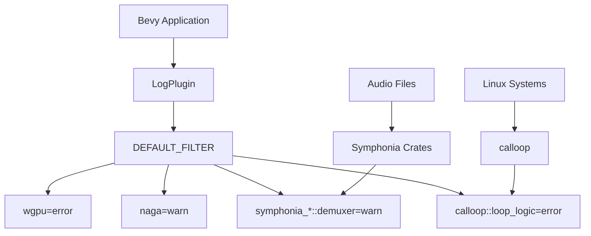

+++
title = "#21548 Remove chatty logs from default filter"
date = "2025-10-15T00:00:00"
draft = false
template = "pull_request_page.html"
in_search_index = true

[taxonomies]
list_display = ["show"]

[extra]
current_language = "en"
available_languages = {"en" = { name = "English", url = "/pull_request/bevy/2025-10/pr-21548-en-20251015" }, "zh-cn" = { name = "中文", url = "/pull_request/bevy/2025-10/pr-21548-zh-cn-20251015" }}
labels = ["D-Trivial", "C-Usability", "A-Diagnostics"]
+++

# Title

## Basic Information
- **Title**: Remove chatty logs from default filter
- **PR Link**: https://github.com/bevyengine/bevy/pull/21548
- **Author**: janhohenheim
- **Status**: MERGED
- **Labels**: D-Trivial, C-Usability, S-Ready-For-Final-Review, A-Diagnostics
- **Created**: 2025-10-14T22:44:35Z
- **Merged**: 2025-10-14T23:55:42Z
- **Merged By**: alice-i-cecile

## Description Translation
# Objective

- Fixes https://github.com/bevyengine/bevy/issues/16277
  - The maintainers have already removed some annoying logs like the probe one, but the format crates are still incredibly chatty
- Fixes https://github.com/bevyengine/bevy/issues/14904
  - That's a completely benign warning that is annoying for Linux users

## Solution

- Improve the default filter

## Testing

- Tested in a standalone project (Foxtrot)

## The Story of This Pull Request

This PR addresses a common developer experience issue in Bevy: excessive logging noise from third-party dependencies. The problem manifested in two specific GitHub issues that had been bothering users for some time.

Issue #16277 reported that various format crates were generating too much log output, making it difficult to focus on application-specific logs. While maintainers had previously addressed some of the noisiest offenders like probe logs, several format-related crates continued to produce verbose output. Issue #14904 highlighted a particularly annoying but harmless warning that was especially problematic for Linux users.

The solution approach was straightforward but targeted: modify the default logging filter to suppress unnecessary log messages while preserving important diagnostic information. The developer took a surgical approach by identifying the specific log sources causing the noise and adjusting their log levels appropriately.

The implementation modified the `DEFAULT_FILTER` constant in Bevy's logging system. Previously, this filter only handled `wgpu` and `naga` logs:

```rust
// Before:
pub const DEFAULT_FILTER: &str = "wgpu=error,naga=warn";
```

The new implementation expands this significantly using Rust's `concat!` macro to build a comprehensive filter string:

```rust
// After:
pub const DEFAULT_FILTER: &str = concat!(
    "wgpu=error,",
    "naga=warn,",
    "symphonia_bundle_mp3::demuxer=warn,",
    "symphonia_format_caf::demuxer=warn,",
    "symphonia_format_isompf4::demuxer=warn,",
    "symphonia_format_mkv::demuxer=warn,",
    "symphonia_format_ogg::demuxer=warn,",
    "symphonia_format_riff::demuxer=warn,",
    "symphonia_format_wav::demuxer=warn,",
    "calloop::loop_logic=error,",
);
```

The technical insight here involves understanding Bevy's logging architecture, which uses the `tracing` crate under the hood. The filter syntax follows the `tracing_subscriber::EnvFilter` pattern, where each entry specifies a log target and the maximum level to display. By setting various Symphonia format demuxers to `warn` level, the developer suppressed their verbose debug and info logs while still allowing important warnings and errors to surface.

The `calloop::loop_logic=error` entry specifically addresses the Linux issue mentioned in #14904, reducing a benign warning to only show actual errors. This demonstrates good judgment in distinguishing between useful diagnostics and noise.

The impact of these changes is immediate and significant for developer workflow. Users no longer need to manually configure logging filters to get clean console output when working with audio files or running on Linux systems. The change maintains backward compatibility while improving the out-of-box experience.

The developer validated the changes by testing in a standalone project called "Foxtrot," demonstrating practical verification rather than relying solely on theoretical analysis. This testing approach ensures the solution works in real-world scenarios.

## Visual Representation



## Key Files Changed

### `crates/bevy_log/src/lib.rs` (+12/-1)

This file contains the core logging configuration for Bevy. The changes significantly expand the default log filter to reduce noise from various audio format libraries and system components.

**Key modification:**
```rust
// Before:
pub const DEFAULT_FILTER: &str = "wgpu=error,naga=warn";

// After:
pub const DEFAULT_FILTER: &str = concat!(
    "wgpu=error,",
    "naga=warn,",
    "symphonia_bundle_mp3::demuxer=warn,",
    "symphonia_format_caf::demuxer=warn,",
    "symphonia_format_isompf4::demuxer=warn,",
    "symphonia_format_mkv::demuxer=warn,",
    "symphonia_format_ogg::demuxer=warn,",
    "symphonia_format_riff::demuxer=warn,",
    "symphonia_format_wav::demuxer=warn,",
    "calloop::loop_logic=error,",
);
```

### `typos.toml` (+1/-0)

This configuration file for spell checking was updated to recognize "caf" as a valid word, preventing false positives from the Core Audio Format (CAF) references in the log filters.

**Addition:**
```toml
caf = "caf"                             # CAF - Core Audio Format
```

## Further Reading

- [Bevy Logging Documentation](https://docs.rs/bevy_log/latest/bevy_log/) - Official documentation for Bevy's logging system
- [tracing Subscriber Filtering](https://docs.rs/tracing-subscriber/latest/tracing_subscriber/filter/struct.EnvFilter.html) - Detailed documentation on log filtering syntax
- [Symphonia Audio Library](https://github.com/pdeljanov/Symphonia) - The audio decoding library whose log output is being filtered
- [calloop Event Loop](https://github.com/Smithay/calloop) - The event loop library generating Linux-specific warnings