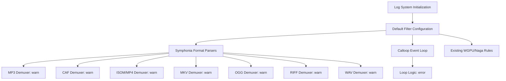

+++
title = "#21548 Remove chatty logs from default filter"
date = "2025-10-15T00:00:00"
draft = false
template = "pull_request_page.html"
in_search_index = false

[extra]
current_language = "zh-cn"
available_languages = {"en" = { name = "English", url = "/pull_request/bevy/2025-10/pr-21548-en-20251015" }, "zh-cn" = { name = "中文", url = "/pull_request/bevy/2025-10/pr-21548-zh-cn-20251015" }}
labels = ["D-Trivial", "C-Usability", "A-Diagnostics"]
+++

# Title

## Basic Information
- **Title**: Remove chatty logs from default filter
- **PR Link**: https://github.com/bevyengine/bevy/pull/21548
- **Author**: janhohenheim
- **Status**: MERGED
- **Labels**: D-Trivial, C-Usability, S-Ready-For-Final-Review, A-Diagnostics
- **Created**: 2025-10-14T22:44:35Z
- **Merged**: 2025-10-14T23:55:42Z
- **Merged By**: alice-i-cecile

## Description Translation
**目标**
- 修复 https://github.com/bevyengine/bevy/issues/16277
  - 维护者已经移除了一些烦人的日志，比如探针日志，但格式库仍然非常冗长
- 修复 https://github.com/bevyengine/bevy/issues/14904
  - 这是一个完全良性的警告，但对 Linux 用户来说很烦人

**解决方案**
- 改进默认过滤器

**测试**
- 在独立项目 (Foxtrot) 中进行了测试

## The Story of This Pull Request

这个 PR 解决了一个看似简单但影响开发者体验的问题：Bevy 引擎的默认日志输出过于冗长。问题源于两个 GitHub issue：16277 和 14904，都报告了特定日志消息在默认配置下过于吵闹，影响了开发工作流。

问题的核心在于 Bevy 的默认日志过滤器设置。在修改之前，默认过滤器只包含两个规则：
```rust
pub const DEFAULT_FILTER: &str = "wgpu=error,naga=warn";
```

这种简约的配置导致许多第三方库的调试和信息级别日志都会输出到控制台，特别是 Symphonia 音频库的各种格式解析器和 calloop 事件循环库。对于日常开发来说，这些日志信息大多是不必要的噪音，淹没了真正需要关注的应用程序日志。

开发者采用了直接但有效的方法：扩展默认过滤器以包含更多特定的日志规则。解决方案不是完全禁用这些库的日志，而是将它们的日志级别调整到更合适的水平。对于 Symphonia 的各个格式解析器，设置为 `warn` 级别，这样只有在真正有问题时才会输出消息；对于 calloop 的循环逻辑，设置为 `error` 级别，只在发生错误时输出。

技术实现上，开发者使用了 Rust 的 `concat!` 宏来构建一个长的过滤字符串。这种方法保持了代码的可读性，同时利用了编译时字符串连接的优势。每个过滤规则都清晰地列在单独的行中，便于维护和后续扩展。

这个修改体现了良好的工程实践：在保持功能完整性的同时优化用户体验。日志系统仍然是完全可配置的，用户可以通过环境变量覆盖这些默认设置。修改只是调整了开箱即用的体验，让新用户在第一次运行 Bevy 应用时不会面对大量的技术性日志输出。

从架构角度看，这个修改位于 Bevy 的日志系统初始化层，影响的是日志过滤的默认行为，而不是日志系统本身的功能。它展示了如何通过细粒度的配置来平衡详细日志和清洁输出的需求。

## Visual Representation



## Key Files Changed

### `crates/bevy_log/src/lib.rs` (+12/-1)

这是主要的代码修改文件，改变了默认的日志过滤器配置。

**修改前：**
```rust
pub const DEFAULT_FILTER: &str = "wgpu=error,naga=warn";
```

**修改后：**
```rust
pub const DEFAULT_FILTER: &str = concat!(
    "wgpu=error,",
    "naga=warn,",
    "symphonia_bundle_mp3::demuxer=warn,",
    "symphonia_format_caf::demuxer=warn,",
    "symphonia_format_isompf4::demuxer=warn,",
    "symphonia_format_mkv::demuxer=warn,",
    "symphonia_format_ogg::demuxer=warn,",
    "symphonia_format_riff::demuxer=warn,",
    "symphonia_format_wav::demuxer=warn,",
    "calloop::loop_logic=error,",
);
```

这个修改通过扩展默认过滤器规则，减少了 Symphonia 音频库和 calloop 事件循环库的冗长日志输出，显著改善了开发者的控制台体验。

### `typos.toml` (+1/-0)

次要的拼写检查配置更新。

**修改后添加：**
```toml
caf = "caf"                             # CAF - Core Audio Format
```

这行修改将 "caf" 添加到拼写检查的例外列表中，因为它是 Core Audio Format 的缩写，在代码中作为 Symphonia 的模块名出现。

## Further Reading

- [tracing crate documentation](https://docs.rs/tracing/latest/tracing/) - Rust 的日志和诊断框架
- [EnvFilter configuration syntax](https://docs.rs/tracing-subscriber/latest/tracing_subscriber/filter/struct.EnvFilter.html) - 日志过滤器配置语法
- [Bevy Logging Guide](https://bevyengine.org/learn/quick-start/getting-started/log/) - Bevy 日志系统使用指南