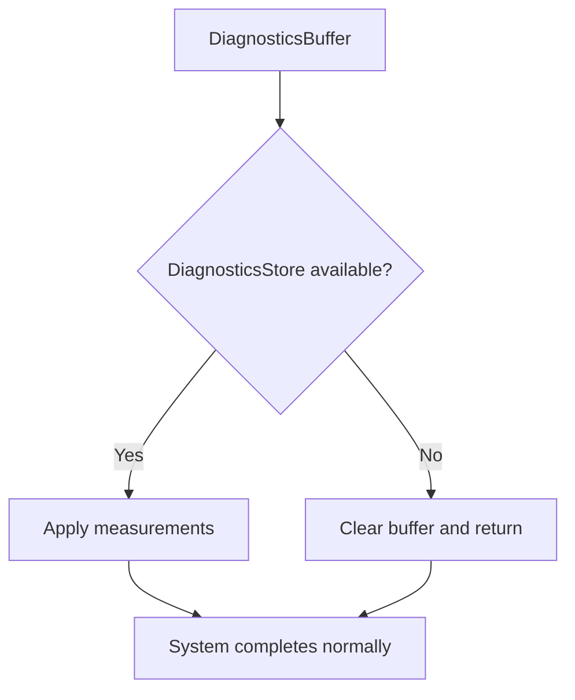

+++
title = "#21550 Allow DiagnosticsBuffer to be applied even if DiagnosticsStore is missing."
date = "2025-10-24T00:00:00"
draft = false
template = "pull_request_page.html"
in_search_index = true

[taxonomies]
list_display = ["show"]

[extra]
current_language = "en"
available_languages = {"en" = { name = "English", url = "/pull_request/bevy/2025-10/pr-21550-en-20251024" }, "zh-cn" = { name = "中文", url = "/pull_request/bevy/2025-10/pr-21550-zh-cn-20251024" }}
labels = ["D-Trivial", "C-Usability", "A-Diagnostics"]
+++

# Title
Allow DiagnosticsBuffer to be applied even if DiagnosticsStore is missing

## Basic Information
- **Title**: Allow DiagnosticsBuffer to be applied even if DiagnosticsStore is missing.
- **PR Link**: https://github.com/bevyengine/bevy/pull/21550
- **Author**: andriyDev
- **Status**: MERGED
- **Labels**: D-Trivial, C-Usability, S-Ready-For-Final-Review, A-Diagnostics
- **Created**: 2025-10-14T23:00:27Z
- **Merged**: 2025-10-23T23:03:28Z
- **Merged By**: mockersf

## Description Translation
# Objective

- Workaround #21549.

## Solution

- Avoid panicking in `DiagnosticsBuffer::apply` if the world is missing the `DiagnosticsStore`.
- Clear the buffer if `DiagnosticsStore` is missing to prevent growing the buffer.

## Testing

- None.

## The Story of This Pull Request

This PR addresses a specific edge case in Bevy's diagnostics system where the `DiagnosticsBuffer` would panic when trying to apply measurements to a missing `DiagnosticsStore` resource. The issue occurred in conditional system scenarios where systems using `If<Diagnostics>` could have their buffers applied even when the diagnostics store wasn't available in the world.

The core problem was in the `SystemBuffer` implementation for `DiagnosticsBuffer`. Previously, the code used `world.resource_mut::<DiagnosticsStore>()` which would panic if the resource wasn't present. This created a problematic situation because `SystemBuffer::apply` is called regardless of whether the system actually runs, leading to crashes in conditional execution paths.

The solution implemented here takes a defensive programming approach. Instead of assuming the `DiagnosticsStore` resource will always be available, the code now uses `world.get_resource_mut::<DiagnosticsStore>()` which returns an `Option`. When the resource is missing, the buffer gracefully handles this by clearing its contents and returning early. This prevents both the panic and potential memory leaks from unbounded buffer growth.

The key insight here is understanding the lifecycle of system buffers in Bevy's ECS. Even when systems are conditionally disabled, their buffers may still be processed, so buffer implementations need to be resilient to missing dependencies. This change makes the diagnostics system more robust in edge cases without affecting normal operation.

## Visual Representation



## Key Files Changed

**File: `crates/bevy_diagnostic/src/diagnostic.rs`**

This file contains the core implementation change that makes the diagnostics system more resilient to missing resources.

**Key Changes:**
- Replaced panicking resource access with safe optional access
- Added early return with buffer cleanup when resource is missing
- Added comprehensive documentation explaining the reasoning

```rust
// Before:
let mut diagnostics = world.resource_mut::<DiagnosticsStore>();

// After:
let Some(mut diagnostics) = world.get_resource_mut::<DiagnosticsStore>() else {
    // `SystemBuffer::apply` is called even if the system never runs. If a user uses
    // `If<Diagnostics>`, this buffer will be applied even if we are missing
    // `DiagnosticsStore`. So be permissive to allow these cases. See
    // https://github.com/bevyengine/bevy/issues/21549 for more.

    // Clear the buffer since we have nowhere to put those metrics and we don't want them to
    // grow without bound.
    self.0.clear();
    return;
};
```

The change transforms a hard failure (panic) into a graceful degradation. When the `DiagnosticsStore` is missing, the system simply clears its buffer and continues, preventing both crashes and memory leaks.

## Further Reading

- [Bevy ECS System Buffers Documentation](https://docs.rs/bevy_ecs/latest/bevy_ecs/system/trait.SystemBuffer.html)
- [Conditional System Execution in Bevy](https://bevy-cheatbook.github.io/programming/conditions.html)
- [Defensive Programming Patterns](https://en.wikipedia.org/wiki/Defensive_programming)
- [Rust Option Type Documentation](https://doc.rust-lang.org/std/option/enum.Option.html)

# Full Code Diff
```diff
diff --git a/crates/bevy_diagnostic/src/diagnostic.rs b/crates/bevy_diagnostic/src/diagnostic.rs
index 937da5b258502..17943ae60d308 100644
--- a/crates/bevy_diagnostic/src/diagnostic.rs
+++ b/crates/bevy_diagnostic/src/diagnostic.rs
@@ -381,7 +381,17 @@ impl SystemBuffer for DiagnosticsBuffer {
         _system_meta: &bevy_ecs::system::SystemMeta,
         world: &mut bevy_ecs::world::World,
     ) {
-        let mut diagnostics = world.resource_mut::<DiagnosticsStore>();
+        let Some(mut diagnostics) = world.get_resource_mut::<DiagnosticsStore>() else {
+            // `SystemBuffer::apply` is called even if the system never runs. If a user uses
+            // `If<Diagnostics>`, this buffer will be applied even if we are missing
+            // `DiagnosticsStore`. So be permissive to allow these cases. See
+            // https://github.com/bevyengine/bevy/issues/21549 for more.
+
+            // Clear the buffer since we have nowhere to put those metrics and we don't want them to
+            // grow without bound.
+            self.0.clear();
+            return;
+        };
         for (path, measurement) in self.0.drain() {
             if let Some(diagnostic) = diagnostics.get_mut(&path) {
                 diagnostic.add_measurement(measurement);
```