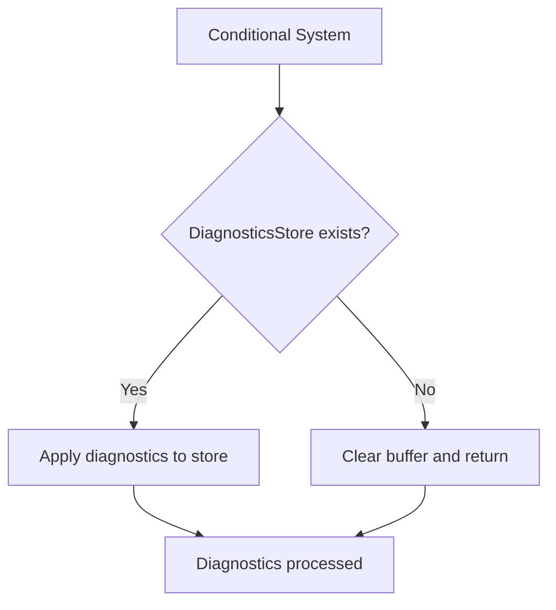

+++
title = "#21550 Allow DiagnosticsBuffer to be applied even if DiagnosticsStore is missing."
date = "2025-10-24T00:00:00"
draft = false
template = "pull_request_page.html"
in_search_index = false

[extra]
current_language = "zh-cn"
available_languages = {"en" = { name = "English", url = "/pull_request/bevy/2025-10/pr-21550-en-20251024" }, "zh-cn" = { name = "中文", url = "/pull_request/bevy/2025-10/pr-21550-zh-cn-20251024" }}
labels = ["D-Trivial", "C-Usability", "A-Diagnostics"]
+++

# Allow DiagnosticsBuffer to be applied even if DiagnosticsStore is missing.

## Basic Information
- **Title**: Allow DiagnosticsBuffer to be applied even if DiagnosticsStore is missing.
- **PR Link**: https://github.com/bevyengine/bevy/pull/21550
- **Author**: andriyDev
- **Status**: MERGED
- **Labels**: D-Trivial, C-Usability, S-Ready-For-Final-Review, A-Diagnostics
- **Created**: 2025-10-14T23:00:27Z
- **Merged**: 2025-10-23T23:03:28Z
- **Merged By**: mockersf

## Description Translation
# Objective

- Workaround #21549.

## Solution

- Avoid panicking in `DiagnosticsBuffer::apply` if the world is missing the `DiagnosticsStore`.
- Clear the buffer if `DiagnosticsStore` is missing to prevent growing the buffer.

## Testing

- None.

## The Story of This Pull Request

这个PR解决了一个在特定条件下会导致系统panic的问题。问题出现在当开发者使用条件系统（conditional systems）时，特别是当使用`If<Diagnostics>`条件时，即使`DiagnosticsStore`资源不存在，`DiagnosticsBuffer::apply`方法仍然会被调用。

问题的核心在于Bevy ECS的执行模型。`SystemBuffer::apply`方法会在系统运行后被调用，即使系统本身由于条件不满足而从未执行。在原来的实现中，代码假设`DiagnosticsStore`资源一定存在：

```rust
let mut diagnostics = world.resource_mut::<DiagnosticsStore>();
```

当资源不存在时，`resource_mut()`会panic，导致应用程序崩溃。这在用户使用条件系统如`If<Diagnostics>`时会发生，因为在这种情况下，`DiagnosticsStore`可能不会被添加到world中。

解决方案采用了防御性编程的方法。新的实现首先尝试获取`DiagnosticsStore`资源，但如果资源不存在，就清空缓冲区并提前返回：

```rust
let Some(mut diagnostics) = world.get_resource_mut::<DiagnosticsStore>() else {
    // Clear the buffer since we have nowhere to put those metrics and we don't want them to
    // grow without bound.
    self.0.clear();
    return;
};
```

这种处理方式有几个技术优势。首先，它避免了panic，使系统更加健壮。其次，通过清空缓冲区，防止了在资源不存在的情况下缓冲区无限增长的内存泄漏问题。代码中使用的`get_resource_mut()`方法返回`Option`，相比原来的`resource_mut()`更加安全，因为它允许资源不存在的情况。

从架构角度看，这个修改体现了Bevy中对条件系统的更好支持。条件系统是Bevy ECS的重要特性，允许系统根据运行时条件决定是否执行。这个修复确保了诊断系统能够与条件系统正确配合工作。

这个修改虽然简单，但展示了重要的工程原则：对可能失败的操作进行适当的错误处理，特别是在框架级别的代码中。通过使用`Option`类型和提前返回模式，代码变得更加健壮且易于理解。

## Visual Representation



## Key Files Changed

### `crates/bevy_diagnostic/src/diagnostic.rs` (+11/-1)

这个文件包含了诊断系统的核心实现。修改主要集中在`DiagnosticsBuffer`的`apply`方法上。

**修改前：**
```rust
impl SystemBuffer for DiagnosticsBuffer {
    fn apply(
        &mut self,
        _system_meta: &bevy_ecs::system::SystemMeta,
        world: &mut bevy_ecs::world::World,
    ) {
        let mut diagnostics = world.resource_mut::<DiagnosticsStore>();
        for (path, measurement) in self.0.drain() {
            if let Some(diagnostic) = diagnostics.get_mut(&path) {
                diagnostic.add_measurement(measurement);
            }
        }
    }
}
```

**修改后：**
```rust
impl SystemBuffer for DiagnosticsBuffer {
    fn apply(
        &mut self,
        _system_meta: &bevy_ecs::system::SystemMeta,
        world: &mut bevy_ecs::world::World,
    ) {
        let Some(mut diagnostics) = world.get_resource_mut::<DiagnosticsStore>() else {
            // `SystemBuffer::apply` is called even if the system never runs. If a user uses
            // `If<Diagnostics>`, this buffer will be applied even if we are missing
            // `DiagnosticsStore`. So be permissive to allow these cases. See
            // https://github.com/bevyengine/bevy/issues/21549 for more.

            // Clear the buffer since we have nowhere to put those metrics and we don't want them to
            // grow without bound.
            self.0.clear();
            return;
        };
        for (path, measurement) in self.0.drain() {
            if let Some(diagnostic) = diagnostics.get_mut(&path) {
                diagnostic.add_measurement(measurement);
            }
        }
    }
}
```

主要变化：
1. 将`world.resource_mut::<DiagnosticsStore>()`改为`world.get_resource_mut::<DiagnosticsStore>()`，后者返回`Option`
2. 添加了资源不存在的处理逻辑，清空缓冲区并提前返回
3. 添加了详细的注释说明这种边界情况的原因

## Further Reading

- [Bevy Conditional Systems Documentation](https://bevyengine.org/learn/quick-start/ecs/#system-sets-and-conditions)
- [Bevy Resources Documentation](https://bevyengine.org/learn/quick-start/ecs/#resources)
- [Rust Option Type Documentation](https://doc.rust-lang.org/std/option/enum.Option.html)
- [Defensive Programming Principles](https://en.wikipedia.org/wiki/Defensive_programming)

# Full Code Diff
```diff
diff --git a/crates/bevy_diagnostic/src/diagnostic.rs b/crates/bevy_diagnostic/src/diagnostic.rs
index 937da5b258502..17943ae60d308 100644
--- a/crates/bevy_diagnostic/src/diagnostic.rs
+++ b/crates/bevy_diagnostic/src/diagnostic.rs
@@ -381,7 +381,17 @@ impl SystemBuffer for DiagnosticsBuffer {
         _system_meta: &bevy_ecs::system::SystemMeta,
         world: &mut bevy_ecs::world::World,
     ) {
-        let mut diagnostics = world.resource_mut::<DiagnosticsStore>();
+        let Some(mut diagnostics) = world.get_resource_mut::<DiagnosticsStore>() else {
+            // `SystemBuffer::apply` is called even if the system never runs. If a user uses
+            // `If<Diagnostics>`, this buffer will be applied even if we are missing
+            // `DiagnosticsStore`. So be permissive to allow these cases. See
+            // https://github.com/bevyengine/bevy/issues/21549 for more.
+
+            // Clear the buffer since we have nowhere to put those metrics and we don't want them to
+            // grow without bound.
+            self.0.clear();
+            return;
+        };
         for (path, measurement) in self.0.drain() {
             if let Some(diagnostic) = diagnostics.get_mut(&path) {
                 diagnostic.add_measurement(measurement);
```