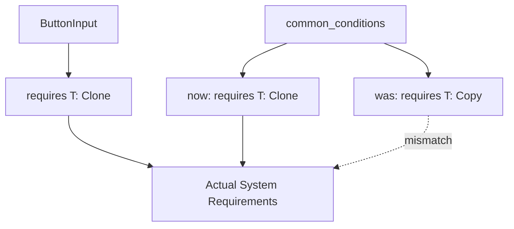

+++
title = "#21554 Match input common_conditions bounds with ButtonInput"
date = "2025-10-15T00:00:00"
draft = false
template = "pull_request_page.html"
in_search_index = true

[taxonomies]
list_display = ["show"]

[extra]
current_language = "en"
available_languages = {"en" = { name = "English", url = "/pull_request/bevy/2025-10/pr-21554-en-20251015" }, "zh-cn" = { name = "中文", url = "/pull_request/bevy/2025-10/pr-21554-zh-cn-20251015" }}
labels = ["C-Bug", "A-Input", "D-Straightforward"]
+++

# Match input common_conditions bounds with ButtonInput

## Basic Information
- **Title**: Match input common_conditions bounds with ButtonInput
- **PR Link**: https://github.com/bevyengine/bevy/pull/21554
- **Author**: akimakinai
- **Status**: MERGED
- **Labels**: C-Bug, A-Input, S-Ready-For-Final-Review, D-Straightforward
- **Created**: 2025-10-15T11:51:46Z
- **Merged**: 2025-10-15T23:39:08Z
- **Merged By**: alice-i-cecile

## Description Translation
# Objective

- `ButtonInput` has `T: Clone + Eq + Hash + Send + Sync + 'static` bounds,
  but functions in `bevy_input::common_conditions` has `T: Copy + Eq + Hash + Send + Sync + 'static` bounds.
  This prevents use of `!Copy` inputs like `Key` for the latter.

## Solution

- Replace `Copy` -> `Clone` in `bevy_input::common_conditions`

## The Story of This Pull Request

This PR addresses a consistency issue in Bevy's input system where the trait bounds for input types were unnecessarily restrictive in the common conditions module. The problem emerged from a mismatch between the bounds required by `ButtonInput<T>` and the bounds enforced by the helper functions in `common_conditions`.

The core issue was that `ButtonInput<T>` only requires `T: Clone`, but the common conditions functions required `T: Copy`. This created an API inconsistency where certain input types that implemented `Clone` but not `Copy` (like `Key`) couldn't be used with the convenient condition functions, even though they worked perfectly with the underlying `ButtonInput` system.

The solution was straightforward but impactful: change the trait bounds from `Copy` to `Clone` across all the common condition functions. This required corresponding changes to the function implementations - instead of passing the input value directly (which would work with `Copy` types due to implicit copying), the code now explicitly calls `.clone()` on the input value.

Here's the key technical insight: `Copy` is a subset of `Clone`. Any type that implements `Copy` automatically implements `Clone`, but the reverse isn't true. By relaxing the bound from `Copy` to `Clone`, the API becomes more flexible while maintaining backward compatibility. Types that were previously supported (those implementing `Copy`) continue to work, while new types that only implement `Clone` can now be used.

The implementation changes are minimal but effective. In each function, the trait bound was updated and the input parameter was cloned before being passed to the `ButtonInput` methods:

```rust
// Before: T: Copy
// After: T: Clone
move |inputs: Res<ButtonInput<T>>| inputs.pressed(input.clone())
```

This change aligns the common conditions API with the actual requirements of the underlying `ButtonInput` system, creating a more consistent and flexible input handling experience for Bevy developers.

## Visual Representation



## Key Files Changed

**File: `crates/bevy_input/src/common_conditions.rs`**

This file contains helper functions for creating run conditions based on input state. The changes ensure these functions have the same trait bounds as the underlying `ButtonInput` system.

Key modifications:

1. **Trait bound updates**: Changed from `Copy` to `Clone` in four functions
2. **Implementation updates**: Added explicit `.clone()` calls on input parameters

```rust
// Before (in all four functions):
T: Copy + Eq + Hash + Send + Sync + 'static,

// After:
T: Clone + Eq + Hash + Send + Sync + 'static,
```

```rust
// Example implementation change in input_pressed:
// Before:
move |inputs: Res<ButtonInput<T>>| inputs.pressed(input)

// After:
move |inputs: Res<ButtonInput<T>>| inputs.pressed(input.clone())
```

The changes affect these four functions:
- `input_toggle_active`
- `input_pressed` 
- `input_just_pressed`
- `input_just_released`

Each function now properly clones the input value when checking the button state, allowing non-`Copy` types to be used while maintaining the same functionality for existing `Copy` types.

## Further Reading

- [Rust Book: Derivable Traits](https://doc.rust-lang.org/book/appendix-03-derivable-traits.html) - Explains the difference between `Copy` and `Clone` traits
- [Bevy Input Documentation](https://docs.rs/bevy_input/latest/bevy_input/) - Official documentation for Bevy's input system
- [Rust Reference: Trait Bounds](https://doc.rust-lang.org/reference/trait-bounds.html) - Detailed explanation of trait bounds in Rust

# Full Code Diff
```diff
diff --git a/crates/bevy_input/src/common_conditions.rs b/crates/bevy_input/src/common_conditions.rs
index c1c486e249ada..1ed63c8987f43 100644
--- a/crates/bevy_input/src/common_conditions.rs
+++ b/crates/bevy_input/src/common_conditions.rs
@@ -53,11 +53,11 @@ pub fn input_toggle_active<T>(
     input: T,
 ) -> impl FnMut(Res<ButtonInput<T>>) -> bool + Clone
 where
-    T: Copy + Eq + Hash + Send + Sync + 'static,
+    T: Clone + Eq + Hash + Send + Sync + 'static,
 {
     let mut active = default;
     move |inputs: Res<ButtonInput<T>>| {
-        active ^= inputs.just_pressed(input);
+        active ^= inputs.just_pressed(input.clone());
         active
     }
 }
@@ -65,9 +65,9 @@ where
 /// Run condition that is active if [`ButtonInput::pressed`] is true for the given input.
 pub fn input_pressed<T>(input: T) -> impl FnMut(Res<ButtonInput<T>>) -> bool + Clone
 where
-    T: Copy + Eq + Hash + Send + Sync + 'static,
+    T: Clone + Eq + Hash + Send + Sync + 'static,
 {
-    move |inputs: Res<ButtonInput<T>>| inputs.pressed(input)
+    move |inputs: Res<ButtonInput<T>>| inputs.pressed(input.clone())
 }
 
 /// Run condition that is active if [`ButtonInput::just_pressed`] is true for the given input.
@@ -87,17 +87,17 @@ where
 /// ```
 pub fn input_just_pressed<T>(input: T) -> impl FnMut(Res<ButtonInput<T>>) -> bool + Clone
 where
-    T: Copy + Eq + Hash + Send + Sync + 'static,
+    T: Clone + Eq + Hash + Send + Sync + 'static,
 {
-    move |inputs: Res<ButtonInput<T>>| inputs.just_pressed(input)
+    move |inputs: Res<ButtonInput<T>>| inputs.just_pressed(input.clone())
 }
 
 /// Run condition that is active if [`ButtonInput::just_released`] is true for the given input.
 pub fn input_just_released<T>(input: T) -> impl FnMut(Res<ButtonInput<T>>) -> bool + Clone
 where
-    T: Copy + Eq + Hash + Send + Sync + 'static,
+    T: Clone + Eq + Hash + Send + Sync + 'static,
 {
-    move |inputs: Res<ButtonInput<T>>| inputs.just_released(input)
+    move |inputs: Res<ButtonInput<T>>| inputs.just_released(input.clone())
 }
 
 #[cfg(test)]
```