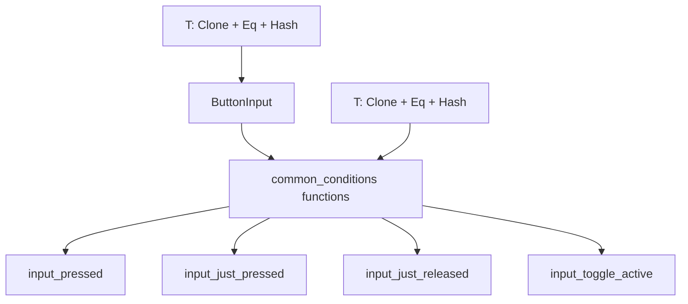

+++
title = "#21554 Match input common_conditions bounds with ButtonInput"
date = "2025-10-15T00:00:00"
draft = false
template = "pull_request_page.html"
in_search_index = false

[extra]
current_language = "zh-cn"
available_languages = {"en" = { name = "English", url = "/pull_request/bevy/2025-10/pr-21554-en-20251015" }, "zh-cn" = { name = "中文", url = "/pull_request/bevy/2025-10/pr-21554-zh-cn-20251015" }}
labels = ["C-Bug", "A-Input", "D-Straightforward"]
+++

# Match input common_conditions bounds with ButtonInput

## Basic Information
- **Title**: Match input common_conditions bounds with ButtonInput
- **PR Link**: https://github.com/bevyengine/bevy/pull/21554
- **Author**: akimakinai
- **Status**: MERGED
- **Labels**: C-Bug, A-Input, S-Ready-For-Final-Review, D-Straightforward
- **Created**: 2025-10-15T11:51:46Z
- **Merged**: 2025-10-15T23:39:08Z
- **Merged By**: alice-i-cecile

## Description Translation
**目标**

- `ButtonInput` 的泛型约束是 `T: Clone + Eq + Hash + Send + Sync + 'static`，
  但 `bevy_input::common_conditions` 中的函数使用的是 `T: Copy + Eq + Hash + Send + Sync + 'static` 约束。
  这导致无法将 `!Copy` 的输入类型（如 `Key`）用于后者。

**解决方案**

- 在 `bevy_input::common_conditions` 中将 `Copy` 替换为 `Clone`

## The Story of This Pull Request

这个 PR 解决了一个输入系统中类型约束不一致的问题。问题的核心在于 `ButtonInput` 结构体和 `common_conditions` 模块中的函数使用了不同的 trait bounds，导致了 API 的不一致性和使用限制。

**问题背景**

在 Bevy 的输入系统中，`ButtonInput<T>` 结构体用于跟踪特定类型输入的状态。它的泛型约束是 `T: Clone + Eq + Hash + Send + Sync + 'static`，这意味着输入类型只需要实现 `Clone` trait，而不需要实现 `Copy` trait。

然而，在 `bevy_input::common_conditions` 模块中，几个常用的条件函数（如 `input_pressed`、`input_just_pressed` 等）却使用了更严格的 `Copy` trait bound。这种不一致性导致了实际问题：当开发者尝试使用不实现 `Copy` trait 的输入类型（比如某些自定义的 `Key` 类型）时，这些条件函数就无法编译。

**解决方案分析**

解决方案很直接：将 `common_conditions` 模块中所有相关函数的 trait bound 从 `Copy` 改为 `Clone`，并在函数内部相应地将直接使用输入值改为调用 `clone()` 方法。

从工程角度看，这是一个典型的 API 一致性修复。`Clone` 和 `Copy` 的主要区别在于：
- `Copy` 表示类型可以通过简单的内存拷贝来复制，是隐式的
- `Clone` 需要显式调用 `clone()` 方法，可能涉及更复杂的复制逻辑

由于输入类型通常不涉及昂贵的复制操作，使用 `Clone` 而不是 `Copy` 不会带来明显的性能损失，但大大增加了 API 的灵活性。

**实现细节**

在具体的实现中，所有四个条件函数都进行了相同的修改：
1. 将泛型约束从 `T: Copy` 改为 `T: Clone`
2. 在函数体内，将直接使用输入值改为调用 `input.clone()`

这种修改确保了向后兼容性，因为所有实现 `Copy` 的类型都自动实现了 `Clone`，所以现有的代码不需要任何修改就能继续工作。

**技术影响**

这个修改虽然看起来很小，但解决了实际的使用障碍。现在开发者可以使用任何实现了 `Clone` trait 的输入类型，而不仅限于 `Copy` 类型。这在处理复杂的输入枚举或需要自定义复制逻辑的输入类型时特别有用。

从架构角度看，这种修改体现了良好的 API 设计原则：使用最宽松的约束来满足功能需求。通过将 `Copy` 放宽到 `Clone`，API 变得更加灵活，同时保持了类型安全。

## Visual Representation



## Key Files Changed

**crates/bevy_input/src/common_conditions.rs** (+8/-8)

这个文件包含了所有输入条件函数的实现。修改涉及四个函数，将它们的类型约束从 `Copy` 统一为 `Clone`，以匹配 `ButtonInput` 的约束。

主要修改：

```rust
// Before:
pub fn input_toggle_active<T>(
    input: T,
) -> impl FnMut(Res<ButtonInput<T>>) -> bool + Clone
where
    T: Copy + Eq + Hash + Send + Sync + 'static,
{
    let mut active = default;
    move |inputs: Res<ButtonInput<T>>| {
        active ^= inputs.just_pressed(input);
        active
    }
}

// After:
pub fn input_toggle_active<T>(
    input: T,
) -> impl FnMut(Res<ButtonInput<T>>) -> bool + Clone
where
    T: Clone + Eq + Hash + Send + Sync + 'static,
{
    let mut active = default;
    move |inputs: Res<ButtonInput<T>>| {
        active ^= inputs.just_pressed(input.clone());
        active
    }
}
```

```rust
// Before:
pub fn input_pressed<T>(input: T) -> impl FnMut(Res<ButtonInput<T>>) -> bool + Clone
where
    T: Copy + Eq + Hash + Send + Sync + 'static,
{
    move |inputs: Res<ButtonInput<T>>| inputs.pressed(input)
}

// After:
pub fn input_pressed<T>(input: T) -> impl FnMut(Res<ButtonInput<T>>) -> bool + Clone
where
    T: Clone + Eq + Hash + Send + Sync + 'static,
{
    move |inputs: Res<ButtonInput<T>>| inputs.pressed(input.clone())
}
```

类似的修改也应用于 `input_just_pressed` 和 `input_just_released` 函数。

## Further Reading

- [Rust Book: Derivable Traits - Clone and Copy](https://doc.rust-lang.org/book/appendix-03-derivable-traits.html#clone-and-copy-for-duplicating-values)
- [Bevy Input System Documentation](https://docs.rs/bevy_input/latest/bevy_input/)
- [Rust API Guidelines: C-COMMON-TRAITS](https://rust-lang.github.io/api-guidelines/interoperability.html#types-eagerly-implement-common-traits-c-common-traits)