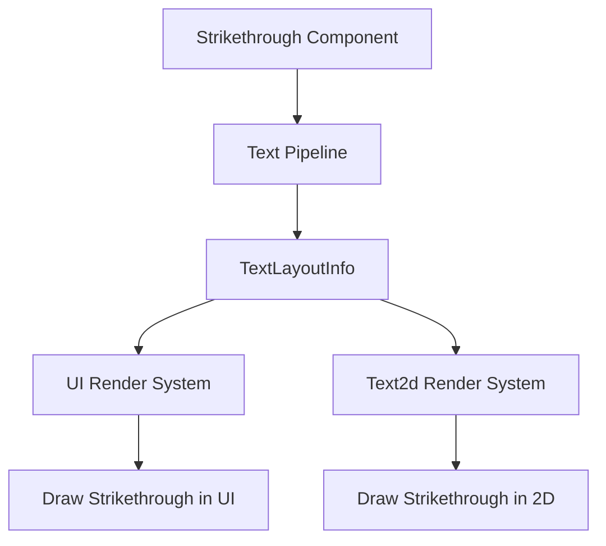

+++
title = "#21555 Text strikethrough"
date = "2025-10-21T00:00:00"
draft = false
template = "pull_request_page.html"
in_search_index = true

[taxonomies]
list_display = ["show"]

[extra]
current_language = "en"
available_languages = {"en" = { name = "English", url = "/pull_request/bevy/2025-10/pr-21555-en-20251021" }, "zh-cn" = { name = "中文", url = "/pull_request/bevy/2025-10/pr-21555-zh-cn-20251021" }}
labels = ["C-Feature", "A-Text", "M-Release-Note", "D-Straightforward"]
+++

# Text strikethrough

## Basic Information
- **Title**: Text strikethrough
- **PR Link**: https://github.com/bevyengine/bevy/pull/21555
- **Author**: ickshonpe
- **Status**: MERGED
- **Labels**: C-Feature, S-Ready-For-Final-Review, A-Text, M-Release-Note, D-Straightforward
- **Created**: 2025-10-15T14:18:43Z
- **Merged**: 2025-10-21T23:37:48Z
- **Merged By**: alice-i-cecile

## Description Translation

# Objective

Add minimal strikethrough support for text.

## Solution

* Insert the new `Strikethrough` component on any `Text`, `Text2d`, or `TextSpan` entity and its text will be drawn with strikethrough.
* The strikethrough geometry is stored in `TextLayoutInfo` in the vec with the section bounding rects.
* Rendering is trivial, identical to drawing text background colours except it's a narrower rect drawn in front instead of behind.
* Text shadows also have strikethrough if the text does.

#

This implementation can easily be expanded to support underline, I've already made a follow up PR that does this here: #21559.

## Testing

```
cargo run --example strikethrough
```

## Showcase


## The Story of This Pull Request

This PR introduces strikethrough text decoration to Bevy's text rendering system. The core problem was straightforward: users needed a way to visually indicate that text should be crossed out, similar to how markdown supports `~~strikethrough~~` formatting.

The implementation follows a component-based approach consistent with Bevy's ECS architecture. A new `Strikethrough` component was added that can be attached to any text entity - whether it's a `Text`, `Text2d`, or `TextSpan`. When the text pipeline processes entities with this component, it calculates the appropriate geometry for drawing the strikethrough line.

In the text layout phase, the system now computes strikethrough positioning using font metrics. For each text section, it calculates the vertical offset and stroke thickness based on the font's strikeout metrics, scaled appropriately for the current font size. This data gets stored alongside the existing bounding rectangle information in `TextLayoutInfo`.

The rendering implementation is efficient because it reuses the existing infrastructure for drawing rectangles. For UI text, strikethrough lines are rendered as thin rectangles positioned at the calculated offset, using the same color as the text. The system ensures strikethrough appears on text shadows as well, maintaining visual consistency.

One notable design decision was storing the strikethrough geometry in the same vector as the section bounding rectangles, using a tuple that includes the section index, bounding rect, strikethrough Y offset, and stroke thickness. This approach minimizes memory allocations and keeps related data together.

The changes maintain backward compatibility while extending functionality. Existing text rendering continues to work unchanged, and the new feature integrates seamlessly with the existing text background color system.

## Visual Representation



## Key Files Changed

### `crates/bevy_text/src/text.rs`
Added the `Strikethrough` component definition:
```rust
/// A text entity with this component is drawn with strikethrough.
#[derive(Component, Copy, Clone, Debug, Reflect, Default, Serialize, Deserialize)]
#[reflect(Serialize, Deserialize, Clone, Default)]
pub struct Strikethrough;
```

### `crates/bevy_text/src/pipeline.rs`
Major changes to text layout to support strikethrough geometry calculation:

```rust
// Before:
pub struct TextLayoutInfo {
    pub section_rects: Vec<(Entity, Rect)>,
    // ...
}

// After:
pub struct TextLayoutInfo {
    pub section_geometry: Vec<(usize, Rect, f32, f32)>,
    // ...
}

// Glyph info extended to store strikethrough data
// Before:
glyph_info: Vec<(AssetId<Font>, FontSmoothing)>

// After:
glyph_info: Vec<(AssetId<Font>, FontSmoothing, f32, f32, f32)>
```

### `crates/bevy_ui_render/src/lib.rs`
Updated UI rendering to draw strikethrough decorations:

```rust
// New system for text decorations combining backgrounds and strikethrough
pub fn extract_text_decorations(
    // ... parameters
) {
    // Processes both TextBackgroundColor and Strikethrough components
    for &(section_index, rect, strikethrough_y, stroke) in text_layout_info.section_geometry.iter() {
        // Draw strikethrough as thin rectangles
    }
}
```

### `crates/bevy_sprite_render/src/text2d/mod.rs`
Extended 2D text rendering to support strikethrough:

```rust
// Added strikethrough support for Text2d
for &(section_index, rect, strikethrough_y, stroke) in text_layout_info.section_geometry.iter() {
    let section_entity = computed_block.entities()[section_index].entity;
    let Ok(_) = strikethrough_query.get(section_entity) else {
        continue;
    };
    // Create sprite for strikethrough line
}
```

### `examples/ui/strikethrough.rs`
New example demonstrating strikethrough usage:

```rust
commands.spawn((
    Text::new("struck\nstruck"),
    Strikethrough,
    TextFont {
        font: asset_server.load("fonts/FiraSans-Bold.ttf"),
        font_size: 67.0,
        ..default()
    },
    // ... other components
));
```

## Further Reading

- [Bevy Text Documentation](https://docs.rs/bevy_text/latest/bevy_text/) - Official Bevy text system documentation
- [Font Metrics and Typography](https://learn.microsoft.com/en-us/typography/opentype/spec/) - OpenType specification for font metrics
- [Bevy UI System](https://bevy-cheatbook.github.io/ui.html) - Bevy UI cheat sheet and examples