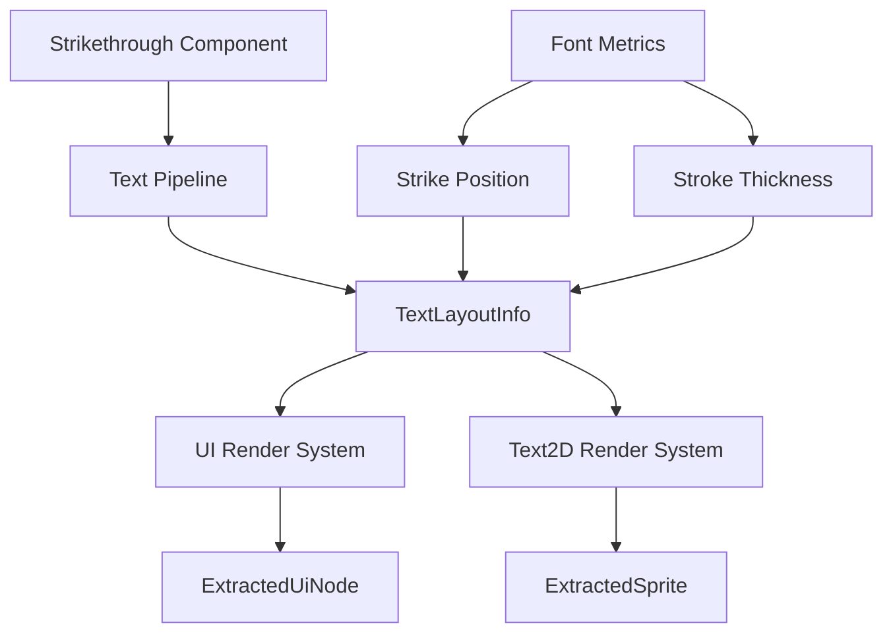

+++
title = "#21555 Text strikethrough"
date = "2025-10-21T00:00:00"
draft = false
template = "pull_request_page.html"
in_search_index = false

[extra]
current_language = "zh-cn"
available_languages = {"en" = { name = "English", url = "/pull_request/bevy/2025-10/pr-21555-en-20251021" }, "zh-cn" = { name = "中文", url = "/pull_request/bevy/2025-10/pr-21555-zh-cn-20251021" }}
+++

# 文本删除线功能实现分析

## 基本信息
- **标题**: Text strikethrough
- **PR链接**: https://github.com/bevyengine/bevy/pull/21555
- **作者**: ickshonpe
- **状态**: 已合并
- **标签**: C-Feature, S-Ready-For-Final-Review, A-Text, M-Release-Note, D-Straightforward
- **创建时间**: 2025-10-15T14:18:43Z
- **合并时间**: 2025-10-21T23:37:48Z
- **合并者**: alice-i-cecile

## 描述翻译

# 目标

为文本添加最小化的删除线支持。

## 解决方案

* 在任何 `Text`、`Text2d` 或 `TextSpan` 实体上插入新的 `Strikethrough` 组件，其文本将带有删除线绘制。
* 删除线几何信息存储在 `TextLayoutInfo` 中，与段落边界矩形一起存储在向量中。
* 渲染过程很简单，与绘制文本背景颜色相同，只是它是一个更窄的矩形，绘制在前面而不是后面。
* 如果文本有删除线，文本阴影也会带有删除线。

#

这个实现可以轻松扩展以支持下划线，我已经在后续的 PR 中实现了这一点： #21559。

## 测试

```
cargo run --example strikethrough
```

## 展示


## 该PR的故事

### 问题与背景

在Bevy游戏引擎中，文本渲染系统缺乏删除线这一基本的文本装饰功能。开发者需要在UI中显示带有删除线的文本，比如表示已完成的待办事项、价格比较或编辑建议等场景。现有的文本系统支持颜色、背景色和阴影，但没有原生的删除线支持。

这个问题的技术约束在于需要在不破坏现有API和性能的前提下，为多种文本类型（`Text`、`Text2d`、`TextSpan`）提供一致的删除线体验，同时确保与现有功能（如文本阴影）的正确交互。

### 解决方案方法

开发者采用了组件化(component-based)的方法来实现删除线功能。核心思路是：

1. 引入新的 `Strikethrough` 组件作为标记组件(marker component)
2. 在文本布局阶段计算删除线的几何信息
3. 在渲染阶段将删除线作为矩形绘制

这种方法利用了Bevy现有的ECS架构，通过添加组件来启用功能，保持了系统的模块化。删除线的渲染复用(leverage)了现有的文本背景色渲染基础设施，只是调整了绘制位置和尺寸。

### 实现细节

实现分为三个主要部分：组件定义、布局计算和渲染处理。

首先，在 `bevy_text/src/text.rs` 中定义了新的 `Strikethrough` 组件：

```rust
/// A text entity with this component is drawn with strikethrough.
#[derive(Component, Copy, Clone, Debug, Reflect, Default, Serialize, Deserialize)]
#[reflect(Serialize, Deserialize, Clone, Default)]
pub struct Strikethrough;
```

这是一个简单的标记组件，没有任何字段，只需添加到文本实体上即可启用删除线。

在文本布局阶段，`bevy_text/src/pipeline.rs` 中的 `TextPipeline` 进行了重要修改。原有的 `section_rects` 字段被重构为更通用的 `section_geometry`：

```rust
// 之前：
pub section_rects: Vec<(Entity, Rect)>,

// 之后：
pub section_geometry: Vec<(usize, Rect, f32, f32)>,
```

现在每个条目包含段索引、边界矩形、删除线Y偏移和笔画粗细。布局计算过程中，系统从字体度量信息中获取删除线的位置和粗细：

```rust
for (font, _, size, strike_offset, stroke) in self.glyph_info.iter_mut() {
    let Some((id, _)) = self.map_handle_to_font_id.get(font) else {
        continue;
    };
    if let Some(font) = font_system.get_font(*id) {
        let swash = font.as_swash();
        let metrics = swash.metrics(&[]);
        let upem = metrics.units_per_em as f32;
        let scalar = *size * scale_factor as f32 / upem;
        *strike_offset = (metrics.strikeout_offset * scalar).round();
        *stroke = (metrics.stroke_size * scalar).round().max(1.);
    }
}
```

在渲染阶段，`bevy_ui_render/src/lib.rs` 中的 `extract_text_background_colors` 系统被重构为 `extract_text_decorations`，同时处理背景色和删除线：

```rust
// 处理删除线渲染
if maybe_strikethrough.is_some() {
    extracted_uinodes.uinodes.push(ExtractedUiNode {
        z_order: uinode.stack_index as f32 + stack_z_offsets::TEXT_STRIKETHROUGH,
        // ... 其他字段
        transform: transform
            * Affine2::from_translation(Vec2::new(
                rect.center().x,
                strikethrough_y + 0.5 * stroke,
            )),
        item: ExtractedUiItem::Node {
            color: text_color.0.to_linear(),
            rect: Rect {
                min: Vec2::ZERO,
                max: Vec2::new(rect.size().x, stroke),
            },
            // ... 其他字段
        },
        // ... 其他字段
    });
}
```

### 技术洞察

这个实现展示了几个重要的工程决策：

1. **字体度量驱动**：删除线的位置和粗细基于字体的实际度量信息计算，确保了跨字体的一致性
2. **架构复用**：通过扩展现有的文本装饰系统而不是创建新系统，减少了代码重复
3. **Z-order管理**：引入了新的 `TEXT_STRIKETHROUGH` 层级，确保删除线在文本上方但在其他UI元素下方正确渲染
4. **向后兼容**：所有更改都是附加的，不影响现有功能

性能考虑方面，实现只在有 `Strikethrough` 组件的实体上执行额外工作，对没有删除线的文本没有性能影响。

### 影响

这个PR为Bevy文本系统添加了重要的新功能，同时保持了代码的整洁和可维护性。实现方式为未来添加其他文本装饰（如下划线）奠定了基础，正如作者在后续PR #21559中展示的那样。

从技术债务的角度看，将 `section_rects` 重构为更通用的 `section_geometry` 实际上改善了代码结构，为将来支持更多文本装饰功能提供了更好的基础设施。

## 视觉表示



## 关键文件更改

### `crates/bevy_text/src/pipeline.rs` (+36/-11)

这个文件包含了文本布局管道的核心修改：
- 重构了 `section_rects` 为 `section_geometry` 以支持更多几何信息
- 添加了字体度量计算来获取删除线位置和粗细

关键代码变更：
```rust
// 之前：
pub section_rects: Vec<(Entity, Rect)>,

// 之后：
pub section_geometry: Vec<(usize, Rect, f32, f32)>,
```

### `crates/bevy_ui_render/src/lib.rs` (+127/-31)

UI渲染系统的主要修改：
- 重构了背景色提取系统为更通用的装饰提取系统
- 添加了删除线渲染逻辑
- 引入了新的Z-order层级

关键代码变更：
```rust
// 之前系统：
pub fn extract_text_background_colors

// 之后系统：  
pub fn extract_text_decorations
```

### `crates/bevy_sprite_render/src/text2d/mod.rs` (+64/-2)

为2D文本添加了删除线支持：
- 扩展了精灵提取逻辑来处理删除线
- 确保2D文本和UI文本的一致性

### `examples/ui/strikethrough.rs` (+125/-0)

新增的示例文件，展示了各种删除线使用场景：
- 基本删除线
- 带背景色的删除线
- 在TextSpan中的删除线
- 不同字体大小的删除线

### `Cargo.toml` (+11/-0)

添加了新的示例到工作空间配置中。

## 进一步阅读

- [Bevy Text Documentation](https://docs.rs/bevy_text/latest/bevy_text/) - Bevy文本系统的官方文档
- [Swash Font Library](https://github.com/dfrg/swash) - Bevy使用的字体处理和渲染库
- [PR #21559](https://github.com/bevyengine/bevy/pull/21559) - 基于此PR的下划线功能实现
- [Bevy ECS Guide](https://bevy-cheatbook.github.io/programming/ecs-intro.html) - 理解Bevy的实体组件系统架构