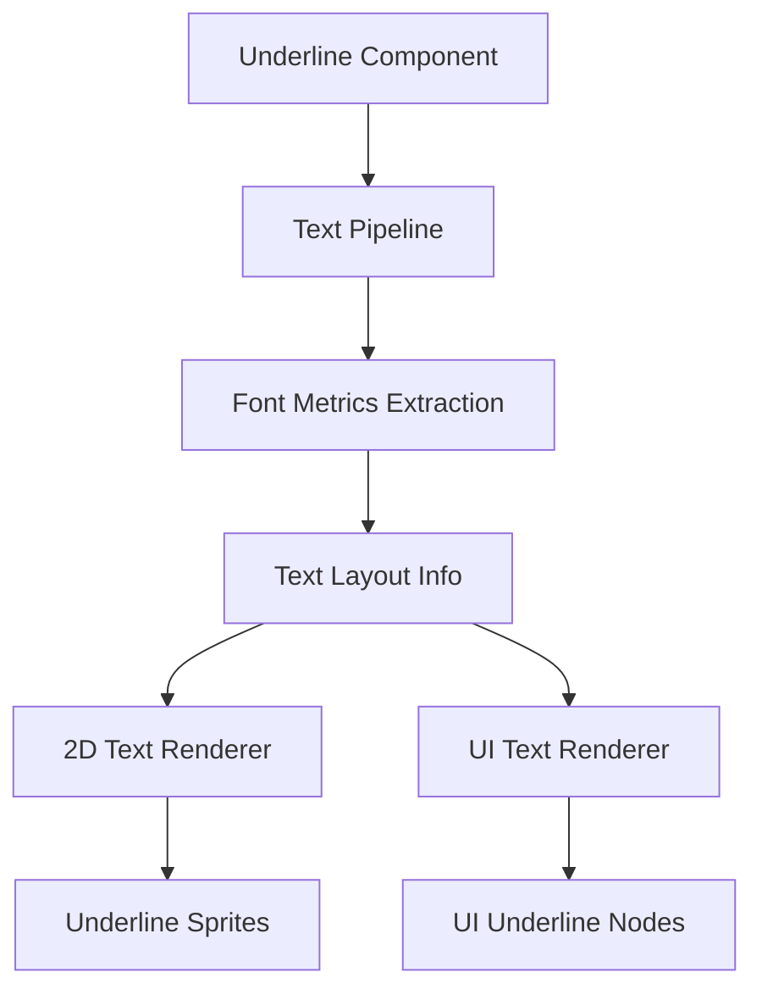

+++
title = "#21559 Text Underline"
date = "2025-10-23T00:00:00"
draft = false
template = "pull_request_page.html"
in_search_index = true

[taxonomies]
list_display = ["show"]

[extra]
current_language = "en"
available_languages = {"en" = { name = "English", url = "/pull_request/bevy/2025-10/pr-21559-en-20251023" }, "zh-cn" = { name = "中文", url = "/pull_request/bevy/2025-10/pr-21559-zh-cn-20251023" }}
labels = ["C-Feature", "A-Text", "M-Release-Note", "D-Modest"]
+++

# Text Underline Support in Bevy

## Basic Information
- **Title**: Text Underline
- **PR Link**: https://github.com/bevyengine/bevy/pull/21559
- **Author**: ickshonpe
- **Status**: MERGED
- **Labels**: C-Feature, S-Ready-For-Final-Review, A-Text, M-Release-Note, D-Modest
- **Created**: 2025-10-15T20:48:16Z
- **Merged**: 2025-10-22T23:20:55Z
- **Merged By**: alice-i-cecile

## Description Translation
# Objective

Text Underline

## Solution

New `Underline` marker component, add to text entities to draw an underline.
This PR is based on #21555, that should probably be reviewed and merged first.

## The Story of This Pull Request

This PR implements underline text decoration support in Bevy's text rendering system. The implementation follows the same architectural pattern as the existing strikethrough feature, extending the text pipeline to support both decoration types efficiently.

The core problem was that Bevy's text system only supported strikethrough decorations but lacked underline support, limiting text styling options for developers. The solution involved extending multiple systems across the text rendering pipeline to handle underline positioning and rendering while maintaining consistency with existing strikethrough implementation patterns.

The implementation begins in the text pipeline where font metrics are processed. The system now extracts underline offset information from font metrics alongside strikethrough data:

```rust
// In bevy_text/src/pipeline.rs
*glyph_info = (font_id, font_smoothing, font_size, strikethrough_offset, stroke_thickness, underline_offset);
```

This additional data flows through the text layout system and becomes available to both 2D sprite text and UI text rendering systems. The `TextLayoutInfo` structure was extended to include underline positioning:

```rust
// Before:
pub section_geometry: Vec<(usize, Rect, f32, f32)>,

// After:  
pub section_geometry: Vec<(usize, Rect, f32, f32, f32)>,
```

In the rendering systems, the extraction queries were refactored to handle both strikethrough and underline components efficiently. The key insight was combining the queries to avoid multiple system iterations:

```rust
// Before:
strikethrough_query: Extract<Query<&TextColor, With<Strikethrough>>>

// After:
decoration_query: Extract<Query<(&TextColor, Has<Strikethrough>, Has<Underline>)>>
```

This query optimization reduces system complexity and improves performance by checking both decoration types in a single pass. The rendering logic then conditionally creates underline sprites based on the component presence:

```rust
if has_underline {
    let render_entity = commands.spawn(TemporaryRenderEntity).id();
    let offset = Vec2::new(rect.center().x, -underline_y - 0.5 * stroke);
    // ... create underline sprite
}
```

The implementation maintains visual consistency by using the same stroke thickness for both strikethrough and underline decorations, ensuring they match the text's visual weight. The positioning calculations use font-derived metrics to place underlines at typographically appropriate positions relative to the baseline.

This approach demonstrates good software engineering practices by reusing existing patterns, minimizing code duplication, and maintaining backward compatibility. The feature integrates seamlessly with Bevy's ECS architecture and follows the component-based design philosophy.

## Visual Representation



## Key Files Changed

### `crates/bevy_text/src/pipeline.rs` (+11/-5)
This file handles the core text layout pipeline. The changes extend the glyph information storage and font metric calculations to include underline positioning data.

```rust
// Before:
glyph_info: Vec<(AssetId<Font>, FontSmoothing, f32, f32, f32)>

// After:
glyph_info: Vec<(AssetId<Font>, FontSmoothing, f32, f32, f32, f32)>
```

The pipeline now extracts underline metrics from fonts and includes them in section geometry calculations.

### `crates/bevy_text/src/text.rs` (+6/-0)
Adds the new `Underline` marker component definition:

```rust
#[derive(Component, Copy, Clone, Debug, Reflect, Default, Serialize, Deserialize)]
#[reflect(Serialize, Deserialize, Clone, Default)]
pub struct Underline;
```

### `crates/bevy_sprite_render/src/text2d/mod.rs` (+103/-48)
Extends the 2D text rendering system to support underline decoration rendering. The changes refactor the extraction system to handle both strikethrough and underline in a unified way.

```rust
// Unified decoration handling
for &(section_index, rect, strikethrough_y, stroke, underline_y) in text_layout_info.section_geometry.iter() {
    let Ok((_, has_strikethrough, has_underline)) = decoration_query.get(section_entity) else {
        continue;
    };
    
    if has_underline {
        // Create underline sprite
    }
}
```

### `crates/bevy_ui_render/src/lib.rs` (+96/-32)
Updates the UI text rendering system with similar changes to support underline in UI elements. The system handles both text shadows and regular text decorations.

### `examples/ui/strikethrough.rs` (+6/-4)
Updated the example to demonstrate both strikethrough and underline functionality, showing how to use the components together.

```rust
// Example usage showing combined decorations
(
    TextSpan::new("underlined and struck"),
    Strikethrough,
    Underline,
)
```

## Further Reading

- [Bevy Text Rendering Documentation](https://docs.rs/bevy_text/latest/bevy_text/)
- [Font Metrics and Typography](https://learn.microsoft.com/en-us/typography/opentype/spec/)
- [Bevy ECS Component System](https://bevy-cheatbook.github.io/programming/ecs-intro.html)

# Full Code Diff
*(Provided in the original request)*