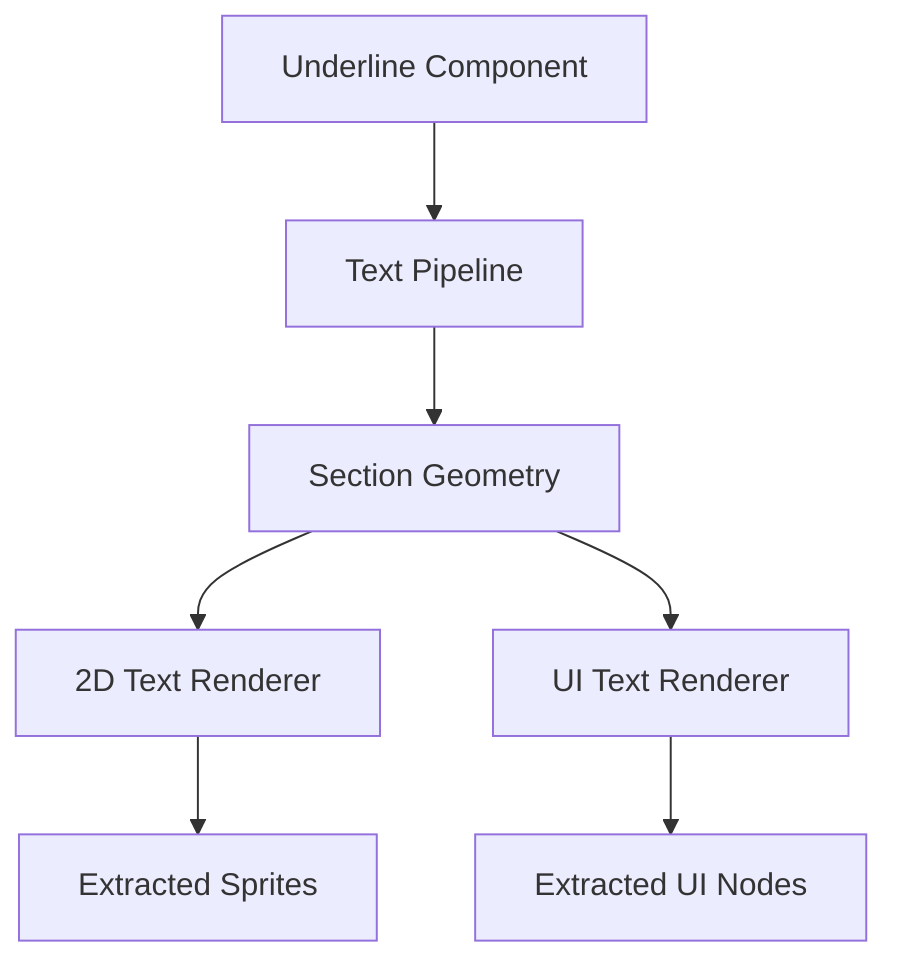

+++
title = "#21559 Text Underline"
date = "2025-10-23T00:00:00"
draft = false
template = "pull_request_page.html"
in_search_index = false

[extra]
current_language = "zh-cn"
available_languages = {"en" = { name = "English", url = "/pull_request/bevy/2025-10/pr-21559-en-20251023" }, "zh-cn" = { name = "中文", url = "/pull_request/bevy/2025-10/pr-21559-zh-cn-20251023" }}
labels = ["C-Feature", "A-Text", "M-Release-Note", "D-Modest"]
+++

# Text Underline

## Basic Information
- **Title**: Text Underline
- **PR Link**: https://github.com/bevyengine/bevy/pull/21559
- **Author**: ickshonpe
- **Status**: MERGED
- **Labels**: C-Feature, S-Ready-For-Final-Review, A-Text, M-Release-Note, D-Modest
- **Created**: 2025-10-15T20:48:16Z
- **Merged**: 2025-10-22T23:20:55Z
- **Merged By**: alice-i-cecile

## Description Translation
目标

文本下划线

解决方案

新的 `Underline` 标记组件，添加到文本实体以绘制下划线。
这个PR基于 #21559，应该先审查和合并那个PR。

## The Story of This Pull Request

这个PR为Bevy引擎的文本系统添加了下划线功能。故事始于一个明确的需求：在现有的删除线功能基础上，提供对文本下划线的支持。

**问题背景**：在之前的PR #21555中，开发者已经实现了文本删除线功能。现在需要在此基础上扩展，添加下划线支持。这两种文本装饰在实现上有很多相似之处，都是通过在文本下方绘制线条来实现的。

**解决方案**：开发者采用了与删除线相同的架构模式。创建了一个新的`Underline`组件，然后在现有的文本渲染管道中扩展了对下划线的处理逻辑。这种方法利用了现有的基础设施，保持了代码的一致性。

**核心实现**：下划线的实现涉及三个主要层面：

1. **文本布局计算**：在`bevy_text/src/pipeline.rs`中，扩展了文本布局信息，添加了下划线位置的计算
2. **2D文本渲染**：在`bevy_sprite_render/src/text2d/mod.rs`中，为2D文本添加了下划线渲染支持
3. **UI文本渲染**：在`bevy_ui_render/src/lib.rs`中，为UI文本添加了下划线渲染支持

技术实现的关键在于复用现有的删除线基础设施。在文本布局阶段，系统现在同时计算删除线和下划线的位置信息。字体度量信息提供了`underline_offset`，用于确定下划线的垂直位置。

```rust
// 在文本布局管道中，现在计算两种装饰线的位置
*glyph_info = (font, smoothing, size, strikethrough_offset, stroke, underline_offset);
```

渲染阶段，系统检查实体是否拥有`Underline`组件，如果有，就在计算好的位置绘制一个矩形作为下划线。这个矩形的大小与文本段的宽度相同，高度由字体的stroke_size决定。

**架构设计**：这个实现展示了良好的组件化设计。`Underline`和`Strikethrough`都是标记组件，它们不包含任何数据，只是表示应该应用相应的渲染效果。这种设计使得添加新的文本装饰变得简单且一致。

## Visual Representation



## Key Files Changed

### `crates/bevy_text/src/text.rs` (+5/-0)
添加了`Underline`组件定义：
```rust
/// Add to a text entity to draw its text with underline.
#[derive(Component, Copy, Clone, Debug, Reflect, Default, Serialize, Deserialize)]
#[reflect(Serialize, Deserialize, Clone, Default)]
pub struct Underline;
```

### `crates/bevy_text/src/pipeline.rs` (+11/-5)
扩展了文本布局管道以支持下划线计算：
```rust
// 修改前：
glyph_info: Vec<(AssetId<Font>, FontSmoothing, f32, f32, f32)>
section_geometry: Vec<(usize, Rect, f32, f32)>

// 修改后：
glyph_info: Vec<(AssetId<Font>, FontSmoothing, f32, f32, f32, f32)>
section_geometry: Vec<(usize, Rect, f32, f32, f32)>
```

添加了下划线位置计算：
```rust
*underline_offset = (metrics.underline_offset * scalar).round();
```

### `crates/bevy_sprite_render/src/text2d/mod.rs` (+103/-48)
扩展了2D文本渲染以处理下划线：
```rust
// 修改查询以同时检查删除线和下划线
decoration_query: Extract<Query<(&TextColor, Has<Strikethrough>, Has<Underline>)>>

// 添加下划线渲染逻辑
if has_underline {
    let render_entity = commands.spawn(TemporaryRenderEntity).id();
    let offset = Vec2::new(rect.center().x, -underline_y - 0.5 * stroke);
    // ... 创建下划线sprite
}
```

### `crates/bevy_ui_render/src/lib.rs` (+96/-32)
扩展了UI文本渲染系统：
```rust
// 更新查询以包含下划线
text_decoration_query: Extract<Query<(Has<Strikethrough>, Has<Underline>)>>

// 添加下划线UI节点创建
if has_underline {
    extracted_uinodes.uinodes.push(ExtractedUiNode {
        // ... 下划线UI节点配置
    });
}
```

### `examples/ui/strikethrough.rs` (+6/-4)
更新示例以展示下划线用法：
```rust
// 添加下划线示例
(Text::new("underline"), Underline),
(TextSpan::new("underline"), Underline),
```

## Further Reading

- [Bevy Text Documentation](https://docs.rs/bevy_text/latest/bevy_text/)
- [Component-based Architecture in Bevy](https://bevy-cheatbook.github.io/programming/ec.html)
- [Text Rendering in Game Engines](https://github.com/bevyengine/bevy/blob/main/examples/2d/text2d.rs)

# Full Code Diff

*(由于代码差异较长，这里仅显示关键修改部分)*

```diff
diff --git a/crates/bevy_sprite_render/src/text2d/mod.rs b/crates/bevy_sprite_render/src/text2d/mod.rs
index b839edeba8058..74e6a69823b5a 100644
--- a/crates/bevy_sprite_render/src/text2d/mod.rs
+++ b/crates/bevy_sprite_render/src/text2d/mod.rs
@@ -16,7 +16,7 @@ use bevy_render::Extract;
 use bevy_sprite::{Anchor, Text2dShadow};
 use bevy_text::{
     ComputedTextBlock, PositionedGlyph, Strikethrough, TextBackgroundColor, TextBounds, TextColor,
-    TextLayoutInfo,
+    TextLayoutInfo, Underline,
 };
 use bevy_transform::prelude::GlobalTransform;
 
@@ -41,7 +41,7 @@ pub fn extract_text2d_sprite(
     >,
     text_colors: Extract<Query<&TextColor>>,
     text_background_colors_query: Extract<Query<&TextBackgroundColor>>,
-    strikethrough_query: Extract<Query<&TextColor, With<Strikethrough>>>,
+    decoration_query: Extract<Query<(&TextColor, Has<Strikethrough>, Has<Underline>)>>,
 ) {
     let mut start = extracted_slices.slices.len();
     let mut end = start + 1;
```

*(完整代码差异请参考原始PR链接)*