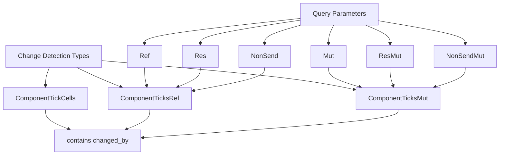

+++
title = "#21562 Minor refactors in change detection"
date = "2025-10-19T00:00:00"
draft = false
template = "pull_request_page.html"
in_search_index = true

[taxonomies]
list_display = ["show"]

[extra]
current_language = "en"
available_languages = {"en" = { name = "English", url = "/pull_request/bevy/2025-10/pr-21562-en-20251019" }, "zh-cn" = { name = "中文", url = "/pull_request/bevy/2025-10/pr-21562-zh-cn-20251019" }}
labels = ["A-ECS", "C-Code-Quality"]
+++

# Title
Minor refactors in change detection

## Basic Information
- **Title**: Minor refactors in change detection
- **PR Link**: https://github.com/bevyengine/bevy/pull/21562
- **Author**: JaySpruce
- **Status**: MERGED
- **Labels**: A-ECS, C-Code-Quality, S-Ready-For-Final-Review, M-Needs-Migration-Guide
- **Created**: 2025-10-16T17:38:43Z
- **Merged**: 2025-10-19T17:56:16Z
- **Merged By**: alice-i-cecile

## Description Translation
**Objective**

While tinkering with change detection, I've collected some nitpicks:

- The word "ticks" is kind of overloaded; ticks are used by components, systems, and the world, but "ticks" is often used to refer to the "added + changed" pair of ticks that only components have (and resources, but they're close enough to components).
- `Ticks` is a nice name for a struct, but it's taken by a `pub(crate)` struct that's pretty niche. (I don't have any plans for the `Ticks` name, but it could be useful for something.)
- Every use of `Ticks`, `TicksMut`, and `TickCells` is accompanied by a `MaybeLocation` that represents the calling location that last modified the component, so it should just be part of the structs.
- `NonSend` seems to be in the wrong file, and doesn't implement methods with the macros that every other change-detecting query parameter uses.

**Solution**

Renamed the following structs:
- `Ticks` -> `RefComponentTicks`
- `TicksMut` -> `MutComponentTicks`
- `TickCells` -> `ComponentTickCells`

Added a `changed_by: MaybeLocation` field to `RefComponentTicks`, `MutComponentTicks`, and `ComponentTickCells` and folded in the loose `MaybeLocation`s.

Moved `NonSend` from `system/system_param.rs` to `change_detection.rs` and updated its implementation to match similar query parameters.

Removed `ComponentTickCells::read` because it is now unused (and not public).

## The Story of This Pull Request

This PR addresses several technical debt issues in Bevy's change detection system through a series of focused refactors. The changes stem from practical observations made while working with the codebase, targeting naming clarity, structural consistency, and architectural organization.

The core problem was that the term "ticks" had become overloaded in the codebase. It referred to both individual tick values used by systems and the world, and the paired "added + changed" ticks specific to components and resources. This ambiguity made the code harder to understand and maintain. Additionally, the `Ticks`, `TicksMut`, and `TickCells` structs were always used alongside separate `MaybeLocation` parameters, creating unnecessary complexity and potential for errors.

The solution involved renaming the core tick-related structs to be more descriptive and self-contained. `Ticks` became `ComponentTicksRef`, `TicksMut` became `ComponentTicksMut`, and `TickCells` became `ComponentTickCells`. These new names clearly indicate their purpose and scope, resolving the naming ambiguity.

More importantly, each of these structs now includes a `changed_by: MaybeLocation` field directly, eliminating the need to pass this information separately throughout the codebase. This structural change simplifies the API and reduces boilerplate code. For example:

```rust
// Before:
pub struct Mut<'w, T: ?Sized> {
    pub(crate) value: &'w mut T,
    pub(crate) ticks: TicksMut<'w>,
    pub(crate) changed_by: MaybeLocation<&'w mut &'static Location<'static>>,
}

// After:
pub struct Mut<'w, T: ?Sized> {
    pub(crate) value: &'w mut T,
    pub(crate) ticks: ComponentTicksMut<'w>,
}
```

The implementation required updating all the change detection macros and methods to work with the new struct layout. The `change_detection_impl` and `change_detection_mut_impl` macros were modified to access the `changed_by` field through the ticks struct rather than as a separate field. This change affected all change-detecting types including `Res`, `ResMut`, `Ref`, `Mut`, and `NonSendMut`.

Another significant improvement was moving the `NonSend` type from `system/system_param.rs` to `change_detection.rs` and updating its implementation to use the same macros as other change-detecting query parameters. This consolidation brings consistency to the change detection system and eliminates duplicate functionality. The `NonSend` type now properly implements the change detection traits through the standard macros, making it behave consistently with other similar types.

The refactor also removed the unused `ComponentTickCells::read` method, which was no longer necessary after the structural changes. This cleanup helps maintain a lean and focused API.

From a technical perspective, these changes improve code organization by grouping related functionality together and reducing coupling between components. The inclusion of `MaybeLocation` directly in the tick structs ensures that change tracking information remains cohesive and is always available when needed. This approach also reduces the cognitive load on developers working with change detection, as they no longer need to manage separate location tracking.

The impact of these changes is primarily internal - they don't change the public API behavior but significantly improve code quality and maintainability. The refactored code is more consistent, easier to understand, and less error-prone. The migration guide included with the PR ensures that any internal usage of the renamed types is properly updated.

## Visual Representation



## Key Files Changed

### `crates/bevy_ecs/src/change_detection.rs` (+91/-72)
This was the primary file modified, containing the core change detection types and implementations. The key changes include:
- Renamed `Ticks` to `ComponentTicksRef` and added `changed_by` field
- Renamed `TicksMut` to `ComponentTicksMut` and added `changed_by` field
- Updated all change detection types to use the new structs
- Moved `NonSend` and `NonSendMut` types into this file

```rust
// Before:
pub(crate) struct Ticks<'w> {
    pub(crate) added: &'w Tick,
    pub(crate) changed: &'w Tick,
    pub(crate) last_run: Tick,
    pub(crate) this_run: Tick,
}

// After:
pub(crate) struct ComponentTicksRef<'w> {
    pub(crate) added: &'w Tick,
    pub(crate) changed: &'w Tick,
    pub(crate) changed_by: MaybeLocation<&'w &'static Location<'static>>,
    pub(crate) last_run: Tick,
    pub(crate) this_run: Tick,
}
```

### `crates/bevy_ecs/src/system/system_param.rs` (+37/-118)
This file was significantly simplified by moving `NonSend` to the change detection module and removing duplicate implementations. The system parameter implementations now use the consolidated change detection types.

```rust
// Before: NonSend was defined here with custom implementation
pub struct NonSend<'w, T: 'static> {
    pub(crate) value: &'w T,
    ticks: ComponentTicks,
    last_run: Tick,
    this_run: Tick,
    changed_by: MaybeLocation<&'w &'static Location<'static>>,
}

// After: NonSend moved to change_detection.rs and uses standard macros
```

### `crates/bevy_ecs/src/component/tick.rs` (+6/-19)
Updated the `ComponentTickCells` struct to include the `changed_by` field and removed the unused `read` method.

```rust
// Before:
pub struct TickCells<'a> {
    pub added: &'a UnsafeCell<Tick>,
    pub changed: &'a UnsafeCell<Tick>,
}

// After:
pub struct ComponentTickCells<'a> {
    pub added: &'a UnsafeCell<Tick>,
    pub changed: &'a UnsafeCell<Tick>,
    pub changed_by: MaybeLocation<&'a UnsafeCell<&'static Location<'static>>>,
}
```

### `crates/bevy_ecs/src/query/fetch.rs` (+17/-11)
Updated query fetching implementations to work with the new tick structs and integrated `changed_by` field.

### `crates/bevy_ecs/src/world/unsafe_world_cell.rs` (+30/-56)
Simplified world cell access methods by leveraging the consolidated tick structs with built-in location tracking.

## Further Reading

- [Bevy Change Detection Documentation](https://bevyengine.org/learn/advanced-topics/change-detection/)
- [Rust Unsafe Code Guidelines](https://rust-lang.github.io/unsafe-code-guidelines/)
- [System Param Documentation](https://docs.rs/bevy_ecs/latest/bevy_ecs/system/trait.SystemParam.html)