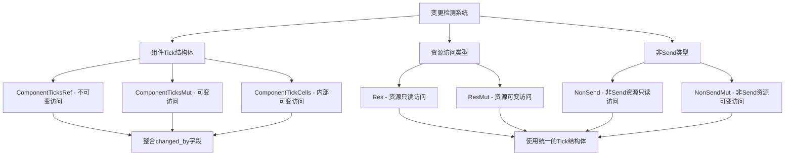

+++
title = "#21562 Minor refactors in change detection"
date = "2025-10-19T00:00:00"
draft = false
template = "pull_request_page.html"
in_search_index = false

[extra]
current_language = "zh-cn"
available_languages = {"en" = { name = "English", url = "/pull_request/bevy/2025-10/pr-21562-en-20251019" }, "zh-cn" = { name = "中文", url = "/pull_request/bevy/2025-10/pr-21562-zh-cn-20251019" }}
+++

# Minor refactors in change detection

## 基本信息
- **标题**: Minor refactors in change detection
- **PR链接**: https://github.com/bevyengine/bevy/pull/21562
- **作者**: JaySpruce
- **状态**: 已合并
- **标签**: A-ECS, C-Code-Quality, S-Ready-For-Final-Review, M-Needs-Migration-Guide
- **创建时间**: 2025-10-16T17:38:43Z
- **合并时间**: 2025-10-19T17:56:16Z
- **合并者**: alice-i-cecile

## 描述翻译

### 目标

在修改变更检测系统时，我收集了一些需要改进的地方：

- "ticks" 这个词有点被过度使用；组件、系统和世界都使用 ticks，但"ticks"经常用来指代只有组件（以及资源，它们与组件足够接近）才有的"added + changed"这对ticks。
- `Ticks` 是一个很好的结构体名称，但它被一个相当小众的`pub(crate)`结构体占用了。（我对`Ticks`名称没有具体计划，但它可能对某些用途有用。）
- 每次使用`Ticks`、`TicksMut`和`TickCells`时都伴随着一个`MaybeLocation`，它表示最后修改组件的调用位置，所以它应该直接成为这些结构体的一部分。
- `NonSend`似乎放错了文件，并且没有使用与其他变更检测查询参数相同的宏来实现方法。

### 解决方案

重命名了以下结构体：
- `Ticks` -> `RefComponentTicks`
- `TicksMut` -> `MutComponentTicks`
- `TickCells` -> `ComponentTickCells`

向`RefComponentTicks`、`MutComponentTicks`和`ComponentTickCells`添加了`changed_by: MaybeLocation`字段，并将松散的`MaybeLocation`整合进去。

将`NonSend`从`system/system_param.rs`移动到`change_detection.rs`，并更新其实现以匹配类似的查询参数。

移除了`ComponentTickCells::read`，因为它现在未被使用（且不是公开的）。

## 这个PR的故事

这个PR源于开发者在深入使用Bevy的变更检测系统时发现的一些命名和结构设计上的不一致问题。变更检测是ECS架构中的核心机制，用于跟踪组件和资源何时被添加或修改，但现有的实现存在几个影响代码清晰度的问题。

首先，术语"ticks"在代码库中被过度使用，既指代系统运行的时间标记，又指代组件变更的状态标记。这种命名冲突使得代码阅读和维护变得更加困难。开发者决定通过更精确的命名来解决这个问题，将原来通用的`Ticks`和`TicksMut`分别重命名为`RefComponentTicks`和`MutComponentTicks`，明确表示这些结构体专门用于组件的变更跟踪。

更重要的改进是整合了`MaybeLocation`字段。在之前的实现中，每次使用变更检测结构体时都需要单独传递一个`MaybeLocation`参数来记录修改来源。这种分离的设计不仅增加了代码复杂性，还容易出错。通过将`changed_by`字段直接嵌入到相关的结构体中，代码变得更加简洁，逻辑也更加清晰。

具体的技术实现体现在几个关键方面。在`change_detection.rs`中，新的`ComponentTicksRef`和`ComponentTicksMut`结构体现在都包含了`changed_by`字段：

```rust
// 重构后的结构体定义
pub(crate) struct ComponentTicksRef<'w> {
    pub(crate) added: &'w Tick,
    pub(crate) changed: &'w Tick,
    pub(crate) changed_by: MaybeLocation<&'w &'static Location<'static>>,  // 新增字段
    pub(crate) last_run: Tick,
    pub(crate) this_run: Tick,
}
```

这种整合使得相关的变更检测类型如`Res`、`ResMut`、`Ref`、`Mut`等不再需要单独维护`changed_by`字段，简化了这些类型的定义和使用：

```rust
// 重构前
pub struct Res<'w, T: ?Sized + Resource> {
    pub(crate) value: &'w T,
    pub(crate) ticks: Ticks<'w>,
    pub(crate) changed_by: MaybeLocation<&'w &'static Location<'static>>,  // 单独字段
}

// 重构后  
pub struct Res<'w, T: ?Sized + Resource> {
    pub(crate) value: &'w T,
    pub(crate) ticks: ComponentTicksRef<'w>,  // changed_by现在包含在ticks中
}
```

另一个重要的改进是重新组织了`NonSend`相关代码的位置。原来`NonSend`定义在`system/system_param.rs`中，与其他变更检测类型分离，导致代码重复和维护困难。通过将其移动到`change_detection.rs`并使用相同的宏系统实现，确保了代码的一致性。

在实现过程中，开发者还移除了`ComponentTickCells::read`方法，因为这个方法没有被使用且不是公开API的一部分。这种清理有助于减少不必要的代码复杂度。

这些重构虽然不改变功能行为，但显著提高了代码的可读性和可维护性。通过更清晰的命名和更合理的结构设计，其他开发者能够更容易地理解和修改变更检测相关的代码。特别是将`MaybeLocation`整合到相关结构体中，减少了代码重复和潜在的错误来源。

从架构角度看，这个PR体现了良好的软件工程实践：识别命名冲突、消除重复代码、保持相关功能的逻辑组织。这些改进为未来可能的功能扩展奠定了更好的基础，同时通过迁移指南确保了向后兼容性。

## 可视化表示



## 关键文件变更

### `crates/bevy_ecs/src/change_detection.rs` (+91/-72)
这是最主要的变更文件，重构了变更检测的核心结构体：

**主要变更：**
- 重命名`Ticks`为`ComponentTicksRef`，`TicksMut`为`ComponentTicksMut`
- 在这些结构体中添加`changed_by: MaybeLocation`字段
- 将`NonSend`和`NonSendMut`移动到此文件
- 更新所有相关类型以使用新的结构体

```rust
// 重构后的结构体定义
pub(crate) struct ComponentTicksRef<'w> {
    pub(crate) added: &'w Tick,
    pub(crate) changed: &'w Tick,
    pub(crate) changed_by: MaybeLocation<&'w &'static Location<'static>>,  // 新增
    pub(crate) last_run: Tick,
    pub(crate) this_run: Tick,
}

// 使用示例 - Res类型现在更简洁
pub struct Res<'w, T: ?Sized + Resource> {
    pub(crate) value: &'w T,
    pub(crate) ticks: ComponentTicksRef<'w>,  // 不再需要单独的changed_by字段
}
```

### `crates/bevy_ecs/src/system/system_param.rs` (+37/-118)
将`NonSend`相关代码从此文件移动到`change_detection.rs`：

**主要变更：**
- 移除了`NonSend`结构体的完整定义
- 简化了系统参数实现
- 现在从`change_detection`模块重新导出`NonSend`和`NonSendMut`

```rust
// 重构前 - 完整的NonSend定义
pub struct NonSend<'w, T: 'static> {
    pub(crate) value: &'w T,
    ticks: ComponentTicks,
    last_run: Tick,
    this_run: Tick,
    changed_by: MaybeLocation<&'w &'static Location<'static>>,
}

// 重构后 - 只需重新导出
pub use crate::change_detection::{NonSend, NonSendMut, Res, ResMut};
```

### `crates/bevy_ecs/src/world/unsafe_world_cell.rs` (+30/-56)
更新了不安全世界单元格中的资源访问方法：

**主要变更：**
- 更新方法以使用新的结构体名称和整合的`changed_by`字段
- 简化了返回类型，不再需要单独返回`MaybeLocation`

```rust
// 重构前
pub(crate) unsafe fn get_resource_with_ticks(
    self,
    component_id: ComponentId,
) -> Option<(
    Ptr<'w>,
    TickCells<'w>,
    MaybeLocation<&'w UnsafeCell<&'static Location<'static>>>,
)>

// 重构后
pub(crate) unsafe fn get_resource_with_ticks(
    self,
    component_id: ComponentId,
) -> Option<(Ptr<'w>, ComponentTickCells<'w>)>  // 更简洁的返回类型
```

### `crates/bevy_ecs/src/query/fetch.rs` (+17/-11)
更新了查询获取逻辑以使用新的结构体：

```rust
// 重构后的查询获取实现
Ref {
    value: component.deref(),
    ticks: ComponentTicksRef {
        added: added.deref(),
        changed: changed.deref(),
        changed_by: caller.map(|caller| caller.deref()),  // 整合到ticks中
        this_run: fetch.this_run,
        last_run: fetch.last_run,
    },
}
```

### `crates/bevy_ecs/src/component/tick.rs` (+6/-19)
更新了tick相关的结构体定义：

```rust
// 重构后的ComponentTickCells
pub struct ComponentTickCells<'a> {
    pub added: &'a UnsafeCell<Tick>,
    pub changed: &'a UnsafeCell<Tick>,
    pub changed_by: MaybeLocation<&'a UnsafeCell<&'static Location<'static>>>,  // 新增
}
```

## 进一步阅读

- [Bevy ECS 文档](https://bevyengine.org/learn/quick-start/ecs/)
- [Rust 所有权和借用系统](https://doc.rust-lang.org/book/ch04-00-understanding-ownership.html)
- [内部可变性模式](https://doc.rust-lang.org/book/ch15-05-interior-mutability.html)
- [系统参数在Bevy中的工作原理](https://bevyengine.org/learn/quick-start/ecs/system-params/)