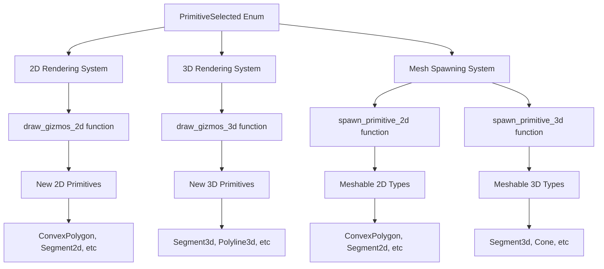

+++
title = "#21563 Add missing primitives to the render_primitives example"
date = "2025-10-17T00:00:00"
draft = false
template = "pull_request_page.html"
in_search_index = true

[taxonomies]
list_display = ["show"]

[extra]
current_language = "en"
available_languages = {"en" = { name = "English", url = "/pull_request/bevy/2025-10/pr-21563-en-20251017" }, "zh-cn" = { name = "中文", url = "/pull_request/bevy/2025-10/pr-21563-zh-cn-20251017" }}
labels = ["C-Examples", "A-Gizmos", "D-Straightforward"]
+++

# Add missing primitives to the render_primitives example

## Basic Information
- **Title**: Add missing primitives to the render_primitives example
- **PR Link**: https://github.com/bevyengine/bevy/pull/21563
- **Author**: martinstarman
- **Status**: MERGED
- **Labels**: C-Examples, S-Ready-For-Final-Review, A-Gizmos, D-Straightforward
- **Created**: 2025-10-16T20:00:03Z
- **Merged**: 2025-10-17T17:07:22Z
- **Merged By**: alice-i-cecile

## Description Translation
**Objective**
Render primitives example is missing primitives that implements `Meshable`.

**Solution**
Updated `examples/math/render_primitives.rs` with new meshable primitives (`ConvexPolygon`, `Segment2d`, `Polyline2d`, `CircularSector`, `CircularSegment`, `Segment3d`, `Polyline3d`, `Cone`, `ConicalFrustum`)

**Testing**
`cargo run --example render_primitives`

---

**Showcase**


## The Story of This Pull Request

This PR addresses a gap in Bevy's render_primitives example where several primitive types that implement the `Meshable` trait were not being showcased. The example serves as a comprehensive demonstration of Bevy's geometry rendering capabilities, so missing these primitives meant developers couldn't see the full range of available shapes.

The core issue was straightforward: as Bevy's geometry system evolved, new primitive types were added with `Meshable` implementations, but the showcase example wasn't updated to include them. This created a documentation gap where developers might not discover these primitives existed or understand how to use them.

The solution approach was systematic - identify all missing `Meshable` primitives and add them to both the 2D and 3D rendering systems in the example. The implementation follows Bevy's existing patterns for primitive rendering, maintaining consistency with the codebase's architecture.

Looking at the technical implementation, the changes start with expanding the `PrimitiveSelected` enum to include the new primitive types:

```rust
enum PrimitiveSelected {
    // ... existing variants
    ConvexPolygon,
    // ... other new variants
}
```

The `PrimitiveSelected::ALL` array was updated to include 20 items instead of 19, ensuring the new `ConvexPolygon` variant is included in the iteration sequence. This pattern of extending existing enums and arrays is common in Bevy when adding new features to examples.

For the actual primitive definitions, the PR introduces several new constants with proper sizing and vertex definitions:

```rust
const POLYLINE_2D_VERTICES: [Vec2; 4] = [
    Vec2::new(-BIG_2D, -SMALL_2D),
    Vec2::new(-SMALL_2D, SMALL_2D),
    Vec2::new(SMALL_2D, -SMALL_2D),
    Vec2::new(BIG_2D, SMALL_2D),
];

const CONVEX_POLYGON_VERTICES: [Vec2; 5] = [
    Vec2::new(-BIG_2D, -SMALL_2D),
    Vec2::new(BIG_2D, -SMALL_2D),
    Vec2::new(BIG_2D, SMALL_2D),
    Vec2::new(BIG_2D / 2.0, SMALL_2D * 2.0),
    Vec2::new(-BIG_2D, SMALL_2D),
];
```

A notable improvement in the code organization is the extraction of vertex arrays into constants. Previously, polyline vertices were defined inline within the rendering functions. By moving them to module-level constants, the code becomes more maintainable and reusable.

The rendering integration follows Bevy's established patterns. For 2D rendering in `draw_gizmos_2d`, the new primitives are added to the match statement:

```rust
PrimitiveSelected::ConvexPolygon => gizmos.primitive_2d(
    &Polygon::from(ConvexPolygon::new(CONVEX_POLYGON_VERTICES).unwrap()),
    isometry,
    color,
),
```

The mesh spawning functions (`spawn_primitive_2d` and `spawn_primitive_3d`) were updated to include mesh generation for the new primitives. The pattern here is consistent: for each primitive type, call `.mesh().build()` to generate the mesh data:

```rust
Some(SEGMENT_2D.mesh().build()),
Some(polyline_2d.mesh().build()),
Some(convex_polygon.mesh().build()),
```

The 3D implementation follows the same approach, with additions for 3D-specific primitives like `Cone` and `ConicalFrustum`. The changes maintain parity between what's available in 2D and 3D contexts where appropriate.

From an engineering perspective, this PR demonstrates good practices for extending examples:
- It maintains backward compatibility
- Follows existing code patterns
- Uses consistent naming conventions
- Properly handles both mesh generation and gizmo rendering
- Includes proper error handling (like the `unwrap()` on `ConvexPolygon::new`)

The impact is primarily educational - developers now have a complete reference for all available `Meshable` primitives in Bevy. This makes the example more valuable as a learning tool and reference implementation.

## Visual Representation



## Key Files Changed

### `examples/math/render_primitives.rs` (+59/-23)

This is the main and only file modified in this PR. The changes comprehensively add support for missing meshable primitives to the render primitives example.

**Key modifications:**

1. **Enum expansion** - Added new primitive variants:
```rust
// Before:
enum PrimitiveSelected {
    // ... 19 variants
}

// After:  
enum PrimitiveSelected {
    // ... 19 existing variants
    ConvexPolygon,
    // ... other new variants
}
```

2. **Constant definitions** - Added vertex arrays for reusable geometry:
```rust
// New constants added:
const POLYLINE_2D_VERTICES: [Vec2; 4] = [/* vertices */];
const POLYLINE_3D_VERTICES: [Vec3; 4] = [/* vertices */];
const CONVEX_POLYGON_VERTICES: [Vec2; 5] = [/* vertices */];
```

3. **Rendering integration** - Updated match statements to handle new primitives:
```rust
// In draw_gizmos_2d:
PrimitiveSelected::ConvexPolygon => gizmos.primitive_2d(
    &Polygon::from(ConvexPolygon::new(CONVEX_POLYGON_VERTICES).unwrap()),
    isometry,
    color,
),

// In spawn_primitive_2d:  
Some(convex_polygon.mesh().build()),
```

4. **Mesh generation** - Added mesh creation for previously unimplemented primitives:
```rust
// Before for Segment:
None, // segment

// After for Segment:  
Some(SEGMENT_2D.mesh().build()),
```

These changes relate to the overall purpose by making the example comprehensive and demonstrating all available `Meshable` primitives in the Bevy engine.

## Further Reading

- [Bevy Meshable Trait Documentation](https://docs.rs/bevy/latest/bevy/render/mesh/trait.Meshable.html)
- [Bevy Primitive Types](https://docs.rs/bevy/latest/bevy/math/primitives/index.html)
- [Bevy Gizmos System](https://docs.rs/bevy/latest/bevy/gizmos/struct.Gizmos.html)
- [Bevy Examples Guide](https://github.com/bevyengine/bevy/tree/main/examples#examples)