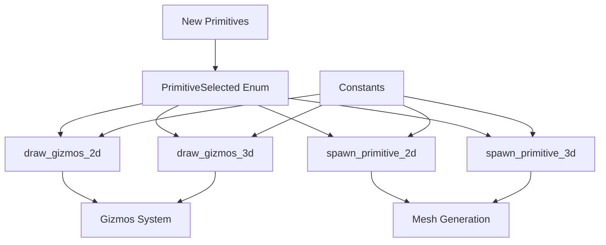

+++
title = "#21563 Add missing primitives to the render_primitives example"
date = "2025-10-17T00:00:00"
draft = false
template = "pull_request_page.html"
in_search_index = false

[extra]
current_language = "zh-cn"
available_languages = {"en" = { name = "English", url = "/pull_request/bevy/2025-10/pr-21563-en-20251017" }, "zh-cn" = { name = "中文", url = "/pull_request/bevy/2025-10/pr-21563-zh-cn-20251017" }}
labels = ["C-Examples", "A-Gizmos", "D-Straightforward"]
+++

# Add missing primitives to the render_primitives example

## Basic Information
- **Title**: Add missing primitives to the render_primitives example
- **PR Link**: https://github.com/bevyengine/bevy/pull/21563
- **Author**: martinstarman
- **Status**: MERGED
- **Labels**: C-Examples, S-Ready-For-Final-Review, A-Gizmos, D-Straightforward
- **Created**: 2025-10-16T20:00:03Z
- **Merged**: 2025-10-17T17:07:22Z
- **Merged By**: alice-i-cecile

## Description Translation
# Objective
渲染图元示例缺少实现了 `Meshable` 的图元。

## Solution
使用新的可网格化图元（`ConvexPolygon`、`Segment2d`、`Polyline2d`、`CircularSector`、`CircularSegment`、`Segment3d`、`Polyline3d`、`Cone`、`ConicalFrustum`）更新了 `examples/math/render_primitives.rs`

## Testing
`cargo run --example render_primitives`

---

## Showcase


## The Story of This Pull Request

这个PR解决了一个直接的问题：Bevy引擎的`render_primitives`示例没有展示所有实现了`Meshable`特性的图元。这是一个示例完整性的问题，对于开发者学习和测试可用图元类型很重要。

### 问题识别
在分析现有代码时，作者发现虽然Bevy的数学库提供了多种图元类型，但示例中只展示了其中一部分。这导致开发者无法通过运行示例来了解所有可用的图元类型，特别是那些新添加的图元。

### 解决方案设计
作者采取了系统性的方法来添加缺失的图元。首先扩展了`PrimitiveSelected`枚举来包含新的图元类型，然后更新了相关的渲染和生成逻辑。这种方法保持了代码的一致性，确保新图元能够无缝集成到现有的示例框架中。

### 实现细节
实现过程中，作者遵循了现有的代码模式。对于每个新图元，都定义了相应的常量，并在2D和3D的生成和渲染函数中添加了对应的处理逻辑。值得注意的是，作者还重构了一些硬编码的顶点数据，将其提取为常量以提高代码的可维护性。

例如，对于折线图元，之前是硬编码的：
```rust
// 之前：
vertices: vec![
    Vec2::new(-BIG_2D, -SMALL_2D),
    Vec2::new(-SMALL_2D, SMALL_2D),
    Vec2::new(SMALL_2D, -SMALL_2D),
    Vec2::new(BIG_2D, SMALL_2D),
],
```

重构为使用常量：
```rust
// 之后：
const POLYLINE_2D_VERTICES: [Vec2; 4] = [
    Vec2::new(-BIG_2D, -SMALL_2D),
    Vec2::new(-SMALL_2D, SMALL_2D),
    Vec2::new(SMALL_2D, -SMALL_2D),
    Vec2::new(BIG_2D, SMALL_2D),
];

// 使用：
vertices: POLYLINE_2D_VERTICES.to_vec(),
```

### 技术考虑
在实现凸多边形时，使用了`ConvexPolygon::new().unwrap()`，这表明作者假设提供的顶点数据总是有效的凸多边形。在生产代码中，这种处理可能需要更健壮的错误处理。

### 影响评估
这个PR显著增强了示例的实用性，现在开发者可以通过单个示例了解Bevy支持的所有图元类型。这对于新用户学习Bevy的几何图元系统特别有帮助，也便于现有用户快速参考可用的图元类型。

## Visual Representation



## Key Files Changed

### `examples/math/render_primitives.rs` (+59/-23)

这是PR中唯一修改的文件，包含了所有新增图元的实现：

1. **枚举扩展** - 添加了新的图元类型到`PrimitiveSelected`枚举：
```rust
enum PrimitiveSelected {
    // ... 现有变体
    ConvexPolygon,  // 新增
    // 其他新增图元...
}
```

2. **常量定义** - 为新图元定义了顶点数据：
```rust
const POLYLINE_2D_VERTICES: [Vec2; 4] = [
    Vec2::new(-BIG_2D, -SMALL_2D),
    Vec2::new(-SMALL_2D, SMALL_2D),
    Vec2::new(SMALL_2D, -SMALL_2D),
    Vec2::new(BIG_2D, SMALL_2D),
];
```

3. **渲染逻辑更新** - 在2D和3D渲染函数中添加了新图元的处理：
```rust
PrimitiveSelected::ConvexPolygon => gizmos.primitive_2d(
    &Polygon::from(ConvexPolygon::new(CONVEX_POLYGON_VERTICES).unwrap()),
    isometry,
    color,
),
```

4. **网格生成更新** - 在实体生成函数中为新图元创建网格：
```rust
Some(SEGMENT_2D.mesh().build()),           // 新增
Some(polyline_2d.mesh().build()),          // 新增
Some(convex_polygon.mesh().build()),       // 新增
```

## Further Reading

- [Bevy Meshable Trait Documentation](https://docs.rs/bevy/latest/bevy/prelude/trait.Meshable.html)
- [Bevy Gizmos System](https://docs.rs/bevy/latest/bevy/gizmos/struct.Gizmos.html)
- [Bevy Primitive Types](https://github.com/bevyengine/bevy/tree/main/crates/bevy_math/src/primitives)