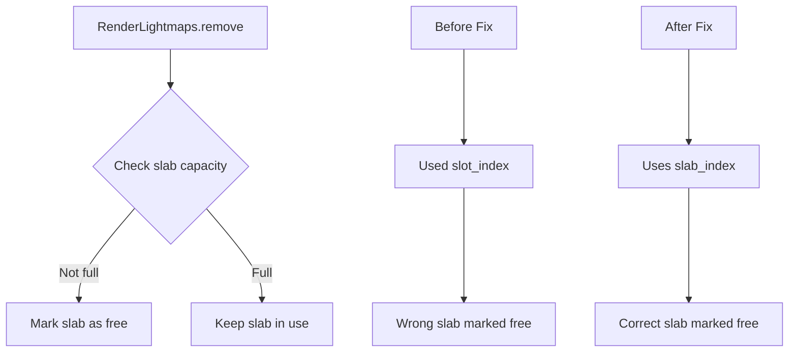

+++
title = "#21564 Fix lightmaps freeing the wrong slab on removal."
date = "2025-10-16T00:00:00"
draft = false
template = "pull_request_page.html"
in_search_index = true

[taxonomies]
list_display = ["show"]

[extra]
current_language = "en"
available_languages = {"en" = { name = "English", url = "/pull_request/bevy/2025-10/pr-21564-en-20251016" }, "zh-cn" = { name = "中文", url = "/pull_request/bevy/2025-10/pr-21564-zh-cn-20251016" }}
labels = ["C-Bug", "D-Trivial", "A-Rendering"]
+++

# Fix lightmaps freeing the wrong slab on removal

## Basic Information
- **Title**: Fix lightmaps freeing the wrong slab on removal.
- **PR Link**: https://github.com/bevyengine/bevy/pull/21564
- **Author**: andriyDev
- **Status**: MERGED
- **Labels**: C-Bug, D-Trivial, A-Rendering, S-Ready-For-Final-Review
- **Created**: 2025-10-16T20:07:01Z
- **Merged**: 2025-10-16T21:28:24Z
- **Merged By**: alice-i-cecile

## Description Translation
# Objective

- Fixes #21551.
- Fixes #20688.

## Solution

- Insert slab_index instead of slot_index into free_slabs.

## Testing

Ran the repro in #20688 and it works!

## The Story of This Pull Request

The problem stemmed from a simple but critical indexing error in Bevy's lightmap management system. Lightmaps in Bevy are organized using a slab allocator pattern, where multiple lightmaps are packed into texture arrays called "slabs." Each slab contains multiple slots, and the system maintains tracking data to know which slabs have available capacity.

The core issue was in the `RenderLightmaps::remove` method, where when removing a lightmap from a slab, the code was incorrectly using the `slot_index` (the position within a specific slab) instead of the `slab_index` (which identifies which slab in the collection) when marking slabs as available for reuse. This meant that when a lightmap was removed, the system would mark the wrong slab as having free capacity, leading to allocation failures and rendering artifacts.

The fix is straightforward but crucial: change one line from inserting `slot_index` to inserting `slab_index` into the `free_slabs` collection. This ensures that when a lightmap slot becomes available, the correct slab is marked as having free capacity.

Additionally, the PR adds a defensive assertion in the `LightmapSlab::allocate` method to catch cases where allocation is attempted on a full slab. This assertion serves as a safety net that would have made the original bug easier to diagnose by providing a clear error message instead of silent misbehavior.

The impact of this fix is significant for users relying on lightmaps in their Bevy applications. Before this fix, lightmap removal could cause the rendering system to incorrectly track available capacity, leading to either failed lightmap allocations or visual artifacts where lightmaps would appear incorrectly or not at all. The bug affected multiple users, as evidenced by the two separate issues (#21551 and #20688) that this PR resolves.

From an engineering perspective, this fix demonstrates the importance of careful indexing in resource management systems and the value of defensive programming through assertions. The addition of the assertion in the allocate method provides an extra layer of protection that could prevent similar bugs in the future.

## Visual Representation



## Key Files Changed

### `crates/bevy_pbr/src/lightmap/mod.rs` (+5/-1)

This file contains the core lightmap management logic in Bevy's physically-based rendering system. The changes fix the slab indexing bug and add a defensive assertion.

**Key modifications:**

```rust
// Before:
if !slab.is_full() {
    self.free_slabs.grow_and_insert(slot_index.into());
}

// After:
if !slab.is_full() {
    self.free_slabs.grow_and_insert(slab_index.into());
}
```

The critical change replaces `slot_index.into()` with `slab_index.into()`, ensuring the correct slab is marked as having available capacity.

Additionally, a new assertion was added to prevent allocation on full slabs:

```rust
assert!(
    !self.is_full(),
    "Attempting to allocate on a full lightmap slab"
);
```

This assertion provides immediate feedback if the system attempts an invalid allocation, making debugging easier and preventing silent failures.

## Further Reading

- [Bevy Lightmap Documentation](https://docs.rs/bevy_pbr/latest/bevy_pbr/lightmap/index.html)
- [Slab Allocator Pattern](https://en.wikipedia.org/wiki/Slab_allocation)
- [Rust Assertions](https://doc.rust-lang.org/std/macro.assert.html)
- [Texture Arrays in Graphics Programming](https://www.khronos.org/opengl/wiki/Array_Texture)

# Full Code Diff

```diff
diff --git a/crates/bevy_pbr/src/lightmap/mod.rs b/crates/bevy_pbr/src/lightmap/mod.rs
index f4adb94738c48..a05d3ebd12db7 100644
--- a/crates/bevy_pbr/src/lightmap/mod.rs
+++ b/crates/bevy_pbr/src/lightmap/mod.rs
@@ -388,7 +388,7 @@ impl RenderLightmaps {
         slab.remove(fallback_images, slot_index);
 
         if !slab.is_full() {
-            self.free_slabs.grow_and_insert(slot_index.into());
+            self.free_slabs.grow_and_insert(slab_index.into());
         }
     }
 }
@@ -417,6 +417,10 @@ impl LightmapSlab {
     }
 
     fn allocate(&mut self, image_id: AssetId<Image>) -> LightmapSlotIndex {
+        assert!(
+            !self.is_full(),
+            "Attempting to allocate on a full lightmap slab"
+        );
         let index = LightmapSlotIndex::from(self.free_slots_bitmask.trailing_zeros());
         self.free_slots_bitmask &= !(1 << u32::from(index));
         self.lightmaps[usize::from(index)].asset_id = Some(image_id);
```