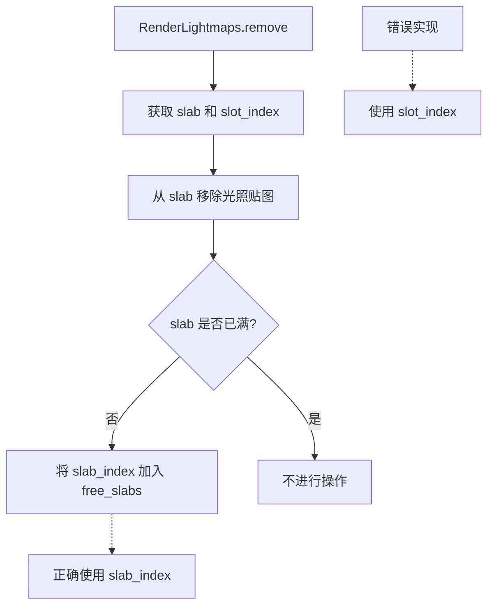

+++
title = "#21564 Fix lightmaps freeing the wrong slab on removal."
date = "2025-10-16T00:00:00"
draft = false
template = "pull_request_page.html"
in_search_index = false

[extra]
current_language = "zh-cn"
available_languages = {"en" = { name = "English", url = "/pull_request/bevy/2025-10/pr-21564-en-20251016" }, "zh-cn" = { name = "中文", url = "/pull_request/bevy/2025-10/pr-21564-zh-cn-20251016" }}
+++

# 修复光照贴图在移除时释放错误 Slab 的问题

## 基本信息
- **标题**: Fix lightmaps freeing the wrong slab on removal.
- **PR 链接**: https://github.com/bevyengine/bevy/pull/21564
- **作者**: andriyDev
- **状态**: 已合并
- **标签**: C-Bug, D-Trivial, A-Rendering, S-Ready-For-Final-Review
- **创建时间**: 2025-10-16T20:07:01Z
- **合并时间**: 2025-10-16T21:28:24Z
- **合并者**: alice-i-cecile

## 描述翻译
### 目标
- 修复 #21551
- 修复 #20688

### 解决方案
- 在 free_slabs 中插入 slab_index 而不是 slot_index

### 测试
在 #20688 中运行了复现步骤，确认修复有效！

## 这个 Pull Request 的故事

这个 PR 解决了一个在光照贴图管理系统中存在的关键 bug。问题出现在当从光照贴图 slab 中移除一个光照贴图时，系统错误地释放了错误的 slab 索引。

在 Bevy 的渲染系统中，光照贴图通过 slab 分配器进行管理。每个 slab 包含多个光照贴图槽位（slots），系统维护一个 free_slabs 集合来跟踪哪些 slab 有空闲槽位可用。

问题的核心在于 `RenderLightmaps::remove` 方法中的逻辑错误。当从一个 slab 中移除光照贴图后，如果该 slab 不再处于满载状态，代码需要将其重新加入到可用 slab 的集合中。然而，原始代码错误地使用了 `slot_index`（槽位索引）而不是 `slab_index`（slab 索引）：

```rust
// 修复前的错误代码
if !slab.is_full() {
    self.free_slabs.grow_and_insert(slot_index.into());  // 错误：使用了 slot_index
}
```

这个错误导致系统将错误的索引标记为空闲，从而破坏了 slab 分配器的正确性。当后续请求分配新的光照贴图时，系统可能会尝试使用无效的 slab 索引，导致崩溃或未定义行为。

修复方案直接而明确：将错误的 `slot_index` 替换为正确的 `slab_index`：

```rust
// 修复后的正确代码
if !slab.is_full() {
    self.free_slabs.grow_and_insert(slab_index.into());  // 正确：使用 slab_index
}
```

此外，PR 还在 `LightmapSlab::allocate` 方法中添加了一个断言检查，确保不会在已满的 slab 上进行分配操作：

```rust
assert!(
    !self.is_full(),
    "Attempting to allocate on a full lightmap slab"
);
```

这个断言提供了额外的安全保障，帮助在开发早期捕获潜在的逻辑错误。

从技术角度来看，这个 bug 属于典型的索引混淆错误。在多层嵌套的数据结构中，区分不同层级的索引至关重要。`slab_index` 标识的是哪个 slab 容器，而 `slot_index` 标识的是该 slab 内部的哪个具体槽位。混淆这两者会导致内存管理错误。

这个修复虽然代码改动很小，但对于光照贴图系统的稳定性至关重要。它确保了光照贴图资源的正确生命周期管理，避免了内存泄漏和无效内存访问。

## 可视化表示



## 关键文件更改

### `crates/bevy_pbr/src/lightmap/mod.rs` (+5/-1)

这个文件包含了光照贴图系统的核心实现。主要修改包括：

1. **修复 slab 释放逻辑**：
```rust
// 修复前：
if !slab.is_full() {
    self.free_slabs.grow_and_insert(slot_index.into());
}

// 修复后：
if !slab.is_full() {
    self.free_slabs.grow_and_insert(slab_index.into());
}
```

2. **添加分配时的安全检查**：
```rust
// 新增的断言：
assert!(
    !self.is_full(),
    "Attempting to allocate on a full lightmap slab"
);
```

这些修改确保了：
- 正确的 slab 索引被标记为空闲
- 在分配时进行额外的完整性检查
- 系统的稳定性和可靠性

## 完整代码差异

```diff
diff --git a/crates/bevy_pbr/src/lightmap/mod.rs b/crates/bevy_pbr/src/lightmap/mod.rs
index f4adb94738c48..a05d3ebd12db7 100644
--- a/crates/bevy_pbr/src/lightmap/mod.rs
+++ b/crates/bevy_pbr/src/lightmap/mod.rs
@@ -388,7 +388,7 @@ impl RenderLightmaps {
         slab.remove(fallback_images, slot_index);
 
         if !slab.is_full() {
-            self.free_slabs.grow_and_insert(slot_index.into());
+            self.free_slabs.grow_and_insert(slab_index.into());
         }
     }
 }
@@ -417,6 +417,10 @@ impl LightmapSlab {
     }
 
     fn allocate(&mut self, image_id: AssetId<Image>) -> LightmapSlotIndex {
+        assert!(
+            !self.is_full(),
+            "Attempting to allocate on a full lightmap slab"
+        );
         let index = LightmapSlotIndex::from(self.free_slots_bitmask.trailing_zeros());
         self.free_slots_bitmask &= !(1 << u32::from(index));
         self.lightmaps[usize::from(index)].asset_id = Some(image_id);
```

## 进一步阅读

- [Bevy 光照贴图系统文档](https://docs.rs/bevy_pbr/latest/bevy_pbr/lightmap/index.html)
- [Slab 分配器模式](https://docs.rs/slab/latest/slab/)
- [资源管理最佳实践](https://bevy-cheatbook.github.io/programming/res.html)